# 电路原理习题册·第一章 电路的基本概念与基本原理（选择 14 / 填空 16 / 计算 13）

## 1. 来源与边界

- **来源**：`电路原理习题册.pdf`（46 页，WPS 导出，含完整文本层）。页眉逐字：**「电路原理习题册」「2026-2027 学年 第一学期」**。第一章占全书第 1–7 页，**选择题 14 + 填空题 16 + 计算题 13，共 43 题**，配图 1.1–1.35。
- **为什么图用原图**：PDF 里的电路图是一张张独立嵌入的小图，已按图号逐张提取入库（`figures/`
  目录，35 张）。其中**图 1.25 与图 1.23、图 1.31 与图 1.29 在原 PDF 里就是同一张图**（复用同一
  对象），照实复用；图 1.26 在原 PDF 里是矢量绘图，按页面原样渲染成图；图 1.23/1.27/1.33–1.35
  的线条与文字分两层存放，按「文字+图形」合成渲染，保证标注完整。
- **题面抄录**：PDF 文本层虽能选中文字，但**等号、负号等符号大量丢失**（如「I1 4A」实为 $I_1=-4$ A），一律不可直接采信。本页题面以页面图像为准，由**三路独立读图**抄录（选择题两路 + 填空与计算一路），再经独立解题人对照修正。
- **使用方法**：每题「提示 → 解答」两层折叠，默认收起——先自己动笔。这一章的全部题目只考三件事：**判参考方向、列 KCL/KVL、算功率**（吸收还是发出看电流从哪端流入）。卡住再展开。

## 2. 依赖：做之前该会的事

| 知识 | 一句话 | 在哪学的 |
| :--- | :--- | :--- |
| 参考方向与关联方向 | 电流从电压「+」端流入 = 关联；$P=UI$ 关联为吸收、非关联为发出 | [课堂笔记 09-23](../课堂笔记/2026-09-23-电压电位与电路名词.md) |
| KCL / KVL | 节点电流代数和为零；回路电压代数和为零；独立方程数 $n-1$ 与 $b-n+1$ | 同上（$M=B-(N-1)$ 一段） |
| 电位与电压 | $U_{xy}=\varphi_x-\varphi_y$；换参考点电位变、两点间电压不变 | 同上 |
| 电容与电感的 u-i 关系 | 关联方向下 $i=C\,\mathrm du/\mathrm dt$ | 同上 |

## 3. 选择题

### 选 1（图 1.1）

> 图 1.1 电路中电压 $U_{AB}$ 为（　）。A. 16 V　B. −16 V　C. 21 V　D. 19 V

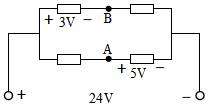

:::collapse accordion
- 提示：给右下端子定 0 V，沿两条支路各算到 A、B
  端口电压 24 V 把左右两个端子的电位差钉死；每条支路内部只有一个标注的电阻压降，逐段加减就行。
- 解答
  取右端子为 $0$ V（则左端子 $24$ V）。上支路：$+3\,\mathrm V-$ 标在 B 左侧电阻上（左高右低），所以
  $\varphi_B = 24-3 = 21$ V。下支路：$5$ V 标在 A 右侧电阻上且 **+ 端在 A 侧**，所以 $\varphi_A = 0+5 = 5$ V。
  $$U_{AB}=\varphi_A-\varphi_B = 5-21 = \mathbf{-16\ V}$$
  **选 B。**
- 复盘：这题全部的功夫在「$+3\,\mathrm V-$ 的 + 端是高电位」这一句上：标注画在哪个电阻上、+ 朝哪头，
  中点电位就往哪边偏。A、B 都是支路中点，谁也不用算电流——电阻值根本没给，也不需要。
:::

### 选 2（图 1.2）

> 图 1.2 电路中，已知 $U_S=10$ V，$I_1=-4$ A，$I_2=1$ A，电流 $I_3$ 为（　）A。A. 1　B. 2　C. 3　D. 不能确定

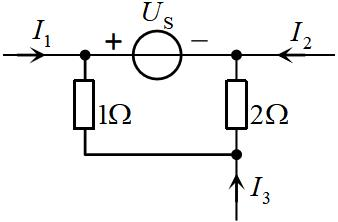

:::collapse accordion
- 提示：把整个电路看成一个「黑盒子」，数一数有几根导线穿过盒子边界
- 解答
  盒子只有三根外引线：$I_1$（参考方向流入，值 $-4$ A）、$I_2$（流入，$1$ A）、$I_3$（流入）。电荷守恒，
  流进盒子的总和为零：
  $$I_1+I_2+I_3=0 \;\Rightarrow\; I_3 = -(-4)-1 = \mathbf{3\ A}$$
  **选 C。** $U_S$、$1\,\Omega$、$2\,\Omega$ 全在盒子内部，与这三根引线的电流无关（干扰项）。
- 复盘：KCL 的「广义节点」用法——对**任意闭合面**都成立。看到题目问外引线电流、而内部结构复杂，
  先数外引线：三根引线一个问题一个方程，直接出答案。
:::

### 选 3（图 1.3）

> 电路如图 1.3 所示，则电流 $I_1=$（　）A。A. 1　B. 2　C. 3　D. 0.5

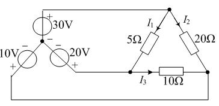

:::collapse accordion
- 提示：找一条只含「电压源 + 5Ω」的闭合路径，其余元件一个都不用碰
- 解答
  按图读数：顶点 P 接 $30$ V 源（上正）；左下顶点 Q 接 $20$ V 源（下正，即 Q 端电位高）；$5\,\Omega$ 斜支路
  接在 P、Q 之间，$I_1$ 参考 P 流向 Q。这条支路两端各是一个**电压源钉死的电位**，电阻上电流与电路其余
  部分无关：
  $$I_1=\frac{30-20}{5}=\mathbf{2\ A}$$
  **选 B。**（$10$ V 源与 $10\,\Omega$、$20\,\Omega$ 只影响别的支路。）
- 复盘：「理想电压源两端的电位是钉死的」——凡是两端都接理想电压源的支路，电流一律
  $I=(U_1-U_2)/R$，跟电路其它部分一刀两断。这是后面前面反复出现的「钉死电位」思想的第一课。
:::

### 选 4（图 1.4）

> 电路如图 1.4 所示，电压 $U$ 等于（　　）V。A. 2　B. 4　C. 5　D. 6

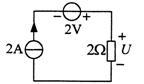

:::collapse accordion
- 提示：单回路里串着电流源——回路电流谁说了算？
- 解答
  单回路串着 $2$ A 电流源，回路电流被它钉死为 $2$ A（$2$ V 源只改变电流源两端的电压，管不了电流）。
  $2\,\Omega$ 上电流 $2$ A 自上而下、从 $U$ 的 + 端流入：
  $$U = 2\times 2 = \mathbf{4\ V}$$
  **选 B。**
- 复盘：电流源串联支路里，**电流源是唯一发令员**。见到「电流源 + 电阻串联」，电阻上的电流立刻写出，
  再 $U=IR$ 收工。
:::

### 选 5

> $n$ 个节点、$b$ 条支路的连通电路，可以列出独立 KCL 方程和独立 KVL 方程的个数分别为（　）。
> A. $n$；$b$　B. $b-n+1$；$n+1$　C. $n-1$；$b-1$　D. $n-1$；$b-n+1$

:::collapse accordion
- 提示：独立 KCL 数 = 能少列一个的节点数；独立 KVL 数 = 连支数
- 解答
  独立 KCL：$n-1$ 个（任取一个节点当参考，它的方程由其余节点线性组合而成）；独立 KVL：$b-n+1$ 个
  （即网孔数 $M=b-(n-1)$）。**选 D。**
- 复盘：这两行是第一章「电路名词」一节的硬结论，课堂例题（5 支路 / 3 节点 / 6 回路）就是用它验的：
  $M = B-(N-1)$。记住顺序别对调——KCL 是 $n-1$、KVL 是 $b-n+1$。
:::

### 选 6（图 1.5）

> 如图 1.5 示电路中，则电流 $i=$（　）A。A. 4　B. 2　C. 2.5　D. 4.5

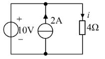

:::collapse accordion
- 提示：三支路并联——电阻两端的电压是谁定的？
- 解答
  $4\,\Omega$ 与 $10$ V 源直接并联，两端电压被钉死为 $10$ V（上 +）。$i$ 参考向下、从 + 端流入：
  $$i=\frac{10}{4}=\mathbf{2.5\ A}$$
  **选 C。** $2$ A 电流源只改变 $10$ V 源支路的电流，不影响 $4\,\Omega$。
- 复盘：与选 4 成对——并联看电压源、串联看电流源。**谁的物理量被「源」直接钉死，就先写谁。**
:::

### 选 7（图 1.6）

> 如图 1.6 示电路中，电压、电流对此元件是否为关联参考方向（　）。
> A. 是　B. 不是　C. 不能确定　D. 以上都不对

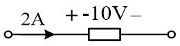

:::collapse accordion
- 提示：只看箭头从哪端流入、+ 在哪端，标注的数值大小不参与判断
- 解答
  电流 $2$ A 箭头指向元件**左端**，电压 $+$ 也标在**左端**——电流从 + 端流入，**关联参考方向**。**选 A。**
  （标注值是 $-10$ V，只说明这个元件实际发出功率，与「参考方向是否关联」无关。）
- 复盘：关联与否是**参考方向的几何关系**，与数值正负无关。两件事必须分开：方向关系统计 $P=UI$ 的
  公式形式，数值正负决定吸收还是发出。
:::

### 选 8

> 电容元件的电流、电压（电容上电压与电流正方向一致）的表达式为（　）。
> A. $i=-C\,\mathrm du/\mathrm dt$　B. $u=-C\,\mathrm di/\mathrm dt$　C. $i=C\,\mathrm du/\mathrm dt$　D. $u=C\,\mathrm di/\mathrm dt$

:::collapse accordion
- 提示：「正方向一致」= 关联。电容的 $i$ 由 $u$ 的变化率决定，还是反过来？
- 解答
  关联方向下电容的端口约束是 $i=C\,\mathrm du/\mathrm dt$（电容电流正比于电压变化率）。**选 C。**
  B、D 把电容当成了电感（$u=L\,\mathrm di/\mathrm dt$ 才是电感）；A 的负号属于非关联方向。
- 复盘：这对选择题常和电感放一起考。记法：电容 $i=C\,\mathrm du/\mathrm dt$——「存电荷的是电压，
  电流是它的水位变化」；电感对偶地 $u=L\,\mathrm di/\mathrm dt$。
:::

### 选 9（图 1.7）

> 如图 1.7 示电路中，电路中的电流值 $I$ 为（　）。A. 1 A　B. −1 A　C. 7 A　D. −7 A

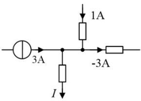

:::collapse accordion
- 提示：对中央节点写 KCL，「流入 = 流出」，负值照带
- 解答
  流入：$3$ A（左）、$1$ A（上）。流出：右侧支路参考朝右流出、标注值 $-3$ A；下支路流出 $I$。
  $$3+1 = (-3) + I \;\Rightarrow\; I=\mathbf{7\ A}$$
  **选 C。**
- 复盘：KCL 里「参考方向朝外但值为负」= 实际朝内。把负号老老实实带进代数和，不要先「看出」它实际
  流向再改符号——一步写对，两步必乱。
:::

### 选 10（图 1.8）

> 如图 1.8 示电路中，元件电压 $u_1$、$u_2$ 分别为（　）。
> A. $u_1=8$ V，$u_2=-15$ V　B. $u_1=-8$ V，$u_2=-15$ V　C. $u_1=-8$ V，$u_2=15$ V　D. $u_1=8$ V，$u_2=15$ V

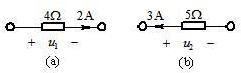

:::collapse accordion
- 提示：电阻电压 = 电流 × 电阻，正负看电流从 + 端还是 − 端流入
- 解答
  (a)：$2$ A 从 $u_1$ 的 + 端（左）流入、流经 $4\,\Omega$，关联：$u_1 = 2\times4 = 8$ V。
  (b)：$3$ A 从右向左流、从 $u_2$ 的 − 端（右）流入，非关联：$u_2 = -3\times5 = -15$ V。
  **选 A。**
- 复盘：一句话模板——**电流从 + 流入取正、从 − 流入取负**。两个小图一个正一个负，专考这句话。
:::

### 选 11（图 1.9）

> 如图 1.9 示电路中，电阻 $R$ 为（　）。A. 8 Ω　B. 10 Ω　C. 12 Ω　D. 14 Ω

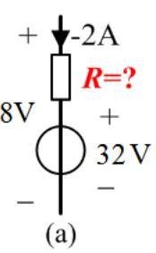

:::collapse accordion
- 提示：把支路两端 8 V 当已知，沿支路把各段电压加起来
- 解答
  按图：支路电流参考朝下、值为 $-2$ A（图上标注带负号，实际朝上 $2$ A）；$32$ V 源 + 上 − 下；
  支路总电压（上对下）$8$ V。沿支路自上而下：
  $$8 = (-2)R + 32 \;\Rightarrow\; R=\mathbf{12\ \Omega}$$
  **选 C。**
- 复盘：这题的坑在「$2$ A 旁边那个负号」——漏看它就得不出选项里的任何值。支路电压 = 各段电压代数和，
  未知量只有一个 $R$，列一条方程收工。
:::

### 选 12（图 1.10）

> 如图 1.10 示电路中，电流 $I$ 值为（　）。A. −4 A　B. 8 A　C. 4 A　D. −8 A

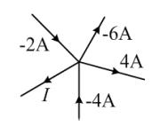

:::collapse accordion
- 提示：单节点 KCL，代数和一步到位
- 解答
  流入 $=$ 流出：$-2 = (-6)+4+(-4)+I \Rightarrow I = \mathbf{4\ A}$。**选 C。**
- 复盘：三个负号一个正号，纯考「带着符号算」的耐心。这类题检验的不是电路知识，是**符号纪律**。
:::

### 选 13（图 1.11）

> 图 1.11 所示电路中，电压 $U_1$ 为（　）。A. −1 V　B. 1 V　C. −2 V　D. 2 V

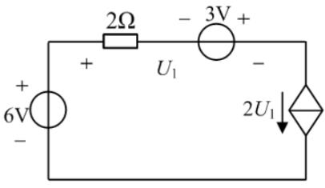

:::collapse accordion
- 提示：先认受控源（菱形 + 箭头 = 受控电流源），回路电流被它直接定死；再看 $U_1$ 到底跨在哪两点
- 解答
  按图：右竖支路是受控**电流**源（菱形内箭头），控制量 $2U_1$，回路电流 $I=2U_1$（顺时针）。
  $U_1$ 跨**整条上支路**（+ 在左上角、− 在右上角）：自左向右先经 $2\,\Omega$（电流向右，压降 $2I$），
  再经 $3$ V 源（图上 − 左 + 右，从 − 到 + 电位**升** 3 V），所以
  $$U_1 = 2I - 3 = 2(2U_1)-3 \;\Rightarrow\; 3U_1=3 \;\Rightarrow\; U_1=\mathbf{1\ V}$$
  **选 B。**（$6$ V 源的值在这条回路里其实用不上——回路电流已被受控源钉死。）
- 复盘：受控源题两步走：①认类型（箭头=电流源、+/−=电压源），把「被它钉死的量」写出来；
  ②控制量 $U_1$ 用同一回路的欧姆定律+KVL 表达，联立即解。若把 $U_1$ 误读成只跨 $2\,\Omega$，
  方程会自相矛盾（$I=2U_1$ 与 $U_1=2I$ 只能同时为零）——那正是读图错位的信号。
:::

### 选 14（图 1.12）

> 图 1.12 所示电路中，$u=$____V，电阻吸收的功率 $P_R=$____W。
> A. 2 V；3 W　B. 3 V；5 W　C. 5 V；3 W　D. 8 V；7 W

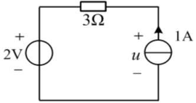

:::collapse accordion
- 提示：回路电流由 1A 源定；u 用 KVL 从 2V 源和 3Ω 反推
- 解答
  回路电流 $=1$ A（电流源定死；$1$ A 源在右竖、箭头朝上 → 顶边电流向左，$3\,\Omega$ 上电流 $1$ A 向左）。
  沿回路（逆时针方向行进）：$1$ A 源两端电压 $u$（+ 上）行进自下而上为**升** $u$；顶边过 $3\,\Omega$
  顺电流压降 $3\times1=3$ V；左竖过 $2$ V 源从 + 到 − 压降 $2$ V：
  $$u-3-2=0 \;\Rightarrow\; u=\mathbf{5\ V}$$
  $$P_R=I^2R=1^2\times3=\mathbf{3\ W}$$
  **选 C。**
- 复盘：电流源两端的电压**不由电流源自己定**，由外电路（KVL）倒推——这是「理想电流源」最常考的
  一面。功率用 $I^2R$ 直接算，连方向都不用判（平方恒正，电阻永远吸收）。
:::

## 4. 填空题

### 填 1（图 1.13）

> 图 1.13 电路中电流 $I_3=$____A，$I=$____A。

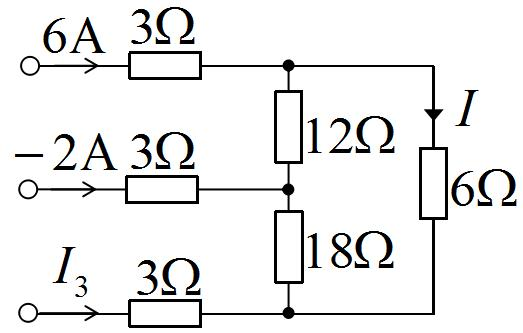

:::collapse accordion
- 提示：左侧三条支路的左端各自悬空——它们是三个「电流注入器」；给下节点定 0 V，用节点电位解
- 解答
  按图：三条 $3\,\Omega$ 支路左端**互不相连**（各自独立端子），右端分别注入上、中、下三个节点；
  竖直链为上—$12\,\Omega$—中—$18\,\Omega$—下；右侧 $6\,\Omega$ 支路接上、下节点之间，$I$ 参考向下。
  设 $\varphi_{\text{下}}=0$、$\varphi_{\text{上}}=x$、$\varphi_{\text{中}}=y$：
  $$\text{上节点：}\;6=\frac{x-y}{12}+\frac{x}{6}\qquad
    \text{中节点：}\;\frac{x-y}{12}-2=\frac{y}{18}$$
  两式整理为 $3x-y=72$ 与 $3x-5y=72$，相减得 $y=0$、$x=24$ V。于是
  $$I=\frac{x-0}{6}=\mathbf{4\ A}$$
  下节点三条支路的电流**全部流入**（$18\,\Omega$ 的 $0$、$I_3$、$6\,\Omega$ 的 $I$），KCL 要求代数和为零：
  $$0+I_3+I=0 \;\Rightarrow\; I_3=\mathbf{-4\ A}$$
- 复盘：这题的题眼是「左端悬空」——三条 $3\,\Omega$ 支路不是并联（左端不共母线），而是三个独立的电流
  注入口。若当成并联分流量，方程组就无解或解错。另外下节点「只进不出」是 KCL 的正常形态：
  代数和为零，不必强找「流出」的支路。
:::

### 填 2（图 1.14）

> 图 1.14 电路中，已知 $I=14$ A，电流 $I_1=$____A，$I_2=$____A。

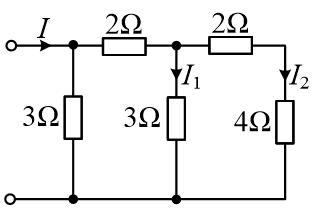

:::collapse accordion
- 提示：从最远端往回算等效电阻，再逐级分回电流
- 解答
  从最右端往回：$N_3$ 节点只挂 $4\,\Omega$；$N_2$ 右侧 = $2\,\Omega + 4\,\Omega = 6\,\Omega$，与该节点上
  的 $3\,\Omega$（$I_1$ 支路）并联 = $2\,\Omega$；$N_1$ 右侧 = $2\,\Omega + 2\,\Omega = 4\,\Omega$，
  与 $3\,\Omega$ 并联 = $\tfrac{12}{7}\,\Omega$。总电压 $V_1 = 14\times\tfrac{12}{7}=24$ V。
  逐级分流（每次按并联反比）：
  $$\text{进 } 2\,\Omega \text{ 段：}14\times\frac{3}{3+4}=6\ \text{A}\qquad
    I_1=6\times\frac{6}{3+6}=\mathbf{4\ A}\qquad
    I_2=6-4=\mathbf{2\ A}$$
  （$N_1$ 上 $3\,\Omega$ 分走 $8$ A；$14=8+4+2$ 校验闭合。）
- 复盘：梯形网络的标准动作就两步：**从远端折算等效电阻 → 从近端逐级分流**。每级分流都是
  「邻支路电阻 / 总电阻」乘上游电流，写清节点字母就不会分错层。
:::

### 填 3（图 1.15）

> 图 1.15 电路中，开关 S 打开时，电压 $u_{ab}=$____V；开关 S 闭合时，电流 $i_{ab}=$____A。

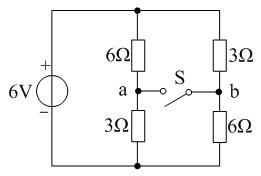

:::collapse accordion
- 提示：S 断开 = 两个独立分压器；S 闭合后 a、b 合并成一个节点，先求合并电位
- 解答
  **S 断开**：左右两条支路各自独立分压（$\varphi_{\text{顶}}=6$ V、$\varphi_{\text{底}}=0$）：
  $$\varphi_a=6\times\frac{3}{6+3}=2\ \text{V}\qquad
    \varphi_b=6\times\frac{6}{3+6}=4\ \text{V}\qquad
    u_{ab}=\varphi_a-\varphi_b=\mathbf{-2\ V}$$
  **S 闭合**：a、b 合并成节点 $M$。顶到 $M$ 是 $6\,\Omega\parallel 3\,\Omega=2\,\Omega$，$M$ 到底是
  $3\,\Omega\parallel 6\,\Omega=2\,\Omega$，总电流 $6/4=1.5$ A，$\varphi_M = 6-1.5\times2=3$ V。
  对 a 侧写 KCL（流入 = 流出 + 开关电流）：
  $$\frac{6-3}{6}=\frac{3}{3}+i_{ab}\;\Rightarrow\; i_{ab}=0.5-1=\mathbf{-0.5\ A}$$
- 复盘：两个空恰好考开关的两种状态：断开比电位、闭合算节点。第二空最容易错在「合并电位」：
  S 一闭合，左右支路**交叉并联**（$6\,\Omega$ 配 $3\,\Omega$），不是各自 $9\,\Omega$ 并联——画节点图再算。
:::

### 填 4（图 1.16）

> 图 1.16 电路，已知 $U_{bc}=8$ V，$U_{cd}=4$ V，$U_{de}=-6$ V，$U_{ef}=-10$ V，则 $I_1=$____A，$U_{ab}=$____V。

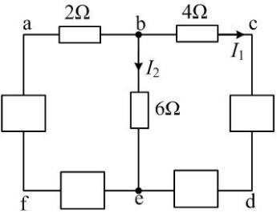

:::collapse accordion
- 提示：给 f 定 0 V，四个已知电压把 a–e 全部钉出来；I₁ 直接来自 4Ω 的欧姆定律
- 解答
  设 $\varphi_f=0$。逐个用 $U_{xy}=\varphi_x-\varphi_y$：
  $$\varphi_e=-10,\quad \varphi_d=-16,\quad \varphi_c=-12,\quad \varphi_b=\varphi_c+8=-4\ \text{V}$$
  $$I_1=\frac{U_{bc}}{4}=\frac{8}{4}=\mathbf{2\ A}\quad(\text{b}\to\text{c})$$
  $b$ 节点 KCL：$I_{ab} = I_1 + I_2$，而 $I_2=\dfrac{\varphi_b-\varphi_e}{6}=\dfrac{-4+10}{6}=1$ A，
  所以 $I_{ab}=3$ A，$2\,\Omega$ 上电流自 a 向 b：
  $$U_{ab}=3\times 2=\mathbf{6\ V}$$
- 复盘：⚠ **此题原书第一个已知印作「$U_{ab}=8$ V」**——但那样第二空再求 $U_{ab}$ 就自相矛盾，
  且按它解出的 $I_1=2.6$ A、$I_2=1.4$ A 与同册计算题 5（同型图、已知 $U_{bc}=8$ V、答案 $2$ A／$1$ A）
  对不上。本页按 $U_{bc}=8$ V 作答，与计算 5 互为印证；原书排印待核对（见文末）。
  方法本身是通用的：**四个支路电压 + 一个参考点 → 全部节点电位 → 欧姆定律出电流**。
:::

### 填 5

> 电路的组成包括电源、______和______三大部分。

:::collapse accordion
- 提示：翻课堂笔记「电路的组成」一节
- 解答：电源、**负载**、**中间环节**（连接导线与开关等传输、控制部分）。
- 复盘：三部分对应「产生电能 — 消耗电能 — 输送与分配」，简答题也可能考，按这个顺序背。
:::

### 填 6

> 电容元件的电流、电压（电容上电压与电流正方向一致）的表达式为______。

:::collapse accordion
- 提示：与选 8 同题异形
- 解答：$$i=C\,\frac{\mathrm du}{\mathrm dt}$$（关联方向。）
- 复盘：选择题考认选项、填空题考默写——同一句话两种考法。
:::

### 填 7

> 基尔霍夫电流定律是对电路中各支路______所施加的约束关系。

:::collapse accordion
- 提示：KCL 约束的是哪一类物理量？KVL 约束的又是哪一类？
- 解答：**电流**。（KCL 源于电荷守恒：节点上电流代数和为零；对偶地，KVL 约束的是**电压**，源于能量守恒。）
- 复盘：一句话题。KCL 管**电流**、KVL 管**电压**，填空别串门。
:::

### 填 8

> 当两个 20 μF 的电容器并联，则并联电容器的总电容为______。

:::collapse accordion
- 提示：电容并联像电阻串联——直接相加
- 解答：$C_{\text{并}}=20+20=\mathbf{40\ \mu F}$。
- 复盘：电容与电阻的串并联公式**对偶**：并联相加、串联取倒数和。与电阻正好相反，别背反。
:::

### 填 9（图 1.17）

> 电路如图 1.17 所示，可得：$U=$_____V。

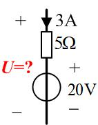

:::collapse accordion
- 提示：支路里串着电流源——电流就是 3A；U = 各段电压代数和
- 解答
  支路电流由 $3$ A 电流源定死（向下）。自上而下：$5\,\Omega$ 压降 $3\times5=15$ V（电流从上到下，
  上端 +），$20$ V 源 + 上 − 下、压降 $20$ V：
  $$U = 15+20=\mathbf{35\ V}$$
- 复盘：⚠ 图上 $U$ 的标注跨在整条支路两端（含电流源）。电流源自己的端电压由外电路定——但这题里
  「外电路」就是同一条支路里的 $5\,\Omega$ 与 $20$ V 源，所以 $U$ 仍然可解：$35$ V。若把 $U$ 的 +
  − 读反，答案变 $-35$ V，选项/空值会提示你。
:::

### 填 10（图 1.18）

> 图 1.18 所示电路，求得 $I_1=$______A。

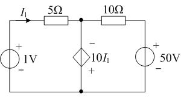

:::collapse accordion
- 提示：受控源是「电压源」（菱形带 +−），它的电压 = 10I₁；用节点电位一条方程解 I₁
- 解答
  设底线为 0。$M$ 节点电位即受控源电压（上 − 下 +，上对下 $=-10I_1$）：$\varphi_M=-10I_1$。
  左支路（$1$ V 源 + 上）经 $5\,\Omega$ 到 $M$：
  $$I_1=\frac{1-\varphi_M}{5}=\frac{1+10I_1}{5}\;\Rightarrow\;5I_1=1+10I_1\;\Rightarrow\;I_1=\mathbf{-0.2\ A}$$
  （此时 $\varphi_M=2$ V，$10\,\Omega$ 支路电流 $(2-50)/10=-4.8$ A，KCL 在 $M$ 点闭合。）
- 复盘：受控源当**电压源**用（它的电压是 $10I_1$），控制量 $I_1$ 再用 $5\,\Omega$ 支路的欧姆定律
  回代——一条方程一个未知数。负号答案说明 $I_1$ 实际方向与箭头相反，照抄不误。
:::

### 填 11

> $n$ 个节点，$b$ 条支路的连通电路，可以列出独立 KVL 方程的个数为______个。

:::collapse accordion
- 提示：与选 5 后半句同源
- 解答：$\mathbf{b-n+1}$ 个（= 网孔数 $M=B-(N-1)$）。
- 复盘：KVL 独立方程数等于「连支数」：每补一条连支就多一个独立回路。填空只填个数，理解在选 5。
:::

### 填 12

> $n$ 个节点，$b$ 条支路的连通电路，可以列出独立 KCL 方程的个数为______个。

:::collapse accordion
- 提示：与选 5 前半句同源
- 解答：$\mathbf{n-1}$ 个。
- 复盘：与填 11 成对出现，注意题目问的是 KCL 还是 KVL，看清再填。
:::

### 填 13（图 1.19）

> 图 1.19 所示电路，求电路中电压源发出的功率为______W。

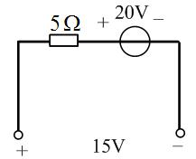

:::collapse accordion
- 提示：单回路，两个源一个电阻；先解电流，再判 20V 源是发是吸
- 解答
  沿回路（顶边自左向右行进）：过 $5\,\Omega$ 压降 $5I$；过 $20$ V 源（+ 左 − 右）压降 $20$ V；
  底边自右向左过 $15$ V 端口（左 + 右 −）从 − 到 + **升** $15$ V：
  $$5I+20-15=0\;\Rightarrow\;I=-1\ \text{A}$$
  实际电流 $1$ A 逆时针——顶边向左流过 $20$ V 源，从 − 端流向 + 端（源内被驱动），**发出**：
  $$P_{\text{发}}=20\times1=\mathbf{20\ W}$$
- 复盘：I 解出负数是常态，别回头改符号——参考方向下的 $-1$ A 就是「实际朝反方向 1 A」，
  功率判定用实际方向：电流从源的 − 端进、+ 端出 = 发出。
:::

### 填 14（图 1.20）

> 图 1.20 所示电路，求元件 A 吸收的功率为____W。

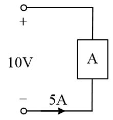

:::collapse accordion
- 提示：A 的电压就是端口电压；判关联，套 P=UI
- 解答
  A 与 $10$ V 端口并联，电压 $10$ V（上 + 下 −）。$5$ A 从 A 的**下端**（− 端）流入、上端流出，
  非关联方向：
  $$P_{\text{吸}}=-10\times5=\mathbf{-50\ W}$$
  即 A 实际**发出** 50 W。
- 复盘：吸收为负 = 发出，一句话说清就行。这题也可以一步用「发出 = $UI$（电流从 + 端流出）」：
  $10\times5=50$ W 发出 = 吸收 $-50$ W，两种写法等价。
:::

### 填 15（图 1.21）

> 图 1.21 所示电路，求元件电压 $u_1=$______V，$u_2=$______V。

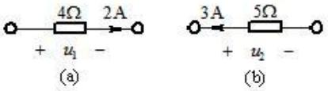

:::collapse accordion
- 提示：与选 10 同型——电流从 + 流入取正、从 − 流入取负
- 解答
  (a)：$2$ A 从 $u_1$ + 端流入 $4\,\Omega$：$u_1=2\times4=\mathbf{8\ V}$。
  (b)：$3$ A 向左流、从 $u_2$ − 端流入 $5\,\Omega$：$u_2=-3\times5=\mathbf{-15\ V}$。
- 复盘：与选 10 几乎逐字相同（图号不同、问法改成填空）——同一知识点在册内重复出现，
  正好当第二遍练习。
:::

### 填 16（图 1.22）

> 电路如图 1.22 所示，$I=$______A；1A 电流源发出功率______W。

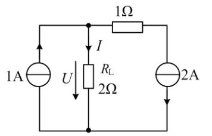

:::collapse accordion
- 提示：右支路电流被 2A 源钉死 → 顶节点 KCL 得 I；1A 源的电压由 φ(顶中) 倒推
- 解答
  右竖 $2$ A 源向下 → 顶边右段电流 $2$ A（从顶中节点 $M$ 流向右上）。$M$ 节点 KCL：
  $$1 = I + 2 \;\Rightarrow\; I=\mathbf{-1\ A}$$
  $2\,\Omega$ 上 $U=2\times(-1)=-2$ V，即 $\varphi_M=-2$ V（底为 0）。$1$ A 源上端接 $M$：
  电流 $1$ A 自下（0 V）流向上（$-2$ V），从高电位流向低电位，被充电——**吸收** $2$ W：
  $$P_{\text{1A,发}}=1\times(0-(-2))\times(-1)=\mathbf{-2\ W}$$
  功率平衡校验：右支路 $1\,\Omega$ 压降 $2\times1=2$ V，$2$ A 源上端电位 $\varphi_M-2=-4$ V，
  电流向下从 $-4$ V 到 $0$ V（升 4 V），**发出** $8$ W；
  吸收方：$1\,\Omega$ 上 $2^2\times1=4$ W、$2\,\Omega$ 上 $(-1)^2\times2=2$ W、$1$ A 源吸 $2$ W，
  合计 $8$ W = 发出 $8$ W ✓。
- 复盘：本题是第一章功率题的「全家福」：电流源定电流、KCL 出 $I$、电位倒推源电压、
  发出/吸收按实际方向判、最后功率平衡收口。**平衡表是自查利器**——发出总和 = 吸收总和，不平就是算错。
:::

## 5. 计算题

### 计 1（图 1.23）

> 电路如图 1.23 所示，求开关 S 闭合与断开两种情况下的电压 $U_{ab}$ 和 $U_{cd}$。

:::collapse accordion
- 提示：S 闭合 = 回路；S 断开 = 无电流，开路电压顺着「无压降」一路量过去
- 解答
  **S 闭合**：单回路 $5\,\mathrm V$、$1\,\Omega$、$4\,\Omega$：
  $$I=\frac{5}{1+4}=1\ \text{A}\quad(\text{a}\to\text{b}\to\text{c}\to\text{d})$$
  开关闭合是导线：$U_{ab}=\mathbf{0\ V}$；$4\,\Omega$ 上电流 $1$ A 自 c 到 d：
  $$U_{cd}=4\times1=\mathbf{4\ V}$$
  **S 断开**：回路电流为零，$1\,\Omega$ 与 $4\,\Omega$ 上都没有压降。a 端电位 = $5$ V（电池正极），
  b、c、d 经无电流的电阻与电池负极连通：$\varphi_b=\varphi_c=\varphi_d=0$ V。
  $$U_{ab}=\mathbf{5\ V}\qquad U_{cd}=\mathbf{0\ V}$$
- 复盘：开关题的标准两问——**闭合算回路、断开量开路电压**。断开时电阻上无电流就无压降，
  「电位顺着导线和电阻一路平过去」，谁都不用重算。
:::

### 计 2（图 1.24）

> 求图 1.24 所示电路中的电流 $I$。

:::collapse accordion
- 提示：从右往左折等效电阻；20mA 源的总电流只在源支路里流，节点处分流
- 解答
  自右向左：两个 $4\,\Omega$ 并联（中间与右侧竖直支路经顶部导线并接）= $2\,\Omega$；串 $18\,\Omega$
  得 $20\,\Omega$；与 $M$ 节点的 $20\,\Omega$ 并联 = $10\,\Omega$。
  $20$ mA 全部流过 $90\,\Omega$ 到 $M$，在 $M$ 点**对半分**（两条支路都是 $20\,\Omega$）：
  $$I=\frac{20\ \text{mA}}{2}=\mathbf{10\ mA}$$
- 复盘：折算到「$M$ 节点两侧电阻恰好相等」就停——分流比 $1:1$，口算收工。这题所有数字都是
  为「对半分」铺路的。
:::

### 计 3（图 1.25）

> 电路如图 1.25 所示，求开关 S 闭合与断开两种情况下的电压 $U_{ab}$ 和 $U_{cd}$。

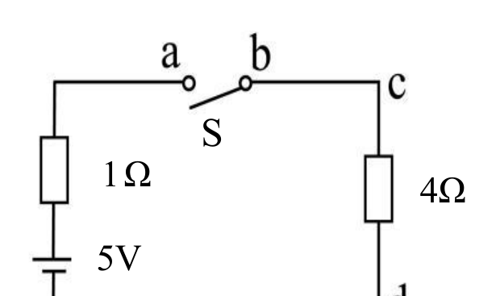

:::collapse accordion
- 提示：图 1.25 与图 1.23 是同一张图
- 解答
  原 PDF 里图 1.25 与图 1.23 复用同一绘图对象（逐字节同一张图），两题同题同解：
  **S 闭合**：$U_{ab}=0$ V、$U_{cd}=4$ V；**S 断开**：$U_{ab}=5$ V、$U_{cd}=0$ V（见计 1）。
- 复盘：习题册里出现重复题不是错误，是编者安排的第二次机会——第一次没做对的，这次应该秒杀。
:::

### 计 4（图 1.26）

> 如图 1.26 所示，求图中电流 $I_1$ 和电压 $U_{AB}$。

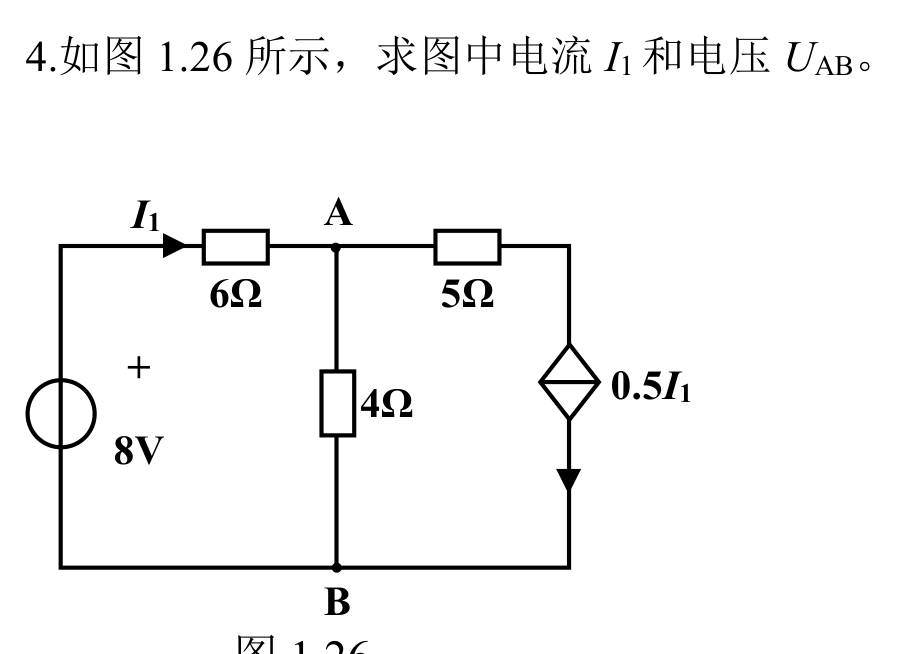

:::collapse accordion
- 提示：右支路是受控电流源（菱形+箭头），它把右上支路的电流钉成 0.5I₁；节点电位法两条方程
- 解答
  设 $B$（底线）为 0。左竖 $8$ V 源 + 上：顶左电位 $8$ V。$I_1$ = 顶线左段电流 = $(8-\varphi_A)/6$。
  $A$ 节点 KCL（流入 = 流出）：
  $$\frac{8-\varphi_A}{6}=\frac{\varphi_A-0}{4}+\frac{\varphi_A-\varphi_C}{5}$$
  右上节点 $C$ KCL（流入 = 流出，流出即受控源 $0.5I_1$ 向下）：
  $$\frac{\varphi_A-\varphi_C}{5}=0.5\,I_1=\frac{8-\varphi_A}{12}$$
  由第二式 $\varphi_A-\varphi_C=\dfrac{5(8-\varphi_A)}{12}$，代入第一式并乘 12：
  $$2(8-\varphi_A)=(8-\varphi_A)+3\varphi_A\;\Rightarrow\;16-2\varphi_A=8+2\varphi_A
    \;\Rightarrow\;\varphi_A=2\ \text{V}$$
  $$I_1=\frac{8-2}{6}=\mathbf{1\ A}\qquad U_{AB}=\varphi_A-0=\mathbf{2\ V}$$
  （$\varphi_C=-0.5$ V。功率平衡校验：$8$ V 源发 $8$ W、受控源发 $0.25$ W；电阻吸
  $6+1.25+1=8.25$ W ✓。）
- 复盘：受控电流源在这题里只干一件事——**把右上支路的电流钉成 $0.5I_1$**，于是 $C$ 节点的 KCL
  把「$5\,\Omega$ 电流」也钉成 $0.5I_1$。两个节点两条方程，未知数只有 $\varphi_A,\varphi_C$（$I_1$
  用欧姆定律回代），机械解完。
:::

### 计 5（图 1.27）

> 电路如图 1.27 所示，已知 $U_{bc}=8$ V，$U_{cd}=4$ V，$U_{de}=-6$ V，$U_{ef}=-10$ V。求 $I_1$、$I_2$。

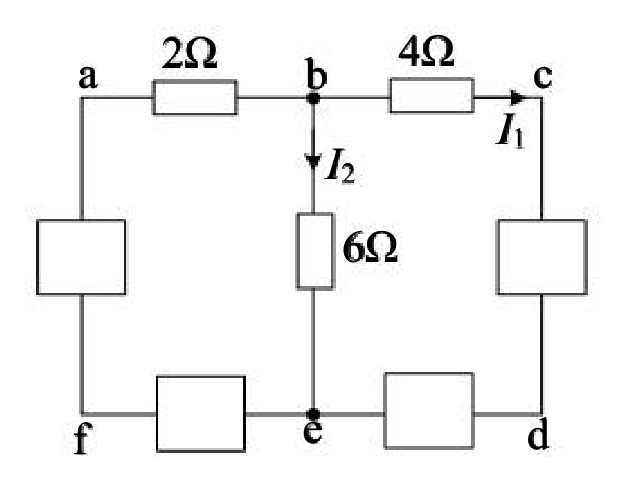

:::collapse accordion
- 提示：I₁ 直接来自 4Ω 的欧姆定律；I₂ 要先把 b、e 两点间的电压沿「已知量最多的路径」加出来
- 解答
  $I_1$ 在 $4\,\Omega$ 支路上（b→c）：
  $$I_1=\frac{U_{bc}}{4}=\frac{8}{4}=\mathbf{2\ A}$$
  $6\,\Omega$ 接在 $b$、$e$ 之间，$I_2=\dfrac{U_{be}}{6}$。沿路径 $b\to c\to d\to e$ 做电压代数和
  （$U_{cd}=4$ V 是 $c$ 对 $d$，$U_{de}=-6$ V 是 $d$ 对 $e$）：
  $$U_{be}=U_{bc}+U_{cd}+U_{de}=8+4+(-6)=6\ \text{V}$$
  $$I_2=\frac{6}{6}=\mathbf{1\ A}$$
  （$U_{ef}=-10$ V 在这两问里用不上，是题面给的冗余条件。）
- 复盘：⚠ **原书数据自身不闭合**：按这组已知电压反推 $2\,\Omega$ 支路电流，与 $I_1+I_2$ 在 $b$
  节点对不上 KCL（差 $1$ A）——四个「已知电压」里至少一个与图上元件值矛盾。本页照教材口径
  「给定支路电压 + 局部 KVL + 欧姆定律」作答，不做整体 KCL 校验（详见文末待核对）。
  方法要点：**任意两点间电压 = 沿任意路径各段电压的代数和**，路径挑已知量最多的那条走。
:::

### 计 6（图 1.28）

> 电路如图 1.28 所示，求电流 $I$。

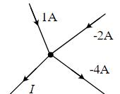

:::collapse accordion
- 提示：单节点 KCL，负值照带
- 解答
  流入 = 流出：$1 = (-2)+(-4)+I \Rightarrow I=\mathbf{7\ A}$。
- 复盘：X 形四支路交于一点，KCL 一行写完。与选 12 同款：**先按参考方向列式，负值自然进方程**。
:::

### 计 7（图 1.29）

> 电路如图 1.29 所示，求电压 $U$。

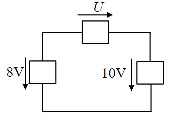

:::collapse accordion
- 提示：三个抽象方框元件的单回路，KVL 一条方程；注意 U 的参考方向朝右
- 解答
  沿回路顺时针行进：顶边沿 $U$ 参考方向压降 $U$；右竖沿 $10$ V 的参考（向下）压降 $10$ V；
  左竖逆着 $8$ V 的参考（向下）行进，**升** $8$ V：
  $$U+10-8=0\;\Rightarrow\;U=\mathbf{-2\ V}$$
- 复盘：方框题不给阻值不给电流，考的就是**KVL 本身**：沿行进方向「同向取 +、反向取 −」，
  代数和为零。$U$ 为负说明顶边电压的实际方向与箭头相反（右高左低）。
:::

### 计 8（图 1.30）

> 电路如图 1.30 所示，求开关 S 闭合后电压 $U_{ab}$ 和 $U_{cd}$。

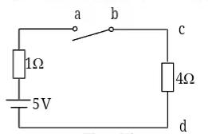

:::collapse accordion
- 提示：与计 1 的「S 闭合」半题同构
- 解答
  回路电流 $I=\dfrac{5}{1+4}=1$ A（a→b→c→d）。开关是导线：
  $$U_{ab}=\mathbf{0\ V}\qquad U_{cd}=4\times1=\mathbf{4\ V}$$
- 复盘：本题只问闭合一种情况（对照计 1 的两问）。结构一模一样，数字一模一样——把计 1 的
  「断开」情况自己补问一遍，就是完整练习。
:::

### 计 9（图 1.31）

> 电路如图 1.31 所示，求电压 $U$。

:::collapse accordion
- 提示：图 1.31 与图 1.29 是同一张图
- 解答
  原 PDF 里两图复用同一绘图对象：$U=\mathbf{-2\ V}$（见计 7）。
- 复盘：又一组重复题。第一遍按行进方向老老实实写 KVL，第二遍应该能直接看出 $U=-(10-8)=-2$ V。
:::

### 计 10（图 1.32）

> 如 1.32 图所示，已知：元件 A 吸收功率 60 W；求电流 $I$。

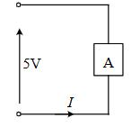

:::collapse accordion
- 提示：单回路里 A 与 5V 元件首尾相接——A 的电压就是 5V；功率 = 电压 × 电流
- 解答
  沿回路 KVL：$A$ 的电压 $u_A = 5$ V（两者构成唯一回路，电压代数和为零：$-5+u_A=0$）。
  A 吸收 $60$ W = $u_A\times i_A$（$i_A$ 为从 A 的 + 端流入的电流）：
  $$i_A=\frac{60}{5}=12\ \text{A}$$
  底边电流 $I$ 与 $i_A$ 是同一回路电流：
  $$I=\mathbf{12\ A}$$
- 复盘：功率题里「电压 $\times$ 电流 = 功率」倒着用（$P\div U = I$）是常态。先 KVL 定电压，
  再用功率定电流，方向由参考方向统一处理。
:::

### 计 11（图 1.33）

> 电路如图 1.33 所示，求受控源提供的功率。

:::collapse accordion
- 提示：受控源是电压源 10I₁（上−下+）→ 先解 I₁ 与 φ(M)，再算流过受控源的电流，最后 P=UI 判发吸
- 解答
  设底线为 0。受控源电压（上对下）$=-10I_1$，即 $\varphi_M=-10I_1$。
  左支路：$I_1=\dfrac{1-\varphi_M}{5}=\dfrac{1+10I_1}{5}\Rightarrow I_1=\mathbf{-0.2\ A}$，
  $\varphi_M=2$ V。
  右支路电流（自 $M$ 流向右上）：$\dfrac{2-50}{10}=-4.8$ A，即实际 $4.8$ A 流入 $M$。
  $M$ 节点 KCL：流入 $=4.8+(-0.2)=4.6$ A = 受控源支路向下的电流。
  受控源两端（上对下）$=2$ V、电流 $4.6$ A **从 + 端流入**：
  $$P_{\text{吸}}=2\times4.6=9.2\ \text{W}\quad\Rightarrow\quad P_{\text{提供}}=\mathbf{-9.2\ W}$$
  （受控源实际吸收 9.2 W。功率平衡：$50$ V 源发 $240$ W = $10\,\Omega$ 吸 $230.4$
  + 受控吸 $9.2$ + $5\,\Omega$ 吸 $0.2$ + $1$ V 源吸 $0.2$ ✓。）
- 复盘：「提供的功率」答负值 = 实际吸收。受控源不是「激励」就一定发电——它的功率完全由外电路
  决定，算完发吸才知道。这道题也是填空 10 的完整版：同一电路，先把 $I_1$ 解出来，再算功率。
:::

### 计 12（图 1.34）

> 电路如图 1.34 所示，求 30V 电压源和 2A 电流源的功率 $P$。

:::collapse accordion
- 提示：φ(M) 被 30V 源钉死 → 20Ω 电流立即可算；中间支路电流被 2A 源钉死 → 30V 源电流 = 2 + I(20Ω)
- 解答
  顶线左段是导线：$\varphi_M = 30$ V。右上节点 $\varphi_R=10$ V（$10$ V 源 + 上）：
  $$I_{20}=\frac{30-10}{20}=1\ \text{A}\quad(M\to R)$$
  中间支路电流被电流源钉死为 $2$ A（向下）。$M$ 节点 KCL：$30$ V 源流出电流
  $I_{30}=2+1=3$ A（从 + 端流出，**发出**）：
  $$P_{\text{30V,发}}=30\times3=\mathbf{90\ W}$$
  $2$ A 源两端电压：中间支路自上而下 $5\,\Omega$ 压降 $2\times5=10$ V，源上端电位
  $\varphi_M-10=20$ V、下端 $0$——电流 $2$ A 从 $+$（20 V）端流入、向 $0$ V 流出，**吸收**：
  $$P_{\text{2A,吸}}=20\times2=40\ \text{W}\quad(\text{即发出}\ -40\ \text{W})$$
  平衡校验：发出 $90$ W = 吸收 $20\,\Omega$ 的 $1^2\times20=20$ W + $5\,\Omega$ 的 $2^2\times5=20$ W
  + $2$ A 源 $40$ W + $10$ V 源（电流 $1$ A 从 + 流入）$10$ W = $90$ W ✓。
- 复盘：两个源两个答：$30$ V 发 $90$ W、$2$ A 源**吸** $40$ W。电流源不一定发电、电压源不一定
  吸收——全看实际电流方向与端电压的配合。功率平衡一行表是这类题的「验钞机」。
:::

### 计 13（图 1.35）

> 如图 1.35 所示电路，列写方程求解电流 $i$，分析受控源功率情况。

:::collapse accordion
- 提示：受控源把左支路电流钉成 3i；M 节点 KCL + 中间支路欧姆定律，两条方程两个未知数
- 解答
  设底线为 0、$M$ 点电位 $\varphi_M$。受控源（菱形箭头向上）把左支路电流定为 $3i$（向上流入 $M$）。
  中间支路欧姆定律：$i=\dfrac{\varphi_M}{5}$，即 $\varphi_M=5i$。
  $M$ 节点 KCL：流入 $3i$ = 流出 $i$（中间 $5\,\Omega$）+ 流出 $I_R$（右 $5\,\Omega$）：
  $$3i=i+\frac{\varphi_M-10}{5}=i+\frac{5i-10}{5}=2i-2\;\Rightarrow\;i=\mathbf{-2\ A}$$
  （$\varphi_M=-10$ V，$I_R=(-10-10)/5=-4$ A，$3i=-6$ A，KCL：$-6=-2+(-4)$ ✓。）
  **受控源功率**：左支路电流 $3i=-6$ A（参考向上，实际 $6$ A 向下）。左竖自上而下：
  $2\,\Omega$ 压降 $2\times(-3i)=12$ V，受控源电压（上对下）$=\varphi_M-12=-22$ V。
  受控源实际电流 $6$ A 向下——从下端 $0$ V 流向上端 $-22$ V（从高到低，非关联）：
  $$P_{\text{吸}}=(-22)\times6=\mathbf{-132\ W}\quad\text{即发出 } 132\ \text{W}$$
  平衡校验：发出 $10$ V 源 $40$ W + 受控源 $132$ W = $172$ W；吸收三电阻
  $4^2\times5+2^2\times5+6^2\times2=80+20+72=172$ W ✓。
- 复盘：受控源功率题的完整流程：**解控制量 → 解受控源电压与电流 → $P=UI$ 判发吸 → 平衡收口**。
  本题受控源发了 $132$ W，比 $10$ V 独立源的 $40$ W 大得多——受控源能把控制支路的能量
  「放大」后送进电路，这正是「有源元件」名字的由来。
:::

## 6. 小结

第一章 43 题做下来，反复出现的只有四招：

1. **参考方向先行**：箭头、+− 全按图抄，负值照带代数和——选 9/12、填 1、计 6 全是「符号纪律」题。
2. **源钉死什么就先写什么**：串联看电流源（选 4/14、填 9/16、计 12），并联看电压源（选 6）；
   两端接理想电压源的支路电流与电路其余部分无关（选 3）。
3. **电位法通吃多节点**：设一个 0 V 点，已知支路电压逐点推电位（填 4、计 5），欧姆定律出电流，
   KCL 闭合校验。
4. **功率题配平衡表**：发出总和 = 吸收总和（填 16、计 4/11/12/13 全部用它收口），不平时回头找符号。

受控源（选 13、填 10、计 4/11/13）是本章唯一的新角色：菱形 + 箭头 = 受控电流源、菱形 + ± = 受控电压源；
它先「钉死」一条支路的电流或电压，控制量再用欧姆定律/KVL 回代，最后功率照 $P=UI$ 判发吸。

## 完成边界

- **已整理**：第一章 43 题（选择 14 / 填空 16 / 计算 13）题面逐字转抄 + 35 张配图原图入库
  （图 1.23=1.25、1.29=1.31 同图复用；图 1.26 为矢量渲染；图 1.23/1.27/1.33–1.35 为「线条+文字」
  合成渲染）；全部解答与复盘。
- **双签**：2026-09-28，三名独立子代理只拿题面与配图重算 43 题：40 题与整理者逐项一致；
  3 处以图为准修正整理者初解（选 1 的支路极性读数、填 3 的 $i_{ab}=-0.5$ A、计 12 的 $2$ A 源
  实为吸收 $40$ W），修正后三方一致。计 4/11/12/13 四题附功率平衡校验（平衡表全部闭合）。
- **〔待核对〕**：① 填 4 / 计 5 的已知电压**第一个下标**（$U_{ab}$ 还是 $U_{bc}$）——两处原书
  排印疑似不一致，本页按 $U_{bc}=8$ V 作答（与计 5 题干一致、数字自洽），请对教材图复核；
  ② 选 11 图上 $2$ A 标注带负号（实际 $-2$ A），$R=12\,\Omega$ 依赖此负号；③ 计 5 四个已知电压
  与图上元件值不满足全节点 KCL（原书数据不闭合），按教材口径作答；④ 填 9 的 $U$ 标注跨含
  电流源的整条支路，按可解口径取 $5\,\Omega+20$ V 段作答（$35$ V）。
- **未完成**：第二至九章（全书 46 页，本次只入第一章）；作业布置范围与截止时间（教师未单独布置，
  整册为备考题库——考题即原题，按 handoff §6-E 的课程约定分章推进）。
- **配图管线（2026-09-28 新增）**：`站点/build.mjs` 现将 `课程/<课>/作业/figures/` 原样拷入 dist；
  页内配图用原生 `` 标签（markdown 链接指向 .jpg 会被「原件不入库」降级徽标拦下，勿用）。

