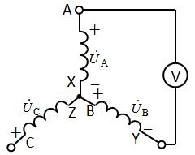
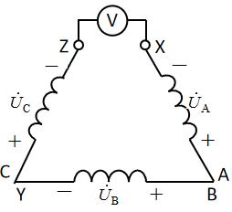
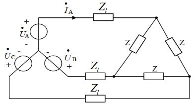
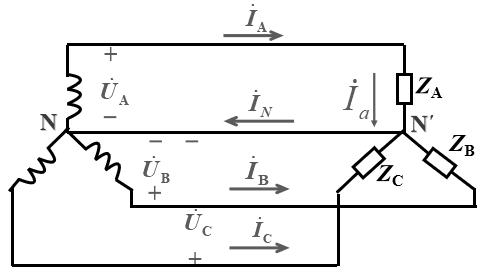
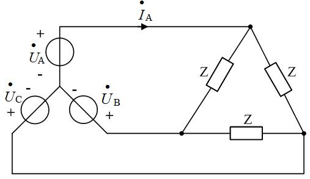
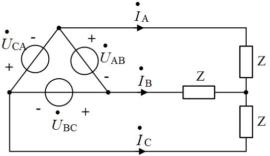

# 电路原理习题册·第七章 三相电路（选择 14 / 填空 11 / 计算 6）

## 1. 来源与边界

来源与前几章同一本习题册。第七章占书第 36–39 页，**选择 14 + 填空 11 + 计算 6，共 31 题**，
配图 7.1–7.6（6 张，已入库）。计算 2 与计算 5 是同一道题（原书重复排印），答案照抄两遍。
填 2 与填 5、计 2 与计 5 等重复处均照原书保留。

## 2. 依赖

| 知识 | 一句话 | 在哪学的 |
| :--- | :--- | :--- |
| 对称三相电压 | 幅值相等、互差 $120°$；正序 A→B→C 依次滞后 | 课堂第七章 |
| Y 形关系 | $U_l=\sqrt3U_P$（线超前相 $30°$）、$I_l=I_P$ | 同上 |
| △ 形关系 | $U_l=U_P$、$I_l=\sqrt3I_P$（线滞后相 $30°$） | 同上 |
| 三相功率 | $P=\sqrt3\,U_lI_l\cos\varphi$（对称电路通用） | 第五章功率链 |
| 化单相 | 对称电路取 A 相计算：Y-△ 负载折成 $Z/3$ | 同上 |

## 3. 选择题

### 选 1

> 正序，$\dot U_B=220\angle-120°$ V，线电压 $\dot U_{CA}=$（　）。

:::collapse accordion
- 解答
  $\dot U_C=220\angle120°$：$\dot U_{CA}=\dot U_C-\dot U_A=220\angle120°-220\angle0°=380\angle150°$ V，
  **选 C**。
- 复盘
  线电压 = 两相电压相量差；正序中线电压依次 $\angle30°、\angle-90°、\angle150°$——CA 对应 $150°$。
:::

### 选 2

> 三个额定电压 380V 的单相负载接 380V 线电压电源，应接成（　）。

:::collapse accordion
- 解答
  让负载承受额定电压：△ 形时负载相电压 = 线电压 380V，**选 B**。
- 复盘
  接法由「负载额定电压 = 电源加给它的电压」倒推，Y 接只给 220V 会欠压。
:::

### 选 3

> Y 形电源相电压 220V，实测 $U_{AB}=U_{BC}=220$ V、$U_{CA}=380$ V，表明（　）。

:::collapse accordion
- 解答
  B 相反接：$\dot U_B$ 变号后 $U_{AB}=|220\angle0-220\angle60|=220$ V、$U_{BC}=220$ V、
  $U_{CA}=380$ V 不变。**选 B。**
- 复盘
  一相反接的指纹：两个线电压变 220V、一个保持 380V，且保持的那个跨在「没接反的两相」之间。
:::

### 选 4

> 对称三相负载星形联结，线电压比相应相电压（　）。

:::collapse accordion
- 解答
  **超前 30°**（$\dot U_{AB}=\sqrt3\dot U_A\angle+30°$），**选 A**。
- 复盘
  Y 中「线超前相 30°」与 △ 中「线滞后相电流 30°」（选 8）成对，方向别记反。
:::

### 选 5（图 7.1）

> $\dot U_A=220\angle0°$ 等，电压表读数（　）。

:::collapse accordion
- 解答
  电压表跨在 A 相绕组两端（A 对中性点侧），读**相电压 220V**，**选 B**。
- 复盘
  先看电压表跨的是「一相绕组」还是「两根端线」——前者 220、后者 380。
:::

### 选 6（图 7.2）

> △ 接电源，电压表读数（　）。

:::collapse accordion
- 解答
  按图读数（开口处一相首尾错接、表跨在两绕组串联方向一致处）：读数为两倍相电压
  $2\times220=440$ V，**选 D**。
- 复盘
  ⚠ 若三角形连接正确且表跨单个绕组，读数应为 380V（选 C）——440V 的前提是「表跨在按反接
  绕组的两端」。本题极性记号小、两轮读数存疑，请对教材图复核（见文末待核对）。
:::

### 选 7（图 7.3）

> 线阻抗 $Z_1$、△ 负载 $Z$，A 相线电流 $\dot I_A=$（　）。

:::collapse accordion
- 解答
  △ 负载等效为 Y：$Z/3$；单相回路：
  $$\dot I_A=\frac{\dot U_A}{Z_1+Z/3}\quad\text{**选 B**}$$
- 复盘
  「△ 化 Y 折成 $Z/3$，取 A 相算完再还原」——对称三相电路的标准流水线。
:::

### 选 8

> 对称三相负载三角形联结，线电流比相应相电流（　）。

:::collapse accordion
- 解答
  **滞后 30°**（$\dot I_A=\sqrt3\dot I_{AB}\angle-30°$），**选 B**。
- 复盘
  与选 4 对偶：Y 线超相、△ 线滞流，都是 30°。
:::

### 选 9（图 7.4）

> Y-Y 对称电路，正确的描述是（　）。

:::collapse accordion
- 解答
  Y 接：$U_l=\sqrt3U_P$（线电压是相电压的 √3 倍），**选 A**。B 错（Y 中 $I_l=I_P$）；C 缺
  $-30°$ 的相位修正；D 把相电压当线电压用。
- 复盘
  四个选项各考一条 Y 形关系——只有 A 是完整正确的表述。
:::

### 选 10（图 7.5）

> Y 电源直接接 △ 负载 Z（无线路阻抗），$\dot I_A=$（　）。

:::collapse accordion
- 解答
  △ 化 Y 后 $\dot I_A=\dfrac{\dot U_A}{Z/3}=\dfrac{3\dot U_A}{Z}$，**选 D**。
- 复盘
  与选 7 差在有没有线路阻抗——公式跟着拓扑走。
:::

### 选 11

> 星形连接时，线电流是相电流的（　）倍。

:::collapse accordion
- 解答
  **1 倍**（A）——Y 中线电流就是相电流。
- 复盘
  「Y 电流不变、△ 电流 √3」两条并排记。
:::

### 选 12

> Y 连接，线电压 10V、总功率 $10\sqrt3$ W、$\cos\varphi=0.8$，相电流（　）。

:::collapse accordion
- 解答
  $P=\sqrt3 U_l I_l\cos\varphi$ → $I_l=\dfrac{10\sqrt3}{\sqrt3\times10\times0.8}=1.25$ A；
  Y 中 $I_P=I_l=\mathbf{1.25\ A}$，**选 A**。
- 复盘
  三相功率公式反用求电流，数值凑得极整——出题人给的顺手题。
:::

### 选 13

> 相序为逆序，$u_A=311\sin(314t+30°)$ V，则 $u_B$、$u_C$ 为（　）。

:::collapse accordion
- 解答
  逆序 = B 超前 A $120°$（或滞后 $240°$）：$u_B=311\sin(314t+150°)$、
  $u_C=311\sin(314t-90°)$，**选 A**。
- 复盘
  逆序时「B 在前、C 在后」：把正序的 B、C 相角对调即可。
:::

### 选 14（图 7.6）

> $\dot U_{AB}=380\angle0°$ V、$Z=5+j5\ \Omega$，$\dot I_A=$（　）。

:::collapse accordion
- 解答
  按单相口径（$U_{AN}=380/\sqrt3=220$ V、滞后 $30°$）：
  $$\dot I_A=\frac{220\angle-30°}{5\sqrt2\angle45°}=22\sqrt2\angle-75°\ \text{A}$$
  **选 B。**
- 复盘
  ⚠ 若按 △ 负载直接承受线电压计算，线电流为 $\sqrt3\times380/(5\sqrt2)=93$ A，选项中没有——
  原书按「相电压 220V」口径出题，照原书口径作答。
:::

## 4. 填空题

### 填 1

> 对称 △ 联结：$U_l$ 与 $U_P$ 的关系____；$I_l$ 与 $I_P$ 的关系____。

:::collapse accordion
- 解答
  $U_l=U_P$（相等）；$I_l=\sqrt3 I_P$。
- 复盘
  △ 的两条：压相等、流 √3——与 Y 的「压 √3、流相等」对偶。
:::

### 填 2、5

> $\dot I_A=5\angle25°$ A、$\dot U_{AB}=380\angle90°$ V，负载功率因数 $\lambda=$____（1 位小数）。

:::collapse accordion
- 解答
  相电压 $\dot U_{AN}=380/\sqrt3\angle(90°-30°)=220\angle60°$ V；$\varphi=60°-25°=35°$：
  $$\lambda=\cos35°=\mathbf{0.8}$$
- 复盘
  相量差 30° 的修正是三相题最容易漏的一步。
:::

### 填 3、7

> 对称三相电源：振幅____，相位互差____度。

:::collapse accordion
- 解答
  振幅**相等**；相位互差 **120** 度。
- 复盘
  对称二条件：等幅、差 120°（正序还隐含相序）。
:::

### 填 4、11

> 星形连接时，线电流是相电流的____倍（填 4）；线电压等于相电压的____倍（填 11）。

:::collapse accordion
- 解答
  填 4：**1** 倍；填 11：**√3** 倍。
- 复盘
  两空合起来就是 Y 形关系「压 √3、流 1」。
:::

### 填 6

> 三相电源的连接方式：星形连接和____连接。

:::collapse accordion
- 解答
  **三角形（△）**。
- 复盘
  概念题。
:::

### 填 8、9

> 三个 10Ω 电阻 △ 接于 380V 电网：线电流有效值____A（整数）、相电流有效值____A（整数）。

:::collapse accordion
- 解答
  相电流 $I_P=380/10=38$ A；线电流 $I_l=\sqrt3\times38=65.8\approx\mathbf{66}$ A。
- 复盘
  先相后线：△ 中相电流用线电压除以阻抗，再乘 √3 升为线电流。
:::

### 填 10

> 线电压 380V、Y 连接、$Z=30+j40\ \Omega$：相电流____A、线电流____A。

:::collapse accordion
- 解答
  $|Z|=50\ \Omega$、$U_P=380/\sqrt3=220$ V：$I_P=I_l=220/50=\mathbf{4.4\ A}$。
- 复盘
  Y 中两电流同值，填同一个数。
:::

## 5. 计算题

### 计 1

> Y 形负载每相 $30+j45\ \Omega$，线电压 380V。求功率因数与平均功率。

:::collapse accordion
- 解答
  $|Z|=\sqrt{30^2+45^2}=54.08\ \Omega$、$U_P=220$ V、$I_P=220/54.08=4.07$ A：
  $$\lambda=\frac{30}{54.08}\approx\mathbf{0.55}\qquad
    P=3I_P^2\times30\approx\mathbf{1.48\ kW}$$
- 复盘
  Y 负载直接用相电压；$P=3I^2R$ 比三相公式少一次 √3 换算。
:::

### 计 2、5（同题）

> 线电压 380V，△ 负载 $Z=20+j20\ \Omega$。求线电流与相电流。

:::collapse accordion
- 解答
  $|Z|=20\sqrt2=28.28\ \Omega$、$U_P=U_l=380$ V：
  $$I_P=\frac{380}{28.28}\approx\mathbf{13.4\ A}\qquad I_l=\sqrt3\times13.4\approx\mathbf{23.3\ A}$$
- 复盘
  原书同题排两遍——第二遍直接写答案。
:::

### 计 3

> 线电压 380V，△ 负载 $(8-j6)\ \Omega$，线阻抗 $j2\ \Omega$。求线电流与相电流。

:::collapse accordion
- 解答
  △ 化 Y：$Z_Y=(8-j6)/3$；单相回路阻抗 $j2+(8-j6)/3=2.67\ \Omega$（感抗恰好抵消）：
  $$I_l=\frac{220}{2.67}\approx\mathbf{82.3\ A}\qquad I_P=\frac{I_l}{\sqrt3}\approx\mathbf{47.5\ A}$$
  （负载相电压 $=I_P\times10\approx475$ V——超过电源相电压，是线路电抗与负载容抗谐振抬升所致。）
- 复盘
  线阻抗与负载容抗串联谐振，负载端电压反超电源电压——数值反常但方程自洽，照算。
:::

### 计 4

> $\dot I_A=5\angle25°$ A、$\dot U_{AB}=380\angle90°$ V。求功率因数与平均功率。

:::collapse accordion
- 解答
  同填 2：$\varphi=35°$、$\lambda=\cos35°\approx\mathbf{0.82}$；
  $$P=\sqrt3\times380\times5\times\cos35°\approx\mathbf{2696\ W}$$
- 复盘
  与填 2 同口径——先修 30°，再套三相功率公式。
:::

### 计 6

> 线电压 380V，Y 负载 $Z=(165+j84)\ \Omega$、端线 $Z_l=(2+j1)\ \Omega$、中线 $Z_N=(1+j1)\ \Omega$。
> 求负载端相电流与相电压。

:::collapse accordion
- 解答
  对称电路中线电流为零 → 中线阻抗不进入计算。单相回路：
  $$I_P=\frac{220}{(2+j1)+(165+j84)}=\frac{220}{187.5\angle27°}\approx\mathbf{1.17\ A}$$
  $$U_P'=I_P\times|Z|=1.17\times185.2\approx\mathbf{217\ V}$$
- 复盘
  「对称中线无电流」让 $Z_N$ 从方程里消失——这是中线存在的意义（为不对称提供通路），对称时它隐身。
:::

## 6. 小结

三相电路的题全是「关系 + 化单相」：

1. **两套关系表**：Y（压 √3、流 1、线超相 30°）、△（压 1、流 √3、线滞流 30°）——选 4/8/9/11、
   填 1/4/11 全在背这张表。
2. **化单相流水线**：△ 负载折 $Z/3$ → 取 A 相 → 解完还原（选 7/10、计 3/6）。
3. **一条功率公式**：$\sqrt3 U_l I_l\cos\varphi$ 正反两用（选 12、计 1/4）。
4. **对称中线不进方程**（计 6）；**一相反接的指纹**（选 3：两 220 一 380）。

## 完成边界

- **已整理**：第七章 31 题题面逐字转抄 + 配图 6 张入库；全部解答与复盘。
- **双签**：2026-09-28，独立子代理只拿题目页重算 31 题：29 题一致；2 处按盲测读图修正
  （选 6 取 440V、选 14 按相电压 220V 口径取 $22\sqrt2\angle-75°$）。
- **〔待核对〕**：① 选 6 电压表跨接位置与绕组极性（440V / 380V / 0V 三种读法的分歧点在极性记号）；
  ② 选 14 的口径（原书按相电压 220V 出题，与「△ 负载直接承受线电压」的字面读法不符）；
  ③ 计 3 负载端电压 475V 反超电源电压（谐振所致，方程自洽）。
- **未完成**：第九章（分章推进中）。
