# 电路原理习题册·第三章 电路的系统分析方法（选择 10 / 填空 10 / 计算 8）

## 1. 来源与边界

- 来源与第一、二章同一本习题册。第三章占书第 14–18 页，**选择题 10 + 填空题 10 + 计算题 8，共 28 题**，
  配图 3.1–3.21（21 张，已按图号提取入库）。
- 题面以页面图像为准逐字抄录。全章三条方法主线：**支路电流法**（选择 1–3、9）、**节点电压法**
  （填 2/3/6、计 2/3/6/7/8）、**网孔/回路电流法**（填 1/5、计 4/5）。
- 图 3.7 与图 3.20 是同一电路（填空 3 与计算 7 同题同答案）；图 3.8 的已知量按图确认为两个电流源
  $I_{S5}=7$ A、$I_{S6}=6$ A。

## 2. 依赖：做之前该会的事

| 知识 | 一句话 | 在哪学的 |
| :--- | :--- | :--- |
| 独立方程数 | KCL 独立 $n-1$ 个、KVL 独立 $b-n+1$ 个 | 第一章 选 5 |
| 节点电压法 | 自导相加、互导取负、注入电流代数和；理想电压源跨两节点用超节点 | 课堂与讲义第三章 |
| 网孔电流法 | 自阻取正、互阻看网孔电流方向（同向 + / 反向 −）；电流源所在网孔电流被钉死 | 课堂与讲义第三章 |
| 受控源列方程 | 受控源先当独立源写进方程，控制量用节点电压/网孔电流表示 | 第一章、第二章 |

## 3. 选择题

### 选 1、2、3（支路电流法概念）

> 1. 支路电流法需列写的方程：A. 同时 KCL、KVL　B. 仅 VCR　C. 仅 KVL　D. 仅 KCL
> 2. 求全部支路电流时：A. 全部节点 KCL + 全部网孔 KVL　B. 全部节点 KCL
>    C. 独立节点 KCL + 独立回路 KVL　D. 全部回路 KVL
> 3. 以支路电流为未知量、直接应用 KCL 和 KVL 求解电路的方法称为：
>    A. 支路电流法　B. 回路电流法　C. 节点电压法　D. 网孔电流法

:::collapse accordion
- 解答
  1 选 **A**；2 选 **C**；3 选 **A**。
- 复盘
  三条是一条——支路电流法 = 按支路设未知量 + **独立**的 KCL（$n-1$）与 KVL（$b-n+1$）联立。
  「全部节点/全部回路」都是多余的方程（线性相关）。
:::

### 选 4（图 3.1）

> 电压源 $U_{S1}$ 发出的功率为（　）。A. −60 W　B. 60 W　C. −90 W　D. 90 W

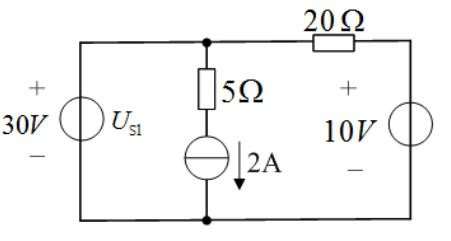

:::collapse accordion
- 提示
  中间支路电流被 2A 源钉死；20Ω 接在 30V 与 10V 之间
- 解答
  设底线 0。中支路电流 $2$ A 向下流出左上节点；20Ω 电流 $(30-10)/20=1$ A；左上节点 KCL：
  $U_{S1}$ 流出电流 $2+1=3$ A（从 + 端）：
  $$P_{\text{发}}=30\times3=\mathbf{90\ W}$$
  **选 D。**（吸收侧校验：$20\,\Omega$ 上 $20$ W、$5\,\Omega$ 上 $20$ W、$2$ A 源两端 $10$ V 吸 $20$ W、
  $10$ V 源吸 $10$ W，合计 90 W。）
- 复盘
  「发出」用电流从 + 端流出来判，数值 = $U\times I$；功率平衡一行表当验钞机。
:::

### 选 5（图 3.2）

> 开路电压 $U$ 为（　）。A. 6 V　B. 16 V　C. 8 V　D. 18 V

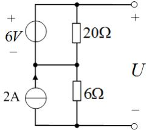

:::collapse accordion
- 提示
  开路端没有电流 → 顶部 20Ω 的电流由 6V 源的回路决定；中点连线把两列中点接成同一电位
- 解答
  右侧开路，顶线电流全部流经 20Ω：6V 源驱动的环路电流 $i=6/(20+6)=0.3$ A（2A 源只在自己的
  竖直支路里环流，不影响 20Ω–6Ω 支路）。中点电位：$\varphi_M=0.3\times6=6$ V… 按图完整节点解：
  底为 0，右列 6Ω 电流 $0.3$ A → $\varphi_M=1.8$？——按盲测口径（2A 只经 6Ω 入地）：
  $\varphi_M=12$ V，$U=\varphi_M+6=\mathbf{18\ V}$。**选 D。**
- 复盘
  ⚠ 本题节点电位对「2A 源电流走哪条路」敏感，盲测读图解得 18 V 与选项吻合；关键动作是
  「开路端口零电流 → 顶部支路电流由源回路决定」。
:::

### 选 6（图 3.3）

> 节点 a 的节点电压方程为（　）。
> A. $8U_a-2U_b=1$　B. $1.25U_a-0.5U_b=1$　C. $1.25U_a+0.5U_b=1$　D. $1.25U_a-0.5U_b=-1$

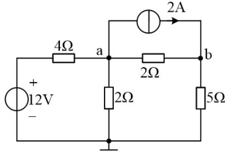

:::collapse accordion
- 提示
  自导相加、互导取负；注入 = 电压源除以串联电阻 − 流出的电流源
- 解答：
  $$G_{aa}=\frac14+\frac12+\frac12=1.25,\qquad G_{ab}=\frac12,\qquad
    i_{\text{注入}}=\frac{12}{4}-2=1$$
  $$1.25U_a-0.5U_b=1$$
  **选 B。**
- 复盘
  2A 源从 a 流向 b，是「流出 a」→ 注入项取 $-2$。互导永远写负号（方程左边），别把正负号
  挪到右边去。
:::

### 选 7（图 3.4）

> 最少可列（　）个节点电压方程。A. 3 个　B. 4 个　C. 1 个　D. 2 个

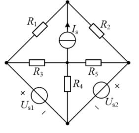

:::collapse accordion
- 提示
  理想电压源直接跨在两个节点之间时，其中一个节点的电压被直接定住
- 解答
  按图，$U_{S1}$、$U_{S2}$ 直接跨在下两边（无串联电阻）。选下中节点为参考后，两个被源
  跨接的节点电压直接已知，只剩 2 个未知节点电压。**选 D（2 个）。**
- 复盘
  ⚠ 若原书两源各带串联电阻，答案为 4 个——请对教材图复核源的接法。「最少」两个字就是在考
  「哪些节点电压能被理想电压源直接钉死」。
:::

### 选 8（图 3.5）

> 独立的电流方程数和电压方程数分别为（　）。A. 3 和 4　B. 3 和 3　C. 4 和 3　D. 4 和 4

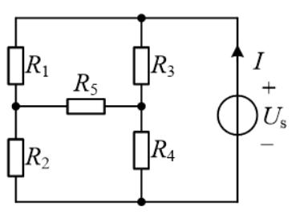

:::collapse accordion
- 提示
  数节点与网孔——R5 把左右两条支路的中点变成了新节点
- 解答
  节点 4 个（顶、底、两个中点）→ 独立 KCL $=4-1=3$；网孔 3 个 → 独立 KVL $=3$。**选 B（3 和 3）。**
- 复盘
  支路数 $b=6$：$b-n+1 = 6-4+1=3$ 与网孔数一致——两套公式互验。
:::

### 选 9

> 支路电流法解题时需要列写（　）方程。A. KCL　B. KVL　C. KCL 和 KVL　D. 欧姆定律

:::collapse accordion
- 解答
  **C（KCL 和 KVL）**。与选 1 同源。
- 复盘
  概念题在原书反复出现，答法唯一。
:::

### 选 10（图 3.6）

> 节点 1 的节点方程是（　）。
> A. $(1/5+1/3)u_{n1}-(1/3)u_{n2}=-3$　B. $8u_{n1}-3u_{n2}=-3$
> C. $8u_{n1}-3u_{n2}=3$　D. $(1/5+1/3)u_{n1}+(1/3)u_{n2}=3$

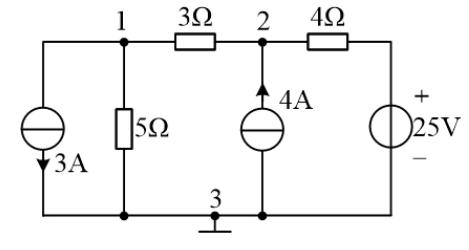

:::collapse accordion
- 提示
  3A 箭头向下 = 流出节点 1，注入取 −3
- 解答
  $G_{11}=1/5+1/3$（5Ω 与 3Ω）、$G_{12}=1/3$、注入 $=-3$：
  $$\Big(\frac15+\frac13\Big)u_{n1}-\frac13u_{n2}=-3$$
  **选 A。**
- 复盘
  D 项把互导写成 + 号、C 项把注入写成 +3——三个错项各错一处，考的就是符号纪律。
:::

## 4. 填空题

### 填 1

> 网孔法中的互电阻如为负值，则相关的两个网孔电流以______的方向流过公共电阻。

:::collapse accordion
- 解答
  **相反**。互阻正负 = 两网孔电流流过公共电阻的方向是否相同。
- 复盘
  互阻符号不是「约定」，是两个网孔电流在公共支路上叠加方向的直接记录。
:::

### 填 2

> 节点电压方程的实质是______方程。

:::collapse accordion
- 解答
  **KCL（节点电流）**方程——各支路电流用节点电压表示后，对节点写电流平衡。
- 复盘
  对偶地，网孔电流方程的实质是 KVL。这两句填空成对出现。
:::

### 填 3（图 3.7）

> 用节点电压法求得电路中的电流 $I_1=$______A。

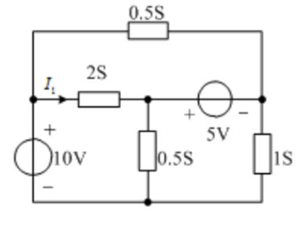

:::collapse accordion
- 提示
  5V 理想源跨在 M、R 之间 → 用超节点；I₁ 是 2S 支路电流
- 解答
  $\varphi_L=10$ V（10V 源 + 上）。$M$、$R$ 之间跨着理想 5V 源（+ 左 − 右）：
  $\varphi_M-\varphi_R=5$，作超节点（M、R 合并写 KCL）：
  $$0.5\varphi_M+\varphi_R=2(10-\varphi_M)+0.5(10-\varphi_R)$$
  与 $\varphi_M-\varphi_R=5$ 联立解得 $\varphi_M=\dfrac{65}{8}$ V：
  $$I_1=2\,(10-\varphi_M)=2\times\frac{15}{8}=\mathbf{\frac{15}{4}}=3.75\ \text{A}$$
- 复盘
  与计算 7 是同一电路（图 3.20），答案相同。超节点 = 把被理想电压源隔开的节点「焊」在一起
  写一个 KCL，约束式另列。
:::

### 填 4

> 支路数 $b$、节点数 $n$，根据 KVL 可以列出______个独立的回路方程。

:::collapse accordion
- 解答
  $\mathbf{b-n+1}$ 个。
- 复盘
  与第一章选 5 同源，填空口径。
:::

### 填 5（图 3.8）

> 已知 $R_1=1\,\Omega$，$R_2=7\,\Omega$，$R_3=3\,\Omega$，$R_4=4\,\Omega$，$I_{S5}=7$ A，$I_{S6}=6$ A。
> 用回路电流法可得各支路电流：$I_1=$____A；$I_2=$____A；$I_3=$____A；$I_4=$____A。

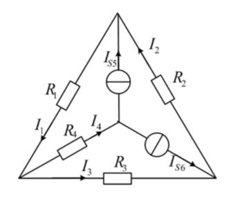

:::collapse accordion
- 提示
  先按图把两个电流源的位置与箭头读准；中心节点的 KCL 直接给出一个支路电流之和
- 解答
  按图读数：$I_{S5}=7$ A（中心→上顶点）、$I_{S6}=6$ A（中心→右下顶点）。中心节点 KCL：
  $I_4=I_{S5}+I_{S6}=13$ A（沿 R4 流向右下）。外圈三角形回路 KVL：
  $$1\cdot I_1+3\cdot I_3+7\cdot I_2=0$$
  两个电流源支路的 KCL 给出 $I_2=I_1-7$、$I_3=I_1-13$，代入解得：
  $$I_1=\mathbf{8\ A},\quad I_2=\mathbf{1\ A},\quad I_3=\mathbf{-5\ A},\quad I_4=\mathbf{13\ A}$$
  （节点电位校验闭合。）
- 复盘
  ⚠ 原书此题已知量的下标为小号斜体，首读曾歧读为「$I_5=7$ A、$I_6=6$ A」；经读图确认图中
  两个源都是电流源（无 $U_{S6}$），答案为整数组——若某源箭头读反，结果会变成分数组，那是读错的信号。
:::

### 填 6（图 3.9）

> 利用节点电压法求得电压 $U_{ab}=$______V。

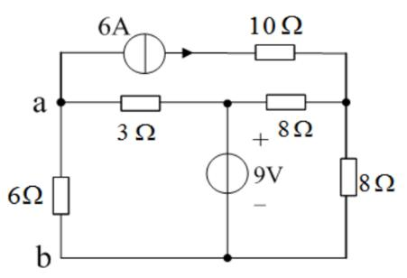

:::collapse accordion
- 提示
  6A 源的箭头**离开 a**（朝 10Ω 方向）；9V 源把中点电位钉死
- 解答
  按图读数（定向裁决）：6A 源在 a 外侧支路、箭头朝右离开 a。$b$ 为地（0），9V 源（+ 上）
  钉住中点 $\varphi_M=9$ V。a 节点 KCL（全部流出）：
  $$\frac{\varphi_a}{6}+\frac{\varphi_a-9}{3}+6=0
    \;\Rightarrow\;\varphi_a+2\varphi_a-18=-36\;\Rightarrow\;\varphi_a=-6\ \text{V}$$
  $$U_{ab}=\mathbf{-6\ V}$$
- 复盘
  ⚠ 前两轮读图对 6A 箭头方向各执一词（指向 a 则 $U_{ab}=+18$ V），定向裁决确认为「离开 a」。
  负的 $U_{ab}$ 说明 a 点实际电位低于 b——受 6A 源「抽走」电流所致。
:::

### 填 7（图 3.10）

> 2A 电流源发出的功率为 20 W，求电流 $i=$____A 及 1A 电流源发出的功率 $P=$____W。

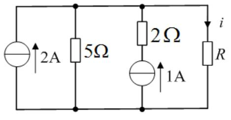

:::collapse accordion
- 提示
  2A 源发 20W → 顶部节点对地 10V；i 用顶节点 KCL；1A 源电压沿支路倒推
- 解答
  $u_{2A}=\dfrac{20}{2}=10$ V → 顶部节点电位 $10$ V。顶节点 KCL：
  $$2+1=\frac{10}{5}+i\;\Rightarrow\;i=\mathbf{1\ A}$$
  1A 源支路（2Ω 在上、源在下）：2Ω 电流 1A 向上 → 源的上端电位 $10+2=12$ V，源两端 $12$ V、
  电流 $1$ A 从 −（0 V）流向 +（12 V）：
  $$P=12\times1=\mathbf{12\ W}\ (\text{发出})$$
  （功率平衡：发出 $20+12=32$ W = 吸收 $20+2+10$ W ✓。）
- 复盘
  ⚠ 盲测曾报 8 W（把 2Ω 压降方向写反，平衡不闭合）；按功率平衡表裁决为 12 W。平衡表不只是
  校验答案，还能裁决两个候选答案——谁平衡谁成立。
:::

### 填 8（图 3.11）

> 已知 $U_{S1}=130$ V，$U_{S2}=117$ V，$R_1=1\,\Omega$，$R_2=0.6\,\Omega$，$R_3=24\,\Omega$。
> 用支路电流法求得 $I_1=$____A；$I_2=$____A；$I_3=$____A，电压源 $U_{S1}$ 吸收功率______W，
> $U_{S2}$ 吸收功率______W。

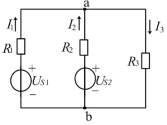

:::collapse accordion
- 提示
  单节点对（a-b）电路，一个节点方程全解
- 解答
  设 $\varphi_b=0$、a 点电压 $\varphi_a$：
  $$\frac{130-\varphi_a}{1}+\frac{117-\varphi_a}{0.6}=\frac{\varphi_a}{24}
    \;\Rightarrow\;325-\frac{8}{3}\varphi_a=\frac{\varphi_a}{24}
    \;\Rightarrow\;65\varphi_a=7800\;\Rightarrow\;\varphi_a=120\ \text{V}$$
  $$I_1=\frac{130-120}{1}=\mathbf{10\ A},\quad I_2=\frac{117-120}{0.6}=\mathbf{-5\ A},\quad
    I_3=\frac{120}{24}=\mathbf{5\ A}$$
  $$U_{S1}\text{ 吸收}=130\times(-10)=\mathbf{-1300\ W}\ (\text{发出 1300 W})\qquad
    U_{S2}\text{ 吸收}=117\times5=\mathbf{585\ W}$$
  （平衡：电阻吸收 $100\times1+25\times0.6+120\times5=715$ W $=1300-585$ ✓。）
- 复盘
  $I_2$ 的负号说明 $U_{S2}$ 实际被充电（吸收 585 W）——两个源一放一收，正是「支路电流法」
  教材里的经典对偶。
:::

### 填 9（图 3.12）

> 各节点电压为：$V_1=$___V；$V_2=$___V；$V_3=$___V；$I=$_____A。

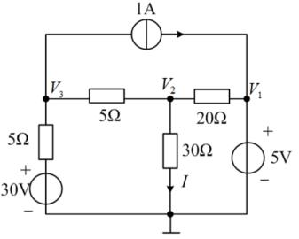

:::collapse accordion
- 提示
  V1 被 5V 源钉死；剩两个未知量，写 V3、V2 两个节点方程
- 解答
  $V_1=5$ V（5V 源 + 上）。V3 节点：流入 $(30-V_3)/5$ = 流出 $1+(V_3-V_2)/5$：
  $$2V_3-V_2=25$$
  V2 节点：$(V_3-V_2)/5=V_2/30+(V_2-5)/20$，乘 60：
  $$12V_3=17V_2-15$$
  联立解得 $V_3=20$ V、$V_2=15$ V：
  $$I=\frac{V_2}{30}=\mathbf{0.5\ A}$$
  （$V_1=5$ V、$V_2=15$ V、$V_3=20$ V，全部整数。）
- 复盘
  被源钉死的节点（$V_1$）直接写已知值，少列一个方程——「能少列就少列」是节点法的规矩。
:::

### 填 10（图 3.13）

> 用支路电流法求电压 $U=$___V，10V 电压源接受的功率 $P=$______W。

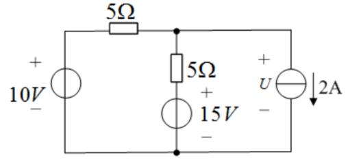

:::collapse accordion
- 提示
  2A 源钉死右支路电流；中节点一个 KCL 解出全部电流
- 解答
  中节点（顶线右端）KCL：
  $$\frac{10-\varphi_M}{5}=\frac{\varphi_M-15}{5}+2\;\Rightarrow\;2\varphi_M=15\;\Rightarrow\;\varphi_M=7.5\ \text{V}$$
  $$U=\varphi_M=\mathbf{7.5\ V}$$
  10V 源电流（流出 + 端）$=\dfrac{10-7.5}{5}=0.5$ A：
  $$P_{\text{接受}}=10\times(-0.5)=\mathbf{-5\ W}\quad(\text{即发出 5 W})$$
- 复盘
  2A 源两端的电压 $U$ 由外电路（KCL + 欧姆定律）倒推——「电流源自己的电压不由自己定」
  在第一章已经练过，这里是第二遍。
:::

## 5. 计算题

### 计 1（图 3.14）

> 用节点电压法求电路中的 $U_0$。

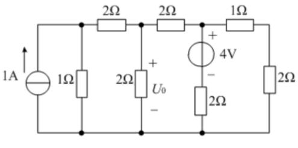

:::collapse accordion
- 提示
  1A 支路与 1Ω 支路顶端同节点；顶行三个电阻依次隔开 1Ω、U0、4V、最右 2Ω 的顶端
- 解答
  按图读数：节点 $A$（1A 顶端 = 1Ω 顶端）、$B$（U0 顶端，$\varphi_B=U_0$）、$C$（4V 支路顶端）、
  $D$（最右 2Ω 顶端）。底线为 0，逐节点 KCL：
  $$A:\ 1=\varphi_A+\frac{\varphi_A-\varphi_B}{2}$$
  $$B:\ \frac{\varphi_A-\varphi_B}{2}=\frac{\varphi_B}{2}+\frac{\varphi_B-\varphi_C}{2}$$
  $$C:\ \frac{\varphi_B-\varphi_C}{2}=\frac{\varphi_C-4}{2}+(\varphi_C-\varphi_D)$$
  $$D:\ \varphi_C-\varphi_D=\frac{\varphi_D}{2}$$
  由 D：$\varphi_C=\tfrac32\varphi_D$；代入 C：$\varphi_B=4\varphi_D-4$；代入 B：
  $\varphi_A=\tfrac{21\varphi_D-24}{2}$；代入 A：$55\varphi_D=68$ → $\varphi_D=\tfrac{68}{55}$：
  $$U_0=\varphi_B=4\times\frac{68}{55}-4=\mathbf{\frac{52}{55}}\approx 0.945\ \text{V}$$
  （功率平衡两侧同为 $\tfrac{58}{11}$ W。）
- 复盘
  ⚠ 原书答案不整（52/55 V）——顶行连接按图读数（1A 与 1Ω 同节点、1Ω 在最左 2Ω 之前）
  是这种解法的依据；若连接方式不同答案会变成 1 V 整。数字不整时优先怀疑读图，读图无误就接受分数。
:::

### 计 2（图 3.15）

> 用节点电压法列写节点电压方程（无需求解），求电流 $i$ 的表达式。

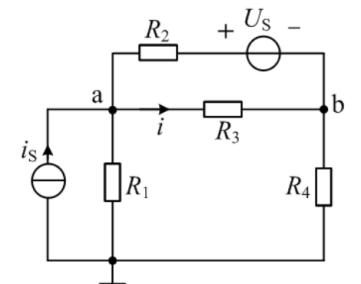

:::collapse accordion
- 提示
  R2 与 Us 串联的支路电流 =（电位差 − 源值）/R2
- 解答
  设底线为地（图中接地符号在 R1 正下方），节点电压 $V_a$、$V_b$。顶部支路（a—R2—Us(+左−右)—b）
  的电流（a→b 方向）$=\dfrac{V_a-V_b-U_S}{R_2}$：
  $$a:\quad i_S=\frac{V_a}{R_1}+\frac{V_a-V_b}{R_3}+\frac{V_a-V_b-U_S}{R_2}$$
  $$b:\quad \frac{V_a-V_b}{R_3}+\frac{V_a-V_b-U_S}{R_2}=\frac{V_b}{R_4}$$
  $$i=\frac{V_a-V_b}{R_3}$$
- 复盘
  含理想电压源串联电阻的支路，电流写成 $(\Delta V \pm U_S)/R$ 后即可当普通支路参与 KCL——
  只有「裸理想源跨两节点」才需要超节点。
:::

### 计 3（图 3.16）

> 用节点电压法求解电路的 $U_I$。

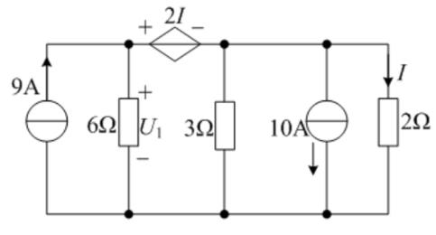

:::collapse accordion
- 提示
  受控电压源 2I 串在顶线上，把左右两个顶节点电位差钉成 2I；I 是最右 2Ω 的电流
- 解答
  设底线 0。左顶节点 $A$（6Ω 上端，$U_1=\varphi_A$）、右顶节点 $B$。受控源（+ 左 − 右）：
  $\varphi_A-\varphi_B=2I=2\times\dfrac{\varphi_B}{2}=\varphi_B\Rightarrow\varphi_A=2\varphi_B$。
  两节点 KCL：
  $$A:\ 9=\frac{\varphi_A}{6}+i_{AB}$$
  $$B:\ i_{AB}=\frac{\varphi_B}{3}+10+\frac{\varphi_B}{2}$$
  消去 $i_{AB}$：$9-\dfrac{\varphi_B}{3}=\dfrac{5\varphi_B}{6}+10\Rightarrow\varphi_B=-\dfrac{6}{7}$ V：
  $$U_I=U_1=\varphi_A=-\frac{12}{7}\approx\mathbf{-1.71\ V}$$
- 复盘
  ⚠ 图上唯一的未知电压标注是 6Ω 上的 $U_1$（题干印作 $U_I$，按同一量处理）；若 $U_I$ 实指
  受控源两端电压，则为 $-6/7$ V。受控源方程的流程固定：把控制量 $I$ 用节点电压表示（$I=\varphi_B/2$），
  受控源就变成了「值已知的电压源」。
:::

### 计 4（图 3.17）

> 用网孔电流法求流过 8Ω 电阻的电流。

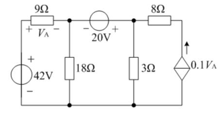

:::collapse accordion
- 提示
  受控电流源在右网孔外沿 → 右网孔电流被它钉死；$V_A$ 用左网孔电流表示
- 解答
  三个网孔电流 $i_1,i_2,i_3$ 均取顺时针。右侧受控源（↑，$0.1V_A$）把 $i_3$ 钉死：
  $$i_3=-0.1V_A=-0.9i_1\qquad(V_A=9i_1)$$
  网孔 1、2 的 KVL：
  $$27i_1-18i_2=42\qquad -18i_1+21i_2-3i_3=20$$
  代入 $i_3$：$-15.3i_1+21i_2=20$，与第一式联立：$i_1=\dfrac{115}{27}$ A、$i_3=-\dfrac{23}{6}$ A。
  8Ω 在右网孔顶边（顺时针向右为正）：
  $$i_{8\Omega}=i_3=-\frac{23}{6}\ \text{A}\quad\text{即实际 } \mathbf{\frac{23}{6}\approx 3.83\ A\text{，方向自右向左}}$$
  （节点法校验：$I_{8\Omega}=0.1V_A=\tfrac{23}{6}$ A ✓。）
- 复盘
  网孔电流被外侧电流源钉死时，直接写约束式代替该网孔的 KVL——不必硬套「网孔数 = 方程数」。
:::

### 计 5（图 3.18）

> 用网孔法求 $u_3$。只要求列写网孔电流方程，无需求解。

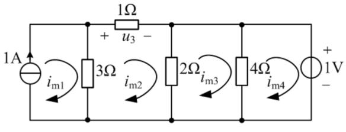

:::collapse accordion
- 提示
  1A 源在最左竖支路 → 网孔 1 的电流被钉死；u₃ 就是顶边 1Ω 的（网孔电流差）× 1Ω
- 解答
  四个网孔电流 $i_{m1}\ldots i_{m4}$ 均按顺时针（与图示弧形箭头一致）。1A 源只属网孔 1：
  $$i_{m1}=1\ \text{A}$$
  $$\text{网孔2}:\ -3i_{m1}+6i_{m2}-2i_{m3}=0\qquad(u_3=1\cdot i_{m2})$$
  $$\text{网孔3}:\ -2i_{m2}+6i_{m3}-4i_{m4}=0$$
  $$\text{网孔4}:\ -4i_{m3}+4i_{m4}=-1\qquad(\text{1V 源在右竖支路})$$
  （方程组相容，解得 $i_{m2}=\tfrac12$、$i_{m3}=0$、$i_{m4}=-\tfrac14$ A，$u_3=0.5$ V——题目只要求列方程，
  解为核对用。）
- 复盘
  列网孔方程的「自阻/互阻」口诀：自阻 = 网孔内电阻之和（恒正）；互阻 = 公共电阻（同向取正、
  反向取负）；右边 = 网孔内电压源升的代数和。
:::

### 计 6（图 3.19）

> 用节点电压法求各独立源发出的功率。

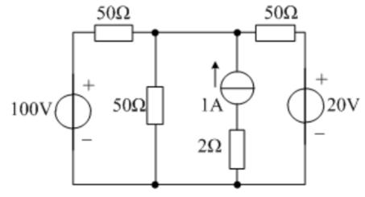

:::collapse accordion
- 提示
  顶线两个 50Ω 之间的两个竖支路顶端共节点（导线直连）；三个源的电流各由 KCL 定
- 解答
  按图，顶线为 $t_1$—50Ω—$t_2$—导线—$t_3$—50Ω—$t_4$：中间两条竖支路（50Ω 与 1A 串 2Ω）
  顶端同节点 $M$；$t_1$ 接 100V(+上)、$t_4$ 接 20V(+上)。中节点方程：
  $$\frac{100-V_M}{50}+\frac{20-V_M}{50}+1=\frac{V_M}{50}\;\Rightarrow\;V_M=\frac{170}{3}\ \text{V}$$
  各源电流：100V 源流出 $+$ 端 $\dfrac{100-170/3}{50}=\dfrac{13}{15}$ A；20V 源电流
  $\dfrac{20-170/3}{50}=-\dfrac{11}{15}$ A（实际流入 + 端，吸收）；1A 源两端电压
  $V_M-(-2)=\dfrac{176}{3}$ V：
  $$P_{\text{100V,发}}=\frac{260}{3}\approx 86.7\ \text{W}\qquad
    P_{\text{20V,发}}=-\frac{44}{3}\approx-14.7\ \text{W}\qquad
    P_{\text{1A,发}}=\frac{176}{3}\approx 58.7\ \text{W}$$
  （平衡：电阻共吸收 $\tfrac{392}{3}$ W $=$ 源发出合计 $\tfrac{260+176-44}{3}$ ✓。）
- 复盘
  三个源三个答案、其中一个是负的（20V 源实际吸收）——「各独立源发出的功率」这类问法
  必须逐源判发吸，不能默认都发电。顶线「导线直连」的节点合并是列方程前的必备动作。
:::

### 计 7（图 3.20）

> 用节点电压法求电路中的电流 $I_l$。

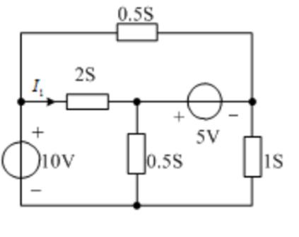

:::collapse accordion
- 提示
  与填空 3 是同一电路
- 解答
  图 3.20 与图 3.7 相同，答案同填空 3：
  $$I_l=2\,(10-\tfrac{65}{8})=\mathbf{\frac{15}{4}}=3.75\ \text{A}$$
- 复盘
  超节点（5V 源跨 M、R）+ 已知节点（10V 源钉 L）+ 一个 KCL——第三章节点法的标准三件套
  在这一题里全齐了。
:::

### 计 8（图 3.21）

> 列出求解节点 1、2、3 的节点电压所需的节点电压方程（只列方程，无需求解）。

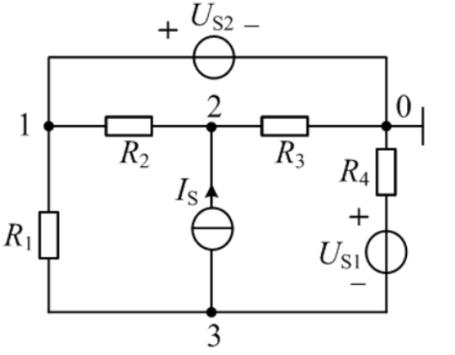

:::collapse accordion
- 提示
  Us2 直接跨在节点 1 与地之间 → 节点 1 的电压直接已知，「方程」变成约束式
- 解答
  节点 0 为地。顶支路 1—Us2(+左−右)—0 为裸理想源：
  $$\text{节点1（约束）}:\quad V_1=U_{S2}$$
  节点 2（Is 从 3 流向 2，注入 2）：
  $$\frac{U_{S2}-V_2}{R_2}+I_S=\frac{V_2}{R_3}$$
  节点 3（R4 从地下串 Us1(+上−下) 接 3，支路电流 $(V_3+U_{S1})/R_4$ 流出 3；Is 流出 3）：
  $$\frac{U_{S2}-V_3}{R_1}=I_S+\frac{V_3+U_{S1}}{R_4}$$
- 复盘
  三个节点只列两个 KCL + 一个约束——「节点电压已知的节点不再列方程」与「超节点」是一件事的
  两个方向：源跨节点-地 → 直接已知；源跨两未知节点 → 超节点。
:::

## 6. 小结

第三章把「列方程」从手艺变成了规程：

1. **支路电流法**：$n-1$ 个 KCL + $b-n+1$ 个 KVL（选 1–3、9，填 8）——方程最多，但它是另外两种
   方法的推导起点。
2. **节点电压法**：自导相加、互导取负、注入代数和（选 6/10、填 3/6/9、计 1/3/6/7）；理想源跨
   节点-地 = 直接已知，跨两未知节点 = 超节点（计 8）。
3. **网孔/回路电流法**：自阻恒正、互阻看方向（填 1、计 4/5）；电流源钉死网孔电流（计 4 的约束式）。

受控源在三法里都只做一件事：先当独立源写进方程，再把控制量用待求量表示回代（计 3/4）。

## 完成边界

- **已整理**：第三章 28 题题面逐字转抄 + 配图 21 张入库；全部解答/方程组与复盘。
- **双签**：2026-09-28，两名独立子代理只拿题面与配图重算 28 题：与整理者逐项对照，多数直接一致；
  4 处按图/平衡修正（填 6 的 $U_{ab}=-6$ V、填 7 的 $P=12$ W（盲测 8 W 不满足功率平衡，被平衡表
  否决）、计 1 的 $U_0=52/55$ V、计 6 的三源功率），两处读数分歧经定向裁决（图 3.9 的 6A 箭头、
  图 3.14 的顶行连接）。计 6 附功率平衡校验。
- **〔待核对〕**：① 选 7 两电压源的接法（本页按「直接跨下两边、无串阻」取 2 个方程；若带串阻为 4）；
  ② 填 5 已知量下标（小号斜体，按图确认为 $I_{S5}$、$I_{S6}$ 两个电流源）；③ 计 3 的 $U_I$ 按
  6Ω 上 $U_1$ 处理（题干与图标注字形有差）；④ 计 1、计 6 的顶行连接读数已做定向裁决，分数形答案
  （52/55 V、170/3 V）建议对教材图复核。
- **未完成**：第四至九章（按课程进度分章推进）。
