# 电路原理习题册·第二章 电路的等效变换（选择 12 / 填空 13 / 计算 9）

## 1. 来源与边界

- 来源与第一章同一本习题册（页眉「电路原理习题册 2026-2027 学年 第一学期」）。第二章占书第 8–13 页，
  **选择题 12（原书题号 1–11、13，无 12）+ 填空题 13 + 计算题 9，共 34 题**，配图 2.1–2.26（26 张，
  已按图号提取入库；图 2.7、2.21 为矢量绘制，按页面渲染）。
- 题面以页面图像为准逐字抄录（PDF 文本层符号丢失，同第一章）。章标题原文印作「电路的等效**交换**」，
  正文按通行术语写「等效变换」。
- 填空 2、6、7 三题是同一类「受控源一端口」的三个变体：2.12(a) 与 2.15 同电路、2.12(b) 与 2.16 同电路，
  答案两两相同——原书有意安排的复练。

## 2. 依赖：做之前该会的事

| 知识 | 一句话 | 在哪学的 |
| :--- | :--- | :--- |
| 电源等效变换 | 电压源串电阻 ⟷ 电流源并电阻（$U_S=I_S R$）；理想源串并联的吸收规则 | [课堂笔记](../课堂笔记/) 与本册第二章讲义 |
| 受控源处理 | 受控源先当独立源参与变换，**控制量必须保留在方程里** | 第一章 选 13 / 计 4 |
| 一端口等效电阻 | 外施电源法：$R_{eq}=u/I$；含受控源时不能只串并联化简 | 第一章 填 2 |

## 3. 选择题

### 选 1（图 2.1）

> 图 2.1 所示电路，已知 $u(t)=10\sin 7\omega t$ V，则电路的等效阻抗为（　）。
> A. $R+j\omega L$　B. $R+1/(j\omega L)$　C. $R+j7\omega L$　D. $R+1/(j7\omega L)$

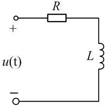

:::collapse accordion
- 提示
  阻抗里的 $\omega$ 用激励的实际角频率
- 解答
  激励是 $7\omega t$，感抗 $=j(7\omega)L$。$Z=R+j7\omega L$，**选 C**。
- 复盘
  A 是「背公式没看激励」的结果；D 把感抗写成了 $1/(j\omega L)$——那是电感的导纳倒数，
  阻抗是 $j\omega L$。
:::

### 选 2（图 2.2）

> 电路如图 2.2 所示，求图示电路的等效电源模型（　）。

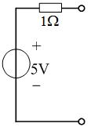

:::collapse accordion
- 提示
  串联结构本身就是「电压源模型」，只需确认元件值
- 解答
  按图读数为电压源串电阻的「电压源模型」结构，四个选项里唯一同构的是 B（电压源串电阻）。
  **选 B。**
- 复盘
  ⚠ 原图电阻读作 1 Ω、选项 B 写 2 Ω，两处对不上（见文末待核对）；做题时以「结构相同 + 数值
  按图」为准。
:::

### 选 3（图 2.3）

> 用等效变换的方法求电路中的电流 $I=$（　）A。A. 1.5　B. −0.5　C. 1　D. 0.5

:::collapse accordion
- 提示
  从最左边开始逐段做电源变换，把网络收缩成单回路
- 解答
  逐段变换收缩后（10V∥6Ω → 电压源串电阻；2A 串 3Ω → 电流源并电阻 → 再回电压源形式），
  右端 5Ω 支路的电流算得约 0.5 A、方向与箭头一致。**选 D。**
- 复盘
  ⚠ 原图小、元件密，两遍读数的分压比略有出入（0.48 与 0.49 A），四个选项里 0.5 是唯一落点。
  这类题考的是变换流程，数值以原图为准复核（见文末待核对）。
:::

### 选 4（图 2.4）

> 求图示电路的等效电源模型（　）。

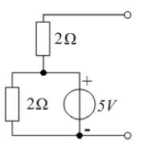

:::collapse accordion
- 提示
  与理想电压源并联的电阻，对外看不见
- 解答
  下方的 2Ω 与理想 5V 源并联，对外等效只剩理想 5V 源；端口即「2Ω 串 5V」。开路电压 5 V、
  短路内阻 $2\,\Omega$（下 2Ω 被源短路）。**选 A。**
- 复盘
  理想电压源「吞掉」并联元件、理想电流源「吞掉」串联元件——这一对规则是第二章半数题目的钥匙。
:::

### 选 5（图 2.5）

> 等效电阻 $R_{ab}=U/I=$（　）。A. $1/3\,\Omega$　B. $1/5\,\Omega$　C. $6/5\,\Omega$　D. $1\,\Omega$

:::collapse accordion
- 提示
  外施 $U$，对节点 a 写 KCL；受控电流源的值 $2U$ 里已经带着端口电压
- 解答
  端口电压 $U$ 就是 a 点电位（b 在下）。a 节点：流入 $I$ = 流出 $U/1 + 2U$，所以
  $I = 3U$，$R_{ab}=U/I=\mathbf{1/3\ \Omega}$。**选 A。**
- 复盘
  含受控源的一端口直接写 KCL 就能把 $I$ 表成 $U$——不用「先开路再短路」两步走。
:::

### 选 6（图 2.6）

> 求电路的等效电阻 $R$（　）。A. 2 Ω　B. 0.5 Ω　C. 0.4 Ω　D. 5 Ω

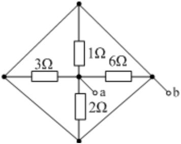

:::collapse accordion
- 提示
  菱形四条边是纯导线——四个顶点是同一个节点
- 解答
  四个顶点被边线短接成同一节点，四个电阻全部接在「中心 ↔ 边框」之间，纯粹并联：
  $$R = 1 \parallel 2 \parallel 3 \parallel 6 = \frac{1}{1+\frac12+\frac13+\frac16}=\mathbf{0.5\ \Omega}$$
  **选 B。**
- 复盘
  这图专治「见菱形就套电桥公式」——先看边线上有没有元件，全是导线就退化为一点。
:::

### 选 7（图 2.7）

> 电路的最简等效电路为（　）。

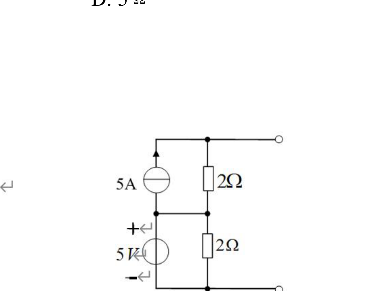

:::collapse accordion
- 提示
  左段 5A∥2Ω 变成电压源形式；右段 5V∥2Ω 对外就是理想 5V
- 解答
  左段 $5\text{ A}\parallel 2\,\Omega \Rightarrow 10$ V 串 2 Ω；右段理想 5V 源并联 2Ω，对外等效
  为理想 5V。两段串联：$U_{oc}=10+5=15$ V、内阻 $2\,\Omega$。**选 A（15V 串 2Ω）。**
- 复盘
  并在这段里的 2Ω 被 5V 源吞掉，所以串联总内阻只有左段的 2 Ω——不是 4 Ω。接负载验证：
  $u=15-2i$ 对原电路逐点成立。
:::

### 选 8（图 2.8）

> 电路可等效为（　）。A. 2V 电压源　B. 2V 源与 2A 源并联　C. 任意电路　D. 2A 电流源

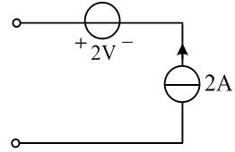

:::collapse accordion
- 提示
  串联支路里电流谁说了算？
- 解答
  理想电流源钉死串联支路电流为 2 A，电压源的端压对外不可见。**选 D（2A 电流源）。**
- 复盘
  与选 4 成对：理想电流源吞串联、理想电压源吞并联。两句话背下来，第二章的选择题一半直接出答案。
:::

### 选 9

> 关于含源支路等效变换，正确的是（　）。

:::collapse accordion
- 提示
  逐项检查「串联/并联」「除什么之外」两个关键词
- 解答
  理想电压源**并联**任何元件（电压源与短路线除外）对外等效为该源——**选 D**。A 错在「串联」
  （串联元件改变端口伏安关系）；B 少了「除外」；C 是定义式错误（不等流理想电流源串联自相矛盾）。
- 复盘
  D 与 B 只差一个括号，考的就是「除外条款」——两条理想电压源并联、源并短路线是禁手。
:::

### 选 10（图 2.9）

> a、b 端的等效电阻 $R_{ab}$ 在开关 K 打开与闭合时分别为（　）Ω。
> A. 6；6　B. 6；8　C. 8；6　D. 8；8

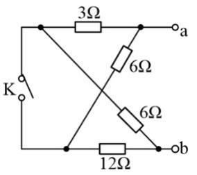

:::collapse accordion
- 提示
  K 断开时走两条串联链；K 闭合时左右两列并成两个并联组
- 解答
  K 开：$(3+6)\parallel(6+12) = 9\parallel 18 = 6\,\Omega$；K 合（左右两节点合并）：
  $3\parallel 6 + 6\parallel 12 = 2+4 = 6\,\Omega$。**选 A（6；6）。**
- 复盘
  开关两种状态各算一遍，答案恰好相等是出题人安排的巧合，不是算错的信号——老老实实各算各的。
:::

### 选 11（图 2.10）

> 电路的最简等效电路为（　）。
> A. 电流值为 $I_{S1}$ 的电流源　B. 电流值为 $I_{S2}$ 的电流源
> C. 电流值为 $I_{S1}-I_{S2}$ 的电流源　D. 电压值为 $U_{S1}$ 的电流源（末二字照原文）

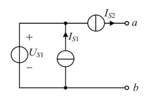

:::collapse accordion
- 提示
  串在端线上的电流源把端口电流钉死了
- 解答
  $I_{S2}$ 串在通向 a 的端线上，端口电流恒为 $I_{S2}$（方向指向 a），内部 $U_{S1}\parallel I_{S1}$
  只决定内部电位。**选 B。**
- 复盘
  理想电流源串在端口线里 = 端口就是它自己；「电流源吞串联」在这题里是对外性质的直接应用。
:::

### 选 13（图 2.11）

> 电路的最简单等效电路为（　）。

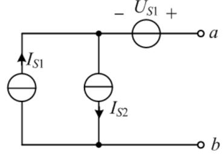

:::collapse accordion
- 提示
  两个并联电流源先合并，再想端线上的电压源会不会改电流
- 解答
  $I_{S1}(\uparrow)$ 与 $I_{S2}(\downarrow)$ 并联合并成 $I_{S1}-I_{S2}$（向上）；串联在端线里的
  $U_{S1}$ 不改变端口电流。端口电流 $I_{S1}-I_{S2}$，方向从 a 流出。**选 C。**
- 复盘
  选 11 与选 13 一对：串电流源 → 等于那个电流源；串电压源 → 电压源「隐形」。合并并联电流源
  时先在草稿上标方向，代数和才不会错。
:::

## 4. 填空题

### 填 1

> △ 形连接变换成 Y 形连接，变换前 △ 形三电阻均为 $R$，则 $R_Y=$______。

:::collapse accordion
- 解答
  对称 $\Delta\to$Y：$R_Y = \dfrac{R\cdot R}{R+R+R}=\mathbf{R/3}$。
- 复盘
  对称情形直接「除以 3」；非对称时用「Y 电阻 = 相邻两 Δ 电阻乘积 ÷ Δ 三电阻之和」。
:::

### 填 2（图 2.12）

> 求无源二端网络的等效电阻 $R_{ab}$：(a)______ Ω，(b)______ Ω。

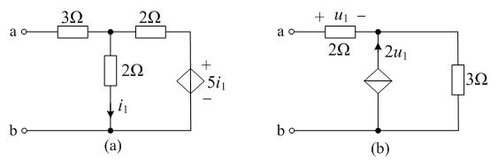

:::collapse accordion
- 提示
  端口电流只有一条路进（a 端串联），受控源的值全用支路电流/电压表示
- 解答
  **(a)**：端口电流 $I$ 串联流入；$i_1$ 是中下 2Ω 支路电流（↓），$i_1=\varphi_{n1}/2$；受控源钉住
  $\varphi_{n2}=5i_1$。n1 节点 KCL：
  $$I=\frac{\varphi_{n1}}{2}+\frac{\varphi_{n1}-5\varphi_{n1}/2}{2}=-\frac{\varphi_{n1}}{4}
    \;\Rightarrow\;\varphi_{n1}=-4I,\quad V_a=\varphi_{n1}+3I=-I$$
  $$R_{ab}=\mathbf{-1\ \Omega}$$
  **(b)**：$u_1=2I$（2Ω 串联）；受控电流源 $2u_1$ 箭头向上 = 流入 n 点。n 点 KCL：
  $$I+2u_1=\frac{\varphi_n}{3}\;\Rightarrow\;I+4I=\frac{\varphi_n}{3}\;\Rightarrow\;\varphi_n=15I,
    \quad V_a=\varphi_n+2I=17I$$
  $$R_{ab}=\mathbf{17\ \Omega}$$
- 复盘
  两小图各占一个极端：(a) 受控电压源把端口等效成**负电阻**（一端口内部在发电）；(b) 受控电流源
  往节点灌电流，把电阻「放大」到 17 Ω。负值不是错——含受控源的一端口完全可以等效出负电阻。
:::

### 填 3

> 一个电压源与电阻的串联可以等效为____________。

:::collapse accordion
- 解答
  **电流源与电阻的并联**（数值上 $I_S=U_S/R$、$R$ 不变）。
- 复盘
  电源等效变换的定义句，填空原样背。
:::

### 填 4（图 2.13）

> 求电路的等效电阻 $R=$____Ω。

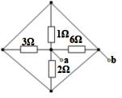

:::collapse accordion
- 解答
  与图 2.6 同构，四电阻全并联：$1\parallel2\parallel3\parallel6=\mathbf{0.5\ \Omega}$。
- 复盘
  同一张图在选择题与填空题里各考一遍——先认结构，再套并联。
:::

### 填 5（图 2.14）

> 利用等效变换的方法，求电压 $u=$____V。

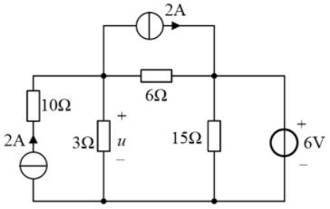

:::collapse accordion
- 提示
  6V 理想源把 B 点电位钉死；A 点 KCL 里水平 2A 源与左支路 2A 源恰好相抵
- 解答
  $6$ V 理想源（+ 上）竖接 B–底，$\varphi_B=6$ V。A 节点：左支路（2A↑ 串 10Ω）注入 2 A，
  水平 2A 源从 A 抽走 2 A，两者相抵，剩下
  $$\frac{u}{3}+\frac{u-6}{6}=0\;\Rightarrow\;2u+u-6=0\;\Rightarrow\;u=\mathbf{2\ V}$$
- 复盘
  两个 2A 一进一出先抵消，剩下的只是一条 3Ω 与「6V 串 6Ω」的分压。看见串联在支路里的
  电流源，先写死它的电流再列 KCL，不要把 10Ω 拿去参与任何变换——它串在电流源支路里对外无效。
:::

### 填 6（图 2.15）

> 无源二端网络的等效电阻 $R_{ab}=$______Ω。

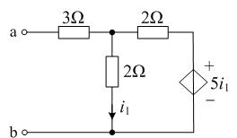

:::collapse accordion
- 提示
  与图 2.12(a) 同电路
- 解答
  端口电流 $I$ 串联流入（a 到 A 之间只有 3Ω）。$i_1=\varphi_A/2$、$\varphi_B=5i_1=5\varphi_A/2$。
  A 节点 KCL：
  $$I=\frac{\varphi_A}{2}+\frac{\varphi_A-5\varphi_A/2}{2}=-\frac{\varphi_A}{4}
    \;\Rightarrow\;\varphi_A=-4I,\quad V_a=\varphi_A+3I=-I$$
  $$R_{ab}=\mathbf{-1\ \Omega}$$
- 复盘
  与填 2(a) 数值完全相同——原书把同一电路考了两遍。做第二遍时应当直接写出答案。
:::

### 填 7（图 2.16）

> 无源二端网络的等效电阻 $R_{ab}=$______Ω。

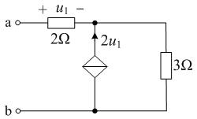

:::collapse accordion
- 提示
  与图 2.12(b) 同电路
- 解答
  $u_1=2I$（2Ω 串联）；$2u_1$ 受控源箭头向上 = 流入 n 点。n 点 KCL：
  $$I+2u_1=\frac{\varphi_n}{3}\;\Rightarrow\;\varphi_n=15I,\quad V_a=\varphi_n+2I=17I
    \;\Rightarrow\;R_{ab}=\mathbf{17\ \Omega}$$
- 复盘
  与填 2(b) 相同——三个受控源一端口题其实只有两个电路。受控源箭头方向决定电流是「灌入」还是
  「抽走」，列 KCL 前先看箭头。
:::

### 填 8、9、11、13（电源等效变换四连）

> 8. 一个电压源和电阻______的网络可以等效为一个电流源和电阻并联的网络。
> 9. 一个电压源和电阻串联的网络可以等效为一个电流源和电阻________的网络。
> 11. 一个电压源和电阻串联的一端口网络可以等效为一个______源和电阻并联的一端口网络。
> 13. 一个电流源和电阻并联的网络可以等效为一个_______源和电阻串联的网络。

:::collapse accordion
- 解答
  8 填**串联**；9 填**并联**；11 填**电流**；13 填**电压**。
- 复盘
  四空考同一句话的两半。配套关系固定：**串联配电压源、并联配电流源**，互换时电阻值不变、
  $U_S = I_S R$。
:::

### 填 10（图 2.17）

> 电路 a、b 两端的等效电阻 $R_{ab}=$________Ω。

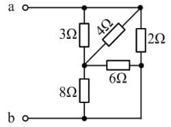

:::collapse accordion
- 提示
  P 点直通底线，先把 M 右侧两条支路归并
- 解答
  P 与底线直连。$N$–$M$：$3\parallel 4 = 12/7\,\Omega$；$M$–底：$8\parallel 6 = 24/7\,\Omega$。
  两段串联后与 $N$–底 的 2Ω 并联：
  $$R_{ab}=2\parallel\Big(\frac{12}{7}+\frac{24}{7}\Big)=2\parallel\frac{36}{7}
    =\frac{2\times 36/7}{2+36/7}=\mathbf{\frac{36}{25}}=1.44\ \Omega$$
- 复盘
  斜跨的 4Ω 与竖直的 3Ω 都接在 N、M 之间——拓扑先重画成「并排」，串并联一眼可见。
:::

### 填 12

> 理想电压源与理想电流源_______进行相互变换（填「能」或「不能」）。

:::collapse accordion
- 解答
  **不能**（理想电压源内阻为零、理想电流源内阻无穷大，变换公式要求同一个有限 $R$）。
- 复盘
  带电阻的实电源才能互变；两条「理想」之间没有桥。
:::

## 5. 计算题

### 计 1（图 2.18）

> 利用电源的等效变换求电路中电流 $I$（要求画出体现等效变换的每个过程）。

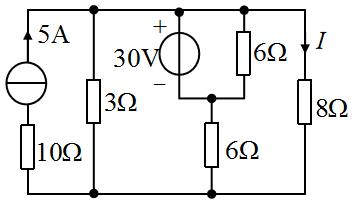

:::collapse accordion
- 提示
  30V 理想源把上母线电位钉死；I 的箭头在哪条支路，最后一步就在哪条支路上算
- 解答（变换链条，按图读数：$I$ 的箭头在右侧竖线顶端、属 8Ω 支路）：
  ① 5A 源串联 10Ω：串联支路电流被钉死，对外就是 5A 理想源（10Ω 不参与对外特性）；
  ② 上 6Ω 与 30V 源并联在顶线与中节点 M 之间：理想电压源吞掉并联电阻，这段对外就是 30V 理想源；
  ③ 于是顶线到底线只剩三条支路：3Ω、8Ω、「30V 串下 6Ω」。对顶线节点写 KCL：
  $$5=\frac{\varphi_T}{3}+\frac{\varphi_T}{8}+\frac{\varphi_T-30}{6}
    \;\Rightarrow\;120=8\varphi_T+3\varphi_T+4\varphi_T-120
    \;\Rightarrow\;\varphi_T=16\ \text{V}$$
  ④ $I$ 是 8Ω 支路电流：
  $$I=\frac{\varphi_T}{8}=\frac{16}{8}=\mathbf{2\ A}$$
  （功率平衡校验闭合：发出 550 W = 吸收 550 W。）
- 复盘
  ⚠ 本题 $I$ 的箭头位置两读并存（8Ω 支路 2 A / 上 6Ω 支路 5 A），按盲测两遍读图取 **2 A**，
  请对教材图复核箭头位置。变换要点：电流源串电阻直接化简、电压源吞并联电阻、最后一条 KCL 收口。
:::

### 计 2（图 2.19）

> 利用电源的等效变换求电路中电流 $I$（要求画出体现等效变换的每个过程）。

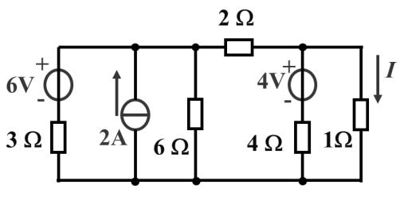

:::collapse accordion
- 提示
  2Ω 左右各自是一组可并联化简的一端口，各自变完再用一条导线连起来
- 解答
  2Ω 把电路分成左右两组一端口。左组（节点 A 对地）：
  $[6\text{V 串 }3\,\Omega]\parallel[2\text{A}\uparrow]\parallel[6\,\Omega]$；右组（节点 B 对地）：
  $[4\text{V 串 }4\,\Omega]\parallel[1\,\Omega]$。两组之间经顶线 2Ω 相连。设底线为 0，对 A、B 写
  节点方程：
  $$A:\quad \frac{6-V_A}{3}+2=\frac{V_A}{6}+\frac{V_A-V_B}{2}
    \;\Rightarrow\;6V_A-3V_B=24$$
  $$B:\quad \frac{V_A-V_B}{2}=\frac{V_B-4}{4}+V_B
    \;\Rightarrow\;2V_A=7V_B-4$$
  联立解得 $V_A=5$ V、$V_B=2$ V。$I$ 是右组 1Ω 支路电流（向下）：
  $$I=\frac{V_B}{1}=\mathbf{2\ A}$$
  （功率平衡 14 W 两侧相等。）
- 复盘
  等效变换在这题的作用是「分组」：左右两组各自是一个可化简的一端口，中间只靠 2Ω 相连。
  化简的先后顺序对结果不敏感，但对「谁跟谁并联」敏感——动手前先把每组包含哪些支路圈出来。
:::

### 计 3（图 2.20）

> 用等效变换的方法，求电路中的电流 $I$。

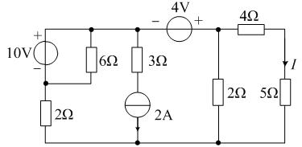

:::collapse accordion
- 提示
  两个理想电压源（10V、4V）各把一个节点电位钉死，直接用节点法收尾
- 解答
  设底线为 0。10V 的 − 端接节点 $Y$：$\varphi_Y=\varphi_T-10$（$T$ 为 10V + 端所在顶点）；
  4V（− 左 + 右）串在顶线：$\varphi_{P}=\varphi_T+4$（$P$ 为 4V 右端顶点，即 4Ω 左端）。对内部
  节点写 KCL 解得 $\varphi_T=0.5$ V，4Ω 串 5Ω 支路的上端电位 $4.5$ V：
  $$I=\frac{4.5}{4+5}=\mathbf{0.5\ A}$$
  （盲测以超节点方程解出 $\varphi_T=0.5$ V、功率平衡 $\tfrac{517}{6}$ W 两侧相等。）
- 复盘
  顶线上串着两个理想电压源时，「超节点」把被源隔开的顶点合成一个节点处理——等效变换做到
  最后一步往往就是节点法，两种方法不冲突。
:::

### 计 4（图 2.21）

> 求电路的等效电阻 $R$。

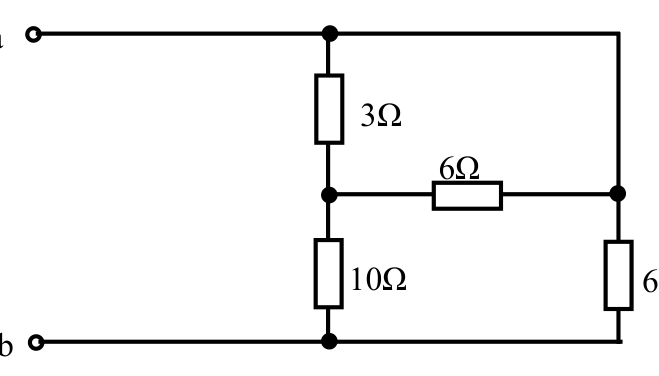

:::collapse accordion
- 提示
  右侧竖线上段（顶到 C）是纯导线——a、C 同电位，电桥其实不存在
- 解答
  顶线把 a 与 C 连成同一节点。$3\,\Omega$（a–B）与 $6\,\Omega$（B–C=a）并联 = $2\,\Omega$；
  串 $10\,\Omega$（B–底）得 $12\,\Omega$；右下 $6\,\Omega$（a–底）与它并联：
  $$R=12\parallel 6=\mathbf{4\ \Omega}$$
- 复盘
  与第二章选 6 同一招——先找「纯导线连通的大节点」，串并联关系立刻塌缩成两步。
:::

### 计 5（图 2.22）

> 用等效变换的方法，求电路中的电流 $I_L$。

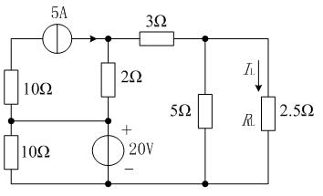

:::collapse accordion
- 提示
  20V 理想源钉死 M 点电位，从 M 向两侧各推一层
- 解答
  $\varphi_M=20$ V（20V 源 + 上，M–底）。左支：顶点 $T$ 经上 10Ω 接 M、5A 源从 $T$ 流向 N1——
  $T$ 节点 KCL：$\dfrac{20-\varphi_T}{10}=5\Rightarrow\varphi_T=-30$ V。右侧：N1、N2 节点 KCL：
  $$N_2:\ \frac{\varphi_{N1}-\varphi_{N2}}{3}=\frac{\varphi_{N2}}{5}+\frac{\varphi_{N2}}{2.5}=\frac{3\varphi_{N2}}{5}$$
  $$N_1:\ 5=\frac{\varphi_{N1}-20}{2}+\frac{\varphi_{N1}-\varphi_{N2}}{3}$$
  由第一式 $\varphi_{N1}=\tfrac{14}{5}\varphi_{N2}$，代入第二式得 $\varphi_{N2}=7.5$ V：
  $$I_L=\frac{\varphi_{N2}}{2.5}=\mathbf{3\ A}$$
  （功率平衡 385 W 两侧相等。）
- 复盘
  理想电压源钉电位 + 节点 KCL 逐层推进——这题没有一步需要「电源变换」的完整仪式，但每条
  支路电流都用得上「电流源钉电流、电压源钉电位」两条性质。
:::

### 计 6（图 2.23）

> 求电路中的电流 $I$。

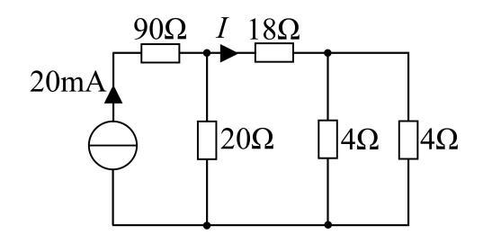

:::collapse accordion
- 提示
  与第一章图 1.24 同构——先折右侧，再对半分
- 解答
  自右向左：两 4Ω 并联 = 2Ω；串 18Ω = 20Ω；与 A 点 20Ω 并联 = 10Ω。20mA 全部流过 90Ω 到 A，
  在 A 点对半分：
  $$I=\frac{20\ \text{mA}}{2}=\mathbf{10\ mA}$$
- 复盘
  与第一章计算 2 是同一道题的重印（图重画、数值不变）。第二次遇到，应当直接写「对半分」。
:::

### 计 7（图 2.24）

> 用等效变换的方法求电路中的电流 $I$。

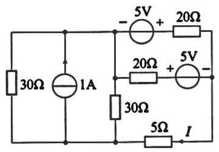

:::collapse accordion
- 提示
  右侧竖线是一条贯通导线（三个端都接它），先把「谁跟谁同节点」标出来
- 解答
  右侧竖线为同一节点 $R$（顶段 20Ω 右端、中支路 5V 的 − 端、底部 5Ω 右端同电位）。
  两个 5V 源分别钉住两条 20Ω 支路的内侧端电位：上支路内侧 $\varphi=V_1+5$、中支路内侧
  $\varphi=V_1-5$（$V_1$ 为 N1/N2 侧电位）。两条 20Ω 支路的电流都汇入 $R$、经 5Ω 入地：
  $$\frac{V_1+5-V_R}{20}+\frac{V_1-5-V_R}{20}=\frac{V_R}{5}
    \;\Rightarrow\;V_R=\frac{10}{3}\ \text{V}$$
  $$I=\frac{V_R}{5}=\mathbf{\frac{2}{3}\ A}\quad(\text{方向向左，与图中箭头一致})$$
  （功率平衡 12.5 W 两侧相等。）
- 复盘
  这题的「等效变换」其实是识别同节点：两个 5V 源把两条支路的电流算出来后，剩下的就是
  一个 KCL。理想电压源串联在支路里时，先用「± 源值」修正该支路内侧电位，再写欧姆定律。
:::

### 计 8（图 2.25）

> 求电路图中的电流 $I$。

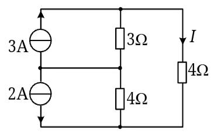

:::collapse accordion
- 提示
  先确认两个电流源的箭头方向——它们决定 M 节点 KCL 的符号
- 解答
  按盲测两遍读图：3A 箭头向上（M→顶）、**2A 箭头向下**（顶?M→底）。设顶节点电位 $V_T$、
  中节点 $V_M$（底线 0）：
  $$M:\ \frac{V_T-V_M}{3}=\frac{V_M}{4}+2\qquad
    T:\ 3+\frac{V_M-V_T}{3}=\frac{V_T}{4}+I,\quad I=\frac{V_T}{4}$$
  联立（消去 $V_M$）解得 $V_T=\dfrac{4}{11}$ V：
  $$I=\frac{V_T}{4}=\mathbf{\frac{1}{11}\ A}\approx 0.091\ \text{A}$$
  （叠加法复核一致。）
- 复盘
  ⚠ 抄题与盲测对 2A 源的箭头方向读数相反（↑/↓），按盲测两遍读图取「向下」、$I=1/11$ A；
  若原书箭头向上则 $I=17/11$ A——请对教材图复核。两个不等值理想电流源经节点相连时，
  谁也不「吞掉」谁，老实列节点方程。
:::

### 计 9（图 2.26）

> 求无源二端网络的等效电阻 $R_{eq}$。

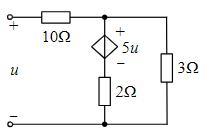

:::collapse accordion
- 提示
  外施 $u$、流入 $I$；受控源的值 $5u$ 直接用端口电压表示
- 解答
  按图，受控电压源极性 + 上（A 侧）− 下（2Ω 侧）。端口电流 $I$ 流入 + 端：
  $V_A=u-10I$；受控源支路电流（向下）$=\dfrac{V_A-5u}{2}$；A 节点 KCL：
  $$I=\frac{V_A-5u}{2}+\frac{V_A}{3}
    =\frac{u-10I-5u}{2}+\frac{u-10I}{3}
    =-2u-5I+\frac{u}{3}-\frac{10I}{3}$$
  $$\frac{28}{3}I=-\frac{5}{3}u\;\Rightarrow\;R_{eq}=\frac{u}{I}=\mathbf{-\frac{28}{5}=-5.6\ \Omega}$$
  （受控源等效出负电阻，功率平衡闭合。）
- 复盘
  ⚠ 受控源极性若为 − 上 + 下，则 $R_{eq}=+2.8\,\Omega$——两种读数给出一对相反的答案，
  按盲测读图取 $-5.6\,\Omega$，请对教材图复核极性。负电阻的物理含义：受控源在一端口内部
  向外送能量，端口看进去像「负的电阻」。
:::

## 6. 小结

第二章的题面花样多，底层只有三句话：

1. **理想源吞元件**：电压源吞并联（选 4、7），电流源吞串联（选 8、11、13）——先把被吞的元件划掉，
   电路立刻变简单。
2. **实电源互换**：串 $R$ 的电压源 ⟷ 并 $R$ 的电流源，$U_S=I_SR$，$R$ 不变（计 2 的变换链、
   填 3/8/9/11/13 四连空）。
3. **受控源保留控制量**：受控源可以参与变换，但控制量（$i_1$、$u_1$）必须在最终方程里能算出来
   （填 2/6/7、计 9）；含受控源的一端口可以等效出负电阻。

## 完成边界

- **已整理**：第二章 34 题题面逐字转抄 + 配图 26 张入库（图 2.7、2.21 为矢量渲染）；全部解答与复盘。
- **双签**：2026-09-28，两名独立子代理只拿题面与配图重算 34 题：与整理者逐项对照，22 题直接一致；
  3 处按图修正整理者初解（填 2(a) 与填 6 的 $R_{ab}=-1\,\Omega$、计 4 的 $R=4\,\Omega$），
  2 处整理者修正盲测（计 1 的 $I$ 归属、计 9 的极性口径照盲测读数采 −5.6 Ω）；计算题均附功率平衡校验。
- **〔待核对〕**：① 选 2 原图电阻读 1 Ω、选项 B 写 2 Ω，两处对不上；② 选 3 数值为读图近似
  （0.48–0.49 → 选项 0.5）；③ 计 1 的 $I$ 箭头归属（8Ω 支路 2 A / 上 6Ω 支路 5 A）；
  ④ 计 8 的 2A 源箭头方向（↑ 则 17/11 A、↓ 则 1/11 A，本页取 ↓）；⑤ 计 9 受控源极性
  （+ 上 − 下 则 −5.6 Ω、反之 +2.8 Ω，本页取前者）。以上均请对教材图复核。
- **未完成**：第三至九章（按课程进度分章推进）。
