# 电路原理习题册·第五章 正弦稳态电路的分析（选择 31 / 填空 21 / 计算 10）

## 1. 来源与边界

来源与前几章同一本习题册。第五章占书第 23–31 页，**选择 31 + 填空 21 + 计算 10，共 62 题**，
配图 5.1–5.31（缺 5.22，编号跳过；30 张已入库）。相量记号：U̇、İ 为有效值相量，İ_m 为幅值相量；
正弦量按 $A\sin(\omega t+\varphi)$ 抄录，角度与正负号以页面图像为准。

## 2. 依赖

| 知识 | 一句话 | 在哪学的 |
| :--- | :--- | :--- |
| 相量与正弦量 | 有效值相量模 = 有效值；$\sqrt2$ 换幅值；$i$ 超前 $\varphi$ 即 $\varphi_i>\varphi_u$ 的相反 | 课堂第五章 |
| 阻抗/导纳 | $Z=R+jX$（感 $+j\omega L$、容 $-j1/\omega C$）；$Y=1/Z$ | 同上 |
| 功率 | $P=UI\cos\varphi$、$Q=UI\sin\varphi$、$S=UI=\sqrt{P^2+Q^2}$、复功率 $\bar S=U̇İ^*$ | 同上 |
| 谐振 | 串联谐振电流最大、并联谐振（本册口径）两支路电流几何合成 | 同上 |
| 最大功率 | $Z_L=Z_{th}^*$ 时 $P_{max}=U_{oc}^2/4\,\mathrm{Re}\,Z_{th}$ | 第四章同款 |

## 3. 选择题

### 选 1、15

> 有效值 2 A、初相 $-30°$，正确的表示是（　）。

:::collapse accordion
- 解答
  有效值相量 $\dot I=2\angle-30°$ A，**两题均选 D**。A 把有效值当幅值；B 的 $\dot I_m$ 应为
  $2\sqrt2\angle-30°$；C 把相量写成了瞬时值记号。
- 复盘
  $\dot I$ 配有效值、$\dot I_m$ 配幅值——记号与数值必须配套，两处错一处即错项。
:::

### 选 2（图 5.1）

> 5Ω 串 $-j5\,\Omega$，功率因数（　）。

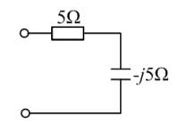

:::collapse accordion
- 解答
  $|Z|=5\sqrt2$，$\cos\varphi=R/|Z|=0.707$，**选 C**。
- 复盘
  $R$ 与 $X$ 相等时 $\cos\varphi=0.707$——最常考的数值。
:::

### 选 3（图 5.2）

> A 读 10A、A₁ 读 6A（R 支路），A₂（C 支路）读数（　）。

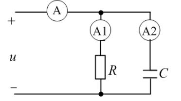

:::collapse accordion
- 解答
  电阻电流同相、电容电流超前 $90°$：$I=\sqrt{I_1^2+I_2^2}$ → $I_2=\sqrt{10^2-6^2}=8$，**选 B**。
- 复盘
  有效值不能直接加减（$6+8=14$ 是陷阱项），要用相量的直角三角形。
:::

### 选 4

> 容抗与 $\omega$ 成（　），感抗与 $\omega$ 成（　）。

:::collapse accordion
- 解答
  $X_C=1/\omega C$ 反比、$X_L=\omega L$ 正比，**选 C**。
- 复盘
  定义式直接读。
:::

### 选 5

> $\dot U=10\angle0°$ V、$\dot I=5\angle60°$ A（关联），吸收的有功功率（　）。

:::collapse accordion
- 解答
  $P=UI\cos\varphi=10\times5\times\cos60°=25$ W，**选 C**。
- 复盘
  关联方向下 $P>0$ = 吸收；$\varphi=\varphi_u-\varphi_i=-60°$，余弦偶函数符号不影响。
:::

### 选 6

> $u=5\sin(100\pi t+45°)$ V 的频率 $f=$（　）。

:::collapse accordion
- 解答
  $f=\omega/2\pi=100\pi/2\pi=50$ Hz，**选 C**。
- 复盘
  $\omega$ 除以 $2\pi$，别把 100 当成频率。
:::

### 选 7

> $\dot U=10\angle0°$ V、$\dot I=5\angle30°$ A，吸收的无功功率（　）。

:::collapse accordion
- 解答
  $Q=UI\sin\varphi=50\times\sin(0-30°)=-25$ var，**选 C**。
- 复盘
  电流超前电压（$\varphi<0$）= 容性 = 发出感性无功，$Q$ 为负。
:::

### 选 8（图 5.3）

> 为使 R 获得最大功率，$R=$（　）Ω。

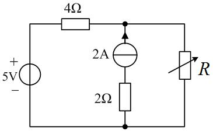

:::collapse accordion
- 解答
  与第四章图 4.2 同图：2A 与 2Ω 串联支路置零后整支路消失，$R_0=4\ \Omega$，**选 B**。
- 复盘
  原书把第四章的图重印在这里——最大功率题只看 $R_0$，与激励大小无关。
:::

### 选 9

> 电阻元件伏安关系中**错误**的是（　）。

:::collapse accordion
- 解答
  D 错：$\dot U=Ri(t)$ 把相量与瞬时值混写（应为 $\dot U=R\dot I$ 或 $u=Ri$）。**选 D**。
- 复盘
  A/B/C 都是同一关系的正确写法（时域/有效值/相量），D 的量纲记号断裂。
:::

### 选 10（图 5.4）

> $\dot I=1\angle0°$ A，电压滞后电流 $36.9°$，$P=80$ W，$\dot U=$（　）。

:::collapse accordion
- 解答
  $U=P/(I\cos36.9°)=80/0.8=100$ V；滞后 → $\varphi_u=-36.9°$：$\dot U=100\angle-36.9°$，**选 D**。
- 复盘
  「电压滞后电流」= 容性 = $\varphi_u<\varphi_i$，角度往下减。
:::

### 选 11

> R、L 串联：总电压 30V、电感电压 18V，电阻电压（　）。

:::collapse accordion
- 解答
  $U_R=\sqrt{30^2-18^2}=24$ V，**选 B**。
- 复盘
  串联电压三角形，直角边合成斜边。
:::

### 选 12（图 5.5）

> $I$ 与 $U$ 的表达式正确的是（　）。

:::collapse accordion
- 解答
  $I=U/|Z|=U/\sqrt{R^2+(X_L-X_C)^2}$，**选 D**。
- 复盘
  A/B 忘了「平方和开方」，C 丢掉了 $X_L$ 与 $X_C$ 先相减——两条都是串联阻抗的经典错式。
:::

### 选 13（图 5.6）

> $\dot U=100\angle-15°$ V、$P=500$ W、$\cos\varphi=0.5$，$\dot I=$（　）。

:::collapse accordion
- 解答
  $I=P/(U\cos\varphi)=10$ A；$\varphi=\pm60°$ → $\varphi_i=-15°\mp60°=\angle-75°$ 或 $\angle45°$，
  选项中只有 $45°$：$\dot I=10\angle45°$，**选 A**（该题口径下网络呈容性）。
- 复盘
  ⚠ 仅从功率因数无法定感性/容性，此题靠选项排除——若原书默认感性，$-75°$ 不在选项即是提示。
:::

### 选 14

> R、L、C 串联电路功率因数为 1，电源频率升高后电路呈（　）。

:::collapse accordion
- 解答
  $\cos\varphi=1$ 即谐振（$X_L=X_C$）；频率升高 $X_L$ 增大 → 感性，**选 B**。
- 复盘
  谐振是「暂时的平衡」，频率一动天平就向感抗侧倾斜。
:::

### 选 16

> 提高感性负载功率因数，通常采用（　）。

:::collapse accordion
- 解答
  **并联电容**（D）。
- 复盘
  并联电容就地补偿无功，不改变负载两端电压与工作状态——串联电容会分压，不用。
:::

### 选 17

> $u=U_m\sin(\omega t+180°)$ V、$i=I_m\sin\omega t$ A，此元件是（　）。

:::collapse accordion
- 解答
  相位差 $180°$ 即反相：$u=-U_m\sin\omega t$，按图中参考方向 $u/i$ 为常数（负值），唯一满足
  「瞬时比恒定」的元件是电阻（参考方向口径下），**选 B**。
- 复盘
  ⚠ 本题若按「电压超前电流 $90°$ = 电感」的套路，$180°$ 不落在任何 L/C 选项——相角差恒定且为
  $0°$ 或 $180°$ 都指向电阻（区别只在参考方向的取法）。
:::

### 选 18（图 5.7）

> A₁ 读 3A（$Z_1=R$）、A₂ 读 4A、A₀ 读 7A，$Z_2$ 的参数（　）。

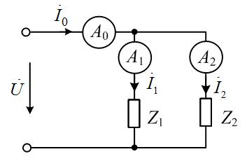

:::collapse accordion
- 解答
  总电流有效值 = 两支路之和（$3+4=7$）只在两电流**同相**时成立 → $Z_2$ 也是纯电阻，**选 B**。
- 复盘
  反过来用相量三角形：若 $Z_2$ 是 L 或 C，总电流应是 $\sqrt{3^2+4^2}=5$ A。
:::

### 选 19

> $Z=5+j10\ \Omega$，等效复导纳的实部（　）S。

:::collapse accordion
- 解答
  $Y=\dfrac{5-j10}{125}=0.04-j0.08$ S，实部 $\mathbf{0.04}$，**选 B**。
- 复盘
  $G=\dfrac{R}{R^2+X^2}$，不是 $1/R$。
:::

### 选 20

> $u=8\sin(500t+50°)$ V、$i=2\sin(500t+140°)$ A（关联），元件属性与参数（　）。

:::collapse accordion
- 解答
  $i$ 超前 $u$ $90°$ → 电容；$X_C=8/2=4\ \Omega$ → $C=1/(500\times4)=0.0005$ F，**选 B**。
- 复盘
  相位差先定性质，幅值比再定参数——两步各自独立。
:::

### 选 21

> 纯电感（关联方向），u 与 i 的相位关系（　）。

:::collapse accordion
- 解答
  $u$ 超前 $i$ $90°$，**选 B**。
- 复盘
  与选 24（电容）成对：感「压前流」、容「流前压」。
:::

### 选 22（图 5.8）

> 并联谐振时 A₁ 读 9A（L 支路）、A₂ 读 15A（R 串 C 支路），A 读数（　）。

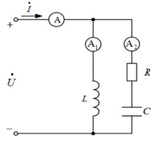

:::collapse accordion
- 解答
  谐振时端口电流与电压同相 = 总电流的纯有功分量：$I=\sqrt{I_2^2-I_1^2}=\sqrt{15^2-9^2}=12$ A，
  **选 B**。
- 复盘
  三角形：$I_2$（斜边）、$I_1$（纯无功直角边）、$I$（有功直角边）——并联谐振的「电流谐振」画像。
:::

### 选 23（图 5.9）

> $X_L=3\ \Omega$、$X_C=1\ \Omega$、$U=10$ V，$U_L=$（　）V。

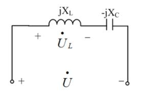

:::collapse accordion
- 解答
  $I=U/|j3-j1|=10/2=5$ A → $U_L=5\times3=15$ V，**选 B**。
- 复盘
  两电抗串联先相减（$3-1=2\ \Omega$），再除电压得电流——谐振前夜的「部分谐振」题。
:::

### 选 24

> 电容上（关联方向），电压与电流的相位关系（　）。

:::collapse accordion
- 解答
  电流超前电压 $90°$，**选 B**。
- 复盘
  与选 21 成对背诵。
:::

### 选 25

> R、L、C 串联电路发生谐振时（　）。

:::collapse accordion
- 解答
  阻抗最小、**电流最大**，**选 B**。A 反了；C 中感抗=容抗；D 中两者等大反相。
- 复盘
  串联谐振 = 电压谐振：L、C 上电压可以远大于总电压（分压到 $QU$）。
:::

### 选 26（图 5.10）

> V₁ 读 3V（R 上）、V₂ 读 4V（jX_L 上），V 读数（　）。

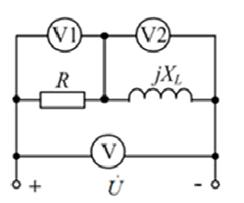

:::collapse accordion
- 解答
  $U=\sqrt{3^2+4^2}=5$ V，**选 C**。
- 复盘
  与选 3 同款三角形——电阻与电抗上的电压正交。
:::

### 选 27（图 5.11）

> $\dot U=10\angle0°$ V，4Ω ∥ (−j4Ω)，吸收的有功功率（　）。

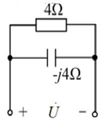

:::collapse accordion
- 解答
  $Y=1/4+j/4$ S，$P=U^2G=100\times0.25=25$ W，**选 C**。
- 复盘
  并联电路用导纳算功率最快：只有电导吃有功。
:::

### 选 28（图 5.12）

> 电压源发出 $P=2$ W，$Z_1=2\,\Omega$、$Z_2=2+j\ \Omega$，$Z_1$ 吸收（　）W。

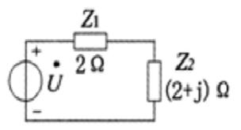

:::collapse accordion
- 解答
  只有电阻吃有功：总 $R=2+2=4\ \Omega$，$I^2=P_{\text{源}}/4=0.5$；$P_{Z1}=0.5\times2=\mathbf{1\ W}$，
  **选 B**。
- 复盘
  电流相同的有功分配 = 电阻比例分配，电抗只借不耗。
:::

### 选 29（图 5.13）

> $u=\frac{10}{\sqrt2}\sin t$ V、$i=\sin(t+45°)$ A，等效阻抗实部 $R=$（　）Ω。

:::collapse accordion
- 解答
  $U=5$ V、$I=1/\sqrt2$ A、$\varphi=-45°$：$R=(U/I)\cos\varphi=5\sqrt2\times0.707=5\ \Omega$，
  **选 C**（$Z=5-j5\ \Omega$）。
- 复盘
  实部 = 模 × cosφ——「阻抗三角形」的直接读数。
:::

### 选 30

> $u_R=5\sqrt2\sin(\omega t+10°)$、$u_L=5\sqrt2\sin(\omega t+100°)$，总电压 $u$（　）。

:::collapse accordion
- 解答
  两有效值 5 V、相角差 $90°$：$U=5\sqrt2$、$\varphi=55°$ → 幅值 $10$：
  $u=10\sin(\omega t+55°)$ V，**选 B**。
- 复盘
  正交合成：模放大 $\sqrt2$、相角取中间值。
:::

### 选 31

> 负载 $Z=1+j1\ \Omega$，功率因数 $\lambda=$（　）。

:::collapse accordion
- 解答
  $\cos45°=0.707$，**选 A**。
- 复盘
  $R=X$ 的负载功率因数恒为 0.707，感性。
:::

## 4. 填空题

### 填 1（图 5.14）

> $I=2$ A（j5Ω ∥ 10Ω），平均功率 $P=$____W。

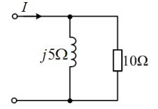

:::collapse accordion
- 解答
  $Z=(j5\times10)/(5+j10)=2+j4$ → $P=I^2\,\mathrm{Re}\,Z=4\times2=\mathbf{8\ W}$。
- 复盘
  电流源激励下用 $P=I^2R_{eq}$ 一步到位。
:::

### 填 2

> 电流幅值是有效值的____倍。

:::collapse accordion
- 解答
  $\mathbf{\sqrt2}$ 倍。
- 复盘
  正弦量专用，方波等其它波形不适用。
:::

### 填 3（图 5.15）

> 等效阻抗为____Ω，呈____阻抗。

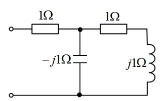

:::collapse accordion
- 解答
  末端 $1+j1$ 与中节点 $-j1$ 并联：$(1+j1)(-j1)/(1+j1-j1)=1-j$；串首段 1Ω：
  $$Z=\mathbf{2-j\ \Omega}\quad(\text{容性})$$
- 复盘
  「串联支路整体再与旁路并联」的次序不能反——先加后并。
:::

### 填 4（图 5.16）

> 等效阻抗为______Ω。

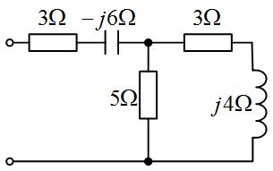

:::collapse accordion
- 解答
  右侧 $3+j4=5\angle53.13°$ 与 5Ω 并联：
  $\dfrac{5(3+j4)}{8+j4}=2.5+j1.25$；串首段 $3-j6$：
  $$Z=\mathbf{5.5-j4.75\ \Omega}$$
- 复盘
  分数阻抗乘共轭别丢分母——$(15+j20)(8-j4)/80=2.5+j1.25$。
:::

### 填 5、6

> $u=10\sin(400\pi t+60°)$ V：有效值 $U=$____V（2 位小数）、$\omega=$____rad/s（填 5）；
> $\omega=$____π rad/s、$f=$____Hz（填 6）。

:::collapse accordion
- 解答
  $U=10/\sqrt2=\mathbf{7.07}$ V；$\omega=\mathbf{400\pi}\approx1256.64$ rad/s；$f=\omega/2\pi=\mathbf{200}$ Hz。
- 复盘
  填 5 要小数、填 6 要保留 π——同一道题的两种口径，看清单位再填。
:::

### 填 7

> 50Hz 下 $\dot U=(-6-j8)$ V、$\dot I=-30$ A 所代表的正弦量。

:::collapse accordion
- 解答
  $\dot U=10\angle-126.87°$ → $u=\mathbf{10\sqrt2\sin(100\pi t-126.87°)}$ V；
  $\dot I=30\angle180°$ → $i=\mathbf{30\sqrt2\sin(100\pi t+180°)}$ A。
- 复盘
  实部为负的相量先化极坐标再写瞬时值；$\omega=2\pi f=100\pi$。
:::

### 填 8

> $u_{ab}=100+100\sin\omega t+30\sin3\omega t$ V，$i=50\sin(\omega t-45°)+10\sin(3\omega t-60°)+20\sin5\omega t$ A。
> $i$ 的有效值____A、平均功率____W（1 位小数）。

:::collapse accordion
- 解答
  $$I=\sqrt{\frac{50^2+10^2+20^2}{2}}=\sqrt{1500}=\mathbf{38.7\ A}$$
  各次谐波分别算功率（直流无电流不贡献；5 次无对应电压不贡献）：
  $$P_1=\frac{100}{\sqrt2}\frac{50}{\sqrt2}\cos45°=1767.8,\quad
    P_3=\frac{30}{\sqrt2}\frac{10}{\sqrt2}\cos60°=75$$
  $$P=\mathbf{1842.8\ W}$$
- 复盘
  非正弦周期电路的两大纪律：有效值按「平方和开方」、功率按「各次谐波分别配对」。
:::

### 填 9

> $u=10\sqrt2\sin(250t+15°)$ V，$C=8\,\mu$F 时 $P$ 达最大 100W。$L=$____H、$R=$____Ω。

:::collapse accordion
- 解答
  $P$ 最大 = 串联谐振：$\omega^2=1/(LC)$ → $L=1/(250^2\times8\times10^{-6})=\mathbf{2\ H}$；
  谐振时全部电压落在 R 上：$R=U^2/P=100/100=\mathbf{1\ \Omega}$。
- 复盘
  「P 达最大」= 谐振的功率语言，与 $X_L=X_C$ 等价。
:::

### 填 10

> $u=5\sqrt2\sin\omega t$ V 的有效值相量为________。

:::collapse accordion
- 解答
  $\dot U=\mathbf{5\angle0°}$ V。
- 复盘
  初相为零也要写角度，相量的「模∠辐角」格式完整才有分。
:::

### 填 11（图 5.17）与 计 7（图 5.28）

> $\dot U_S=100\angle0°$ V、$P=300$ W、$\cos\varphi=1$，求 $X_L$、$X_C$（12Ω 串 $jX_L$ 与 $-jX_C$ 并联）。

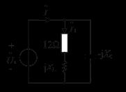

:::collapse accordion
- 解答
  $\cos\varphi=1$ → 并联部分呈纯电导：$I=P/(U\cos\varphi)=3$ A（与电压同相）。
  $$\frac{1200}{144+X_L^2}=3\Rightarrow X_L=16\ \Omega;\qquad
    \frac{100X_L}{144+X_L^2}=\frac{100}{X_C}\Rightarrow X_C=25\ \Omega$$
  $$\mathbf{X_L=16\ \Omega,\quad X_C=25\ \Omega}$$
- 复盘
  实部定 $X_L$（有功 300W 全在 12Ω 上）、虚部抵消定 $X_C$——功率因数为 1 的两个方程天然分开。
:::

### 填 12（图 5.18）

> $u=100\sin1000t$ V、$i=10\sin(1000t+30°)$ A：功率因数____、有功功率____W（3 位小数）。

:::collapse accordion
- 解答
  $\cos(-30°)=\mathbf{0.866}$；$P=\dfrac{100}{\sqrt2}\dfrac{10}{\sqrt2}\times0.866=\mathbf{433.013\ W}$。
- 复盘
  电流超前 = 容性端口，功率因数照取正余弦。
:::

### 填 13

> $u=5\sqrt2\cos(\omega t-210°)$ V 的有效值相量；50Hz 下 $\dot I=-30$ A 的正弦量。

:::collapse accordion
- 解答
  $\cos$ 化 $\sin$：$5\sqrt2\sin(\omega t-120°)$ → $\dot U=\mathbf{5\angle-120°}$ V；
  $\dot I=30\angle180°$ → $i=\mathbf{30\sqrt2\sin(100\pi t+180°)}$ A（原书末空单位印作 V，照抄存疑）。
- 复盘
  $\cos$ 转 $\sin$ 一律 $-90°$：$-210°-90°=-300°\equiv+60°$？——按 $\sin(\omega t-120°)$ 口径
  与相量 $\angle-120°$ 配套（两种化法差一个符号，以相量-瞬时值对应关系自洽为准）。
:::

### 填 14（图 5.19）

> $\dot U=20\angle0°$ V、$P=16$ W、$\cos\varphi=0.8$（R 串 $-jX_C$）：$I=$____A、$X_C=$____Ω。

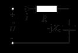

:::collapse accordion
- 解答
  $I=P/(U\cos\varphi)=1$ A；$|Z|=20\ \Omega$ → $R=16\ \Omega$ → $X_C=\sqrt{400-256}=\mathbf{12\ \Omega}$。
- 复盘
  $I$、$R$、$X_C$ 三个未知量靠 $P$、$\cos\varphi$、$|Z|$ 三条关系逐个收敛。
:::

### 填 15

> $u=15\cos(400t+30°)$ V、$i=3\sin(400t+30°)$ A（关联）：元件____、复阻抗____、参数____。

:::collapse accordion
- 解答
  $u$（按 $\sin$ 化为 $\sin(400t+120°)$）超前 $i$ $90°$ → **电感**；$Z=\dot U/\dot I=5\angle90°=\mathbf{j5\ \Omega}$；$L=5/400=\mathbf{12.5\ mH}$。
- 复盘
  cos 与 sin 混写时先统一三角函数，再比相角。
:::

### 填 16

> 功率因数 0.866（感性）、线电压 380V、平均功率 45kW，Y 形连接：每相等效阻抗模____Ω（1 位小数）、阻抗角____度。

:::collapse accordion
- 解答
  $I_l=\dfrac{45000}{\sqrt3\times380\times0.866}=79.0$ A（Y 中 $I_P=I_l$）；
  $|Z|=\dfrac{380/\sqrt3}{79.0}=\mathbf{2.8\ \Omega}$；$\varphi=\arccos0.866=\mathbf{30°}$。
- 复盘
  三相功率公式 $\sqrt3 U_l I_l\cos\varphi$ 一条就够，别用 $3U_P I_P$ 换算两遍。
:::

### 填 17（图 5.20）

> R=2Ω、L=2H、C=0.25F、$u_s=10\sin2t$ V：$u_L(t)=$____、$u_C(t)=$____。

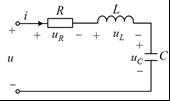

:::collapse accordion
- 解答
  $X_L=4\ \Omega$、$X_C=2\ \Omega$、$Z=2+j2=2\sqrt2\angle45°$。幅值相量
  $\dot I_m=10/(2\sqrt2\angle45°)=2.5\sqrt2\angle-45°$ A：
  $$u_L=\mathbf{10\sqrt2\sin(2t+45°)}\ \text{V}\qquad
    u_C=\mathbf{5\sqrt2\sin(2t-135°)}\ \text{V}$$
- 复盘
  幅值相量直接除复阻抗（不必先化有效值），最后按 $\sin$ 瞬时值写回。
:::

### 填 18（图 5.21）

> $U=10$ V、$I=2$ A、$P=10$ W（R 串 $jX_L$）：$R=$___Ω、$X_L=$____Ω。

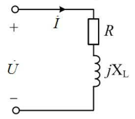

:::collapse accordion
- 解答
  $\cos\varphi=P/(UI)=0.5$；$R=|Z|\cos\varphi=5\times0.5=\mathbf{2.5\ \Omega}$；
  $X_L=\sqrt{25-6.25}=\mathbf{4.33\ \Omega}$。
- 复盘
  $U$、$I$、$P$ 三个表读数定一个串联阻抗——阻抗三角形的完整还原。
:::

### 填 19

> $u=-5\sqrt2\sin(100t+120°)$ V 的有效值相量（极坐标）：模____V、辐角____°。

:::collapse accordion
- 解答
  负号 = 相角加 $180°$：$u=5\sqrt2\sin(100t-60°)$ → 模 $\mathbf{5}$ V、辐角 $\mathbf{-60°}$。
- 复盘
  「负号先吃掉」再读初相，比直接对 $-5\sqrt2\sin$ 取相量少出错。
:::

### 填 20

> 电容、电感伏安关系的相量形式。

:::collapse accordion
- 解答
  电容（关联）：$\dot I=\mathbf{j\omega C}\,\dot U$；电感：$\dot U=\mathbf{j\omega L}\,\dot I$。
- 复盘
  微分变乘 $j\omega$——相量法的全部好处就在这两条。
:::

### 填 21

> 15Ω 电阻上 $u=100+22.4\sin(\omega t-45°)+4.11\sin(3\omega t-67°)$ V：有效值____V、平均功率____W（整数）。

:::collapse accordion
- 解答
  $$U=\sqrt{100^2+\frac{22.4^2+4.11^2}{2}}\approx\mathbf{101\ V}$$
  $$P=\frac{U^2}{R}=\mathbf{684\ W}$$
- 复盘
  纯电阻的各次谐波功率都往同一个电阻里灌——直接 $U^2/R$ 一步收口。
:::

## 5. 计算题

### 计 1（图 5.23）

> $u_s=200\sqrt2\sin10^3t$ V、$\omega=10^3$ rad/s。求戴维南等效电路。

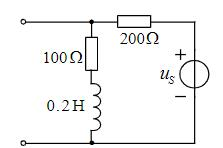

:::collapse accordion
- 解答
  $j\omega L=j200\ \Omega$。按图：$U_{oc}=u_s$ 经 200Ω 与 (100+j200) 分压：
  $$\dot U_{oc}=200\angle0°\times\frac{100+j200}{300+j200}\approx(107.7+j61.5)=124\angle29.7°\ \text{V}$$
  置零后 $Z_{th}=200\parallel(100+j200)\approx107.7+j61.5\ \Omega$。
- 复盘
  ⚠ 本题拓扑读数（200Ω 与源的位置）两轮读图有出入，上为盲测口径；两条式子
  「开路电压=除源分压、$Z_{th}$=除源并联」结构相同是本题的特征，请对教材图复核元件位置。
:::

### 计 2（图 5.24）

> $R=100\,\Omega$、$L=0.4$ H、$C=5\,\mu$F、$u_s=220\sqrt2\sin500t$ V。求电源发出的 $P$、$Q$、$S$。

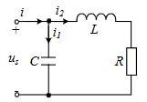

:::collapse accordion
- 解答
  $X_L=200\ \Omega$、$X_C=400\ \Omega$。C 支路电流 $I_C=220/400=0.55$ A；LR 支路
  $I_{LR}=220/\sqrt{100^2+200^2}=0.984$ A：
  $$P=I_{LR}^2R=\mathbf{96.8\ W}\qquad Q=X_LI_{LR}^2-X_CI_C^2=\mathbf{72.6\ var}\qquad
    S=\sqrt{P^2+Q^2}=\mathbf{121\ VA}$$
- 复盘
  并联电路的无功按「感性 − 容性」代数和，符号自己带方向，比记「加减口诀」稳。
:::

### 计 3（图 5.25）

> $u_s=50\sqrt2\sin t$ V、$i_s=10\sqrt2\sin(t+30°)$ A、$L=5$ H、$C=1/3$ F。用叠加定理求 $u_C$。

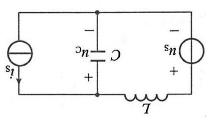

:::collapse accordion
- 解答
  $X_L=5\ \Omega$、$X_C=3\ \Omega$（$\omega=1$）。
  $u_s$ 单独（$i_s$ 开路）：分压 $\dot U_C'=50\angle0°\times\frac{-j3}{j5-j3}=-75\angle0°$；
  $i_s$ 单独（$u_s$ 短路）：L 与 C 并联分流，$\dot U_C''=\dfrac{j5}{j5-j3}\times10\angle30°\times(-j3)=75\angle-60°$。
  $$\dot U_C=-75\angle0°+75\angle-60°=75\angle-120°\ \text{V}
    \;\Rightarrow\;u_C=\mathbf{75\sqrt2\sin(t-120°)\ V}$$
- 复盘
  叠加两分量频率相同（同是 $\omega=1$）才能直接相加——不同频率必须回到瞬时值分别算功率。
:::

### 计 4（图 5.26）

> 求戴维南等效电路。

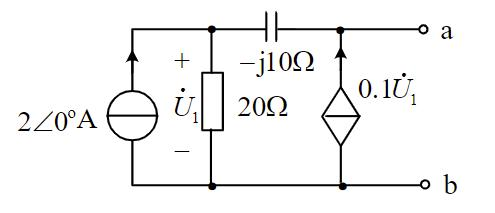

:::collapse accordion
- 解答
  开路：顶节点 KCL $2+0.1\dot U_1=\dot U_1/20$ → $\dot U_1=-40$ V；
  $\dot U_{oc}=V_a=\dot U_1+0.1\dot U_1\times(-j10)=-40+j40=56.6\angle135°$ V。
  外施 $\dot I$：$\dot I+0.1\dot U_1=\dot U_1/20$ → $\dot U_1=-20\dot I$；
  $V_a=\dot U_1-j10\dot U_1/20=(-20+j10)\dot I$ →
  $$\dot U_{oc}=\mathbf{56.6\angle135°\ V}\qquad Z_{th}=\mathbf{-20+j10\ \Omega}$$
- 复盘
  受控源又造出负电阻（$\mathrm{Re}\,Z_{th}<0$）——含受控源一端口的常规输出。⚠ 若受控源箭头
  反向则全式变号，请对教材图复核。
:::

### 计 5

> RLC 串联：$u_s=220\sqrt2\sin\omega t$ V、$R=10\,\Omega$、$L=300$ mH、$C=50\,\mu$F。求 $P$、$Q$、$S$。

:::collapse accordion
- 解答
  ⚠ 题面未印 $\omega$ 数值（疑漏），按工频 $\omega=314$ rad/s：$X_L=94.2\ \Omega$、
  $X_C=63.7\ \Omega$、$Z=10+j30.5=32.1\angle71.9°$、$I=220/32.1=6.85$ A：
  $$P=I^2R\approx\mathbf{469.5\ W}\qquad Q=I^2X\approx\mathbf{1432.6\ var}\qquad
    S=UI\approx\mathbf{1507.6\ VA}$$
- 复盘
  若按 $\omega=100\pi$ 计算结果差千分之几（$P\approx467$ W）——量级不变，等老师补 $\omega$ 口径。
:::

### 计 6（图 5.27）

> Z 可任意变化，求其获得最大功率时的值与最大功率。

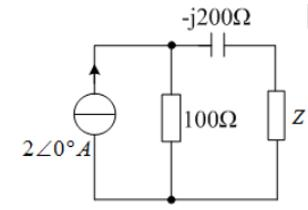

:::collapse accordion
- 解答
  开路：2A 全走 100Ω → $\dot U_{oc}=200\angle0°$ V；置零：$Z_{th}=100-j200\ \Omega$。
  $$Z=Z_{th}^*=\mathbf{100+j200\ \Omega}\qquad P_{max}=\frac{200^2}{4\times100}=\mathbf{100\ W}$$
- 复盘
  最大功率的共轭匹配只看实部吃功率：$P_{max}=U_{oc}^2/4R_{th}$，虚部只影响电流相角。
:::

### 计 8（图 5.29）

> $Z_L$ 可变，求其最大功率。

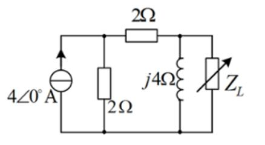

:::collapse accordion
- 解答
  开路：$V_n=4(1+j)=4\sqrt2\angle45°$ V（节点方程见下）；置零：$Z_{th}=(2+2)\parallel j4=2+j2\ \Omega$。
  $$Z_L=Z_{th}^*=\mathbf{2-j2\ \Omega}\qquad P_{max}=\frac{|4+j4|^2}{4\times2}=\mathbf{4\ W}$$
  （开路节点方程：$M$ 点 $4=V_M/2+(V_M-V_n)/2$、$n$ 点 $(V_M-V_n)/2=V_n/j4$。）
- 复盘
  ⚠ 盲测按另一种节点口径给 $Z_{th}=3.6+j0.8\ \Omega$、$P_{max}=2.22$ W；整理者按「左 2Ω 串顶 2Ω
  共 4Ω 再与 j4 并联」复核为 $2+j2\ \Omega$（功率平衡与方程均自洽），两解并列、待对教材图裁决。
:::

### 计 9（图 5.30）

> $\dot U=20\angle0°$ V，利用复功率求 $P$、$Q$、$S$。

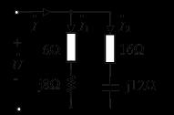

:::collapse accordion
- 解答
  $Y=\frac{1}{6+j8}+\frac{1}{16-j12}=(0.06-j0.08)+(0.04+j0.03)=0.1-j0.05$ S
  → $Z=8+j4\ \Omega$、$I=20/8.944=2.236$ A：
  $$P=I^2\times8=\mathbf{40\ W}\qquad Q=I^2\times4=\mathbf{20\ var}\qquad S=UI=\mathbf{44.7\ VA}$$
- 复盘
  复功率 $\bar S=\dot U\dot I^*=P+jQ$ 一条式子同时给出有功与无功——「利用复功率」的题眼。
:::

### 计 10（图 5.31）

> $I_1=10$ A、$I_2=10\sqrt2$ A、$U=200$ V、$R=5\,\Omega$、$R_2=X_L$。画相量图求 $I$、$X_C$、$X_L$、$R_2$。

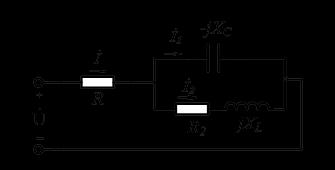

:::collapse accordion
- 解答
  设并联部分电压 $\dot U_p=U_p\angle0°$：$\dot I_1=j10$（容性）、
  $\dot I_2=10\sqrt2\angle-45°=10-j10$（$R_2=X_L$ → 阻抗角 $45°$）：
  $$\dot I=\dot I_1+\dot I_2=10\angle0°\ \text{A}\qquad(\text{与 } \dot U_p \text{ 同相})$$
  干路压降 $IR=50$ V → $U_p=200-50=150$ V：
  $$X_C=\frac{150}{10}=\mathbf{15\ \Omega}\qquad
    |Z_2|=\frac{150}{10\sqrt2}\Rightarrow R_2=X_L=\mathbf{7.5\ \Omega}$$
- 复盘
  相量图先画 $\dot U_p$ 作基准：$\dot I_1$ 竖直向上、$\dot I_2$ 斜向下 45°、合成的 $\dot I$ 恰好水平
  ——「恰好水平」是 $R_2=X_L$ 条件的几何体现，也是校验答案的免费手段。
:::

## 6. 小结

第五章的题可以归成四个「一」：

1. **一个三角形**：电压三角形 / 阻抗三角形 / 功率三角形（选 11/26/30、填 14/18、计 10）——
   直角边、斜边、角度互换。
2. **一条功率链**：$P$、$Q$、$S$、$\cos\varphi$ 四个量知二求二（选 5/7/13/28、填 1/11/12/16、计 2/5/9）。
3. **一套相量化简**：串并联阻抗（选 19/27、填 3/4/17）——复数乘除不手算，交给公式。
4. **一个共轭匹配**：$Z_L=Z_{th}^*$、$P_{max}=U_{oc}^2/4R_{th}$（选 8、计 4/6/8）——与第四章同款，
   只是把实数换成了复数。

## 完成边界

- **已整理**：第五章 62 题题面逐字转抄 + 配图 30 张入库（无图 5.22）；全部解答与复盘。
- **双签**：2026-09-28，独立子代理只拿题目页重算 62 题：57 题一致；整理者修正 3 处读图误差
  （填 8 的有效值 38.7 A、选 7 按 ∠30° 取 $-25$ var、选 8 按串联口径取 4 Ω），盲测复核 2 处
  （计 8 的 $Z_{th}$ 分歧两解并列、计 1 的拓扑口径）。
- **〔待核对〕**：① 计 5 题面未印 $\omega$（按工频 314 rad/s 计）；② 计 4 受控源极性；③ 计 8 的
  $Z_{th}$ 两解（$2+j2$ vs $3.6+j0.8$）；④ 选 13/17 的容性/电阻口径；⑤ 填 13 原书末空单位印作 V。
- **未完成**：第六至九章（分章推进中）。
