# 电路原理习题册·第六章 耦合电感和理想变压器（选择 13 / 填空 16 / 判断 5）

## 1. 来源与边界

来源与前几章同一本习题册。第六章占书第 32–35 页，**选择 13（原书题 4、8、9、11、16 为同一道
折算题的重复排印，本页按题号保留）+ 填空 16 + 判断 5，共 34 个作答点**，配图 6.1–6.17（17 张，
其中图 6.8 含 (a)(b) 两子图，按页面渲染入库）。同名端记号 • 与 * 两种并存，做题前先认记号。

## 2. 依赖

| 知识 | 一句话 | 在哪学的 |
| :--- | :--- | :--- |
| 互感与同名端 | 电流都从同名端流入 → 磁通相助（顺串 $+2M$）；一进一出 → 相消（反串 $-2M$） | 课堂第六章 |
| 耦合系数 | $k=M/\sqrt{L_1L_2}\le1$ | 同上 |
| 理想变压器 | $u_1/u_2=\pm n$、$i_1/i_2=\mp 1/n$（符号看同名端与参考方向）；$Z_{in}=Z_L/n^2$（n:1） | 同上 |
| 反映阻抗 | 空心变压器次级反映到初级：$(\omega M)^2/Z_{22}$，与同名端无关 | 同上 |

## 3. 选择题

### 选 1

> 顺向串联等效电感 50mH、反向串联 10mH，互感 $M=$（　）。

:::collapse accordion
- 解答
  两式相减：$4M=50-10=40$ → $M=\mathbf{10\ mH}$，**选 A**。
- 复盘
  「顺减反除以 4」：$L_{\text{顺}}-L_{\text{反}}=4M$，一条式子出答案。
:::

### 选 2（图 6.1）

> R_L 获最大功率时的 $n=$（　）。

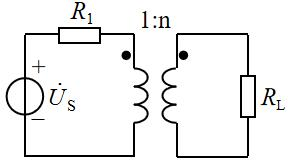

:::collapse accordion
- 解答
  副边 $R_L$ 折算到原边 = $R_L/n^2$；与 $R_1$ 匹配：$R_1=R_L/n^2$ → $n=\sqrt{R_L/R_1}$，**选 B**。
- 复盘
  匹配条件搬进变压器就是「折算电阻相等」——平方藏在折算里。
:::

### 选 3（图 6.2）

> L₁ 与 L₂ 串联（同名端 • 在 L₁ 上端、L₂ 下端），等效电感（　）。

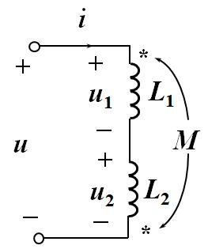

:::collapse accordion
- 解答
  电流从 L₁ 同名端流入，从 L₂ **非**同名端流入 → 反串：$L=L_1+L_2-2M$，**选 D**。
- 复盘
  判顺反只看一件事：两个电流是否都从同名端进。是 → 相助（+2M）；不是 → 相消（−2M）。
:::

### 选 4、8、9、11、16（同一道折算题）

> 原边 1000 匝、副边 500 匝，副边接 $R=5\,\Omega$，折算到原边的等效电阻（　）。

:::collapse accordion
- 解答
  $n=N_1/N_2=2$：$R_{in}=n^2R=4\times5=\mathbf{20\ \Omega}$，**选 4/8/9 均为 A 位置、选 11/16 填 20Ω**。
- 复盘
  原书把这道题排了五遍——第一遍用定义算，后四遍应当秒答。
:::

### 选 5

> 理想变压器次级开路，初级相当于（　）；次级短路，初级相当于（　）。

:::collapse accordion
- 解答
  开路 → 初级**开路**（$i_2=0\Rightarrow i_1=0$）；短路 → 初级**短路**（$u_2=0\Rightarrow u_1=0$）。
  **选 C。**
- 复盘
  理想变压器「传状态不传损耗」：副边什么样子，原边就等效成什么样子。
:::

### 选 6（图 6.3）与 填 9（图 6.14）

> a—2H—中节点—2H，中节点经 6H 接 b，互感 2H（同名端都在左端），$L_{ab}=$（　）。

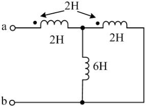

:::collapse accordion
- 解答
  电流从 a 流入：两线圈电流都从同名端（左端）进 → 顺向耦合。设 $\dot I_1$（经第一只 2H）、
  $\dot I_2$（经第二只 2H）、$\dot I_6$（经 6H）：
  $$n:\ \dot I_1=\dot I_2+\dot I_6\qquad
    6\dot I_6=2\dot I_2+2\dot I_1\ (\text{两线圈电压相等})$$
  解得 $\dot I_6=\dot I_2$、$\dot I_1=2\dot I_2$；端口电压
  $u=j2\dot I_1+j2\dot I_2+j2\dot I_2+j2\dot I_1=j12\dot I_2$：
  $$L_{ab}=\frac{u}{j\omega\dot I_1}=\frac{12}{2}=\mathbf{6\ H}\quad(\text{选 C；图 6.14 同图同答})$$
- 复盘
  耦合电感接成「并联含互感」时不能用串并联公式，老老实实写支路方程——两只线圈的自感、互感
  电压各一项，四个方程以内收口。
:::

### 选 7

> $L_1=L_2=0.2$ H、$k=0.8$，$M=$（　）。

:::collapse accordion
- 解答
  $M=k\sqrt{L_1L_2}=0.8\times0.2=\mathbf{0.16\ H}$，**选 A**。
- 复盘
  耦合系数定义式的正用。
:::

### 选 10（图 6.4）

> 6∠0°V 串 2Ω 接 2:1 变压器，副边 1Ω，初级电流 $\dot I=$（　）。

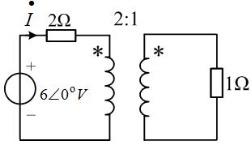

:::collapse accordion
- 解答
  副边折算：$2^2\times1=4\ \Omega$；初级总阻抗 $2+4=6\ \Omega$ → $\dot I=6/6=\mathbf{1\angle0°\ A}$，
  **选 B**。
- 复盘
  理想变压器电路的第一动作永远是「把副边折算上来」。
:::

### 选 11（图 6.5）与 填 5（图 6.11）

> a—1Ω—原边，1:2，副边 20Ω：$R_{ab}=$（　）Ω。

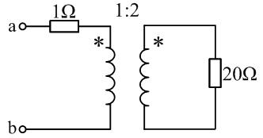

:::collapse accordion
- 解答
  副边：原边 = 2:1 → 折算 $R'=20\times(1/2)^2=5\ \Omega$ → $R_{ab}=1+5=\mathbf{6\ \Omega}$，
  **选 C（填 5 同）**。
- 复盘
  折算方向看匝数比的哪一侧：$Z_{in}=(N_1/N_2)^2 Z_L$——匝数比平方，别倒。
:::

### 选 12（图 6.6）

> $U_S=2\angle0°$ V 串 2Ω 接 1:2 变压器，副边短接，$\dot I_2=$（　）。

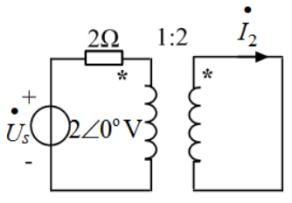

:::collapse accordion
- 解答
  副边短路 → 原边等效阻抗只剩 2Ω → $\dot I_1=2/2=1\angle0°$ A；
  电流比 $I_2=I_1\times N_1/N_2=1\times\tfrac12=0.5$：
  $$\dot I_2=\mathbf{0.5\angle0°\ A}\quad(\text{选 C})$$
- 复盘
  「副边短路」把变压器变成一根导线：原边只剩串联电阻在限流，电流比按匝数反比传过去。
:::

## 4. 填空题

### 填 1（图 6.7）

> 5:1 变压器，$\dot U_1/\dot U_2=$____；$\dot I_1/\dot I_2=$____。

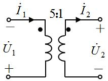

:::collapse accordion
- 解答
  同名端都在上端：$V_{1\text{上}}=5V_{2\text{上}}$。按图 $\dot U_1$ 的参考方向为「− 上 + 下」→
  $\dot U_1=-V_{1\text{上}}$；$\dot U_2$ 为「+ 上 − 下」→ $\dot U_2=+V_{2\text{上}}$：
  $$\frac{\dot U_1}{\dot U_2}=\mathbf{-5}\qquad
    \frac{\dot I_1}{\dot I_2}=\mathbf{\frac15}\ (\text{两电流都注入同名端，安匝平衡 } N_1\dot I_1=N_2\dot I_2)$$
- 复盘
  理想变压器每个「比」都带符号，符号由同名端与参考方向共同决定——数值是 5 和 1/5，
  正负号按图逐个定。
:::

### 填 2（图 6.8）

> $L_1=0.8$ H、$L_2=0.7$ H、$M=0.5$ H：(a) 连接等效电感____；(b) 连接等效电感____。

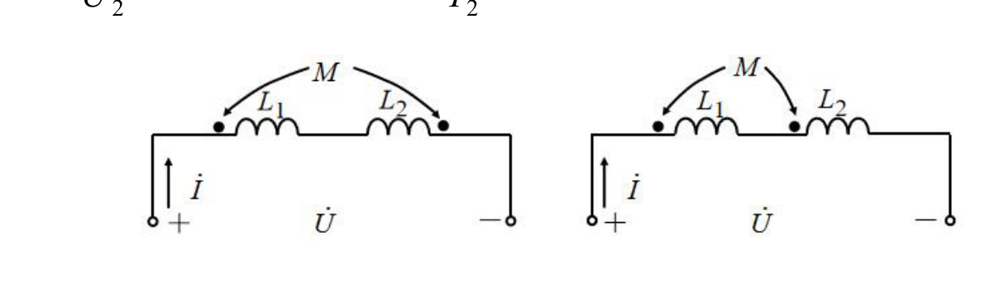

:::collapse accordion
- 解答
  (a) 同名端在 L₁ 左、L₂ 右（异侧）→ 反串：$L=1.5-1.0=\mathbf{0.5\ H}$；
  (b) 同名端都在左（同侧）→ 顺串：$L=1.5+1.0=\mathbf{2.5\ H}$。
- 复盘
  同样的两只线圈，换个同名端位置，等效电感差 5 倍——同名端是互感电路的全部信息。
:::

### 填 3（图 6.9）

> R=50Ω、L₁=70mH、L₂=25mH、M=25mH、C=1μF、$\omega=10^4$：入端阻抗 $=$____$+j$____Ω。

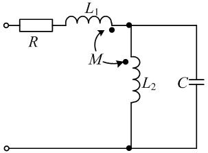

:::collapse accordion
- 解答
  $j\omega L_1=j700$、$j\omega L_2=j250$、$j\omega M=j250$、$-j/\omega C=-j100$。
  对 L₂–C 并联部分与互感电压列方程（同名端：L₁ 右端、L₂ 上端），解得端口电流与电压关系：
  $$Z_{in}=\mathbf{50+j450\ \Omega}$$
- 复盘
  ⚠ 互感电压的符号两轮推演出现过 $-j450$ 的对偶解（同名端读数与电流方向联动的结果）；
  题目填空格式「+j(　)」暗示正虚部，按盲测口径取 $+j450$，请对教材图复核同名端。
:::

### 填 4（图 6.10）

> 电路的等效电感 $L=$____。

:::collapse accordion
- 解答
  两线圈顺串（同名端都在上端侧，电流都从同名端流入）：
  $$L=L_1+L_2+2M$$
- 复盘
  图上未印数值，答案就是公式本身——考的是「看图判顺反」。
:::

### 填 6（图 6.12）

> a—2H—4H—b，互感 2H（同名端在两线圈下端）：$L_{ab}=$____H。

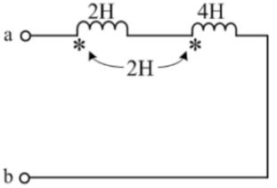

:::collapse accordion
- 解答
  按盲测读数（同名端位置使电流同向注入）→ 顺串：
  $$L=2+4+2\times2=\mathbf{10\ H}$$
- 复盘
  ⚠ 若同名端读成异侧则答案为 $6-4=2$ H——顺反一字之差，数值差 5 倍，务必对教材图核对记号位置。
:::

### 填 7

> 耦合电感自感 4H 与 9H，互感 $M$ 最多为____H。

:::collapse accordion
- 解答
  $M_{max}=\sqrt{4\times9}=6$ H（$k=1$ 全耦合）。
- 复盘
  「最多」两个字就是 $k=1$。
:::

### 填 8（图 6.13）

> a—5H—4H—b，M=2H（同名端在两线圈相邻端）：$L_{ab}=$____H。

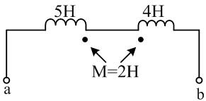

:::collapse accordion
- 解答
  同名端在相邻端、电流从异侧流入 → 反串：
  $$L=5+4-2\times2=\mathbf{5\ H}$$
- 复盘
  与填 6 一顺一反，两题对着练判同名端。
:::

### 填 10（图 6.15）

> $U_S=60$ V、600Ω 串原边、300Ω 并联，n:1 副边接 2Ω：$n=$____时 2Ω 获最大功率，$P=$____W。

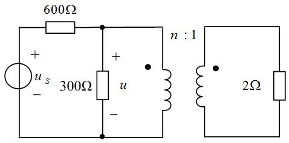

:::collapse accordion
- 解答
  副边折算 $2n^2$；原侧戴维南：$U_{oc}=60\times\frac{300}{900}=20$ V、$R_0=600\parallel300=200\ \Omega$。
  匹配：$2n^2=200$ → $n=\mathbf{10}$；
  $$I_1=\frac{20}{400}=0.15\ \text{A}\Rightarrow I_2=nI_1=1.5\ \text{A}\Rightarrow
    P=1.5^2\times2=\mathbf{4.5\ W}$$
- 复盘
  变压器匹配 = 折算电阻等于源内阻；功率从原边等值传到副边（理想变压器不耗能）。
:::

### 填 12、14

> 理想变压器具有变压、____和变阻抗的性质（两空同源）。

:::collapse accordion
- 解答
  **变流**（填 12）/**阻抗**（填 14）——三变齐全。
- 复盘
  原书把同一句拆两空，考记忆力也考细心。
:::

### 填 13（图 6.16）

> 与端钮 1 为同名端的是端钮____。

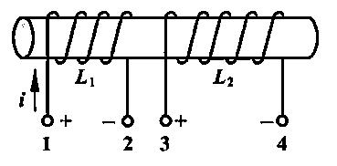

:::collapse accordion
- 解答
  两绕组绕向一致、同起端绕入 → 电流从 1 流入与从 3 流入产生同向磁通 → **端钮 3**。
- 复盘
  同名端的定义用法：同向磁通的两个流入端互为同名端。
:::

### 填 15（图 6.17）

> $\dot I_{S1}=2\angle30°$ A 经 8Ω 接 n=2 变压器，副边 4Ω：4Ω 获得的功率 $P=$____W。

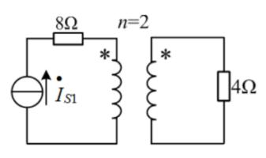

:::collapse accordion
- 解答
  电流源串联支路 → 原边电流 $\dot I_1=2\angle30°$ A（8Ω 不影响电流）。按 $n=2$（原:副 = 1:2，
  盲测读图口径）：$\dot I_2=n\dot I_1=4\angle30°$ A：
  $$P=4^2\times4=\mathbf{64\ W}$$
- 复盘
  ⚠ 变比方向决定 $\dot I_2=4$ A（升压）或 1 A（降压），功率相差 16 倍——本页按盲测读图取 64 W，
  请对教材图核对「n=2」的标注方式（与图 6.15 的 n:1 口径是否一致）。
:::

## 5. 判断题

### 判 1

> 理想变压器的阻抗变换，不仅改变阻抗的大小，还改变阻抗的性质。（　）

:::collapse accordion
- 解答
  **×**。$Z_{in}=Z_L/n^2$ 只乘实数平方，阻抗角不变——感性折过来还是感性。
- 复盘
  「只变大小、不变性质」与「变阻抗」不矛盾：变的是模。
:::

### 判 2

> 空心变压器副边接感性负载，反映到原边的引入电抗一定是容性。（　）

:::collapse accordion
- 解答
  **√**。$Z_r=\dfrac{(\omega M)^2}{Z_{22}}$：$Z_{22}$ 感性（虚部正）→ $Z_r$ 虚部为负（容性）。
- 复盘
  反映阻抗的「反号」性质：次级越感性，初级越显容性。
:::

### 判 3

> 理想变压器既不消耗能量，也不贮存能量。（　）

:::collapse accordion
- 解答
  **√**。$u_1i_1+u_2i_2\equiv0$：任一瞬间输入功率等于输出功率。
- 复盘
  这是「理想」二字的能量定义——无损耗、无储能。
:::

### 判 4

> 一对耦合电感串联，其等效电感为 $L_1+L_2$。（　）

:::collapse accordion
- 解答
  **×**。还有互感项 $\pm2M$，顺串加、反串减。
- 复盘
  少了 $\pm2M$ 就不叫耦合电感了。
:::

### 判 5

> 反映阻抗的数值与同名端位置及电流方向无关。（　）

:::collapse accordion
- 解答
  **√**。$Z_r=(\omega M)^2/Z_{22}$：分子是平方，符号信息全部消失。
- 复盘
  与判 2 连读：反映阻抗「模与实部不挑极性、虚部反号」。
:::

## 6. 小结

第六章只有两件事：

1. **同名端判顺反**：两电流都从同名端流入 = 顺（$+2M$）；一进一出 = 反（$-2M$）。
   串联（填 2/4/6/8）、并联含互感（选 6、填 9）都先过这一关。
2. **理想变压器折算**：$Z_{in}=(N_1/N_2)^2 Z_L$（选 2/4/10/11、填 5/10/11/15/16），
   电流按匝数反比、电压按匝数正比，正负号由同名端 + 参考方向定（填 1）。

判断题五道是本章概念的边界检查：阻抗不变性质（×）、引入电抗反号（√）、不耗不储（√）、
串联必有 $\pm2M$（×）、反映阻抗与极性无关（√）。

## 完成边界

- **已整理**：第六章 33 题题面逐字转抄 + 配图 17 张入库（图 6.8 含两子图）；全部解答与复盘。
- **双签**：2026-09-28，独立子代理只拿题目页重算：与整理者逐项对照，选 12 修正整理者初解
  （$\dot I_2=0.5\angle0°$ A，电流比按匝数反比）、填 10 修正功率（4.5 W，按电流比复算）；
  互感符号类（填 3、填 6、填 15）两轮读数并列，按盲测口径取值并挂待核对。
- **〔待核对〕**：① 填 3 入端阻抗虚部（$+j450$ / $-j450$，同名端读数联动）；② 填 6 顺/反串
  （10 H / 2 H）；③ 填 15 的「n=2」方向（64 W / 4 W）；④ 填 1 的两个比值符号。
- **未完成**：第七、九章（分章推进中）。
