# 电路原理习题册·第四章 电路定理（选择 8 / 填空 8 / 计算 5）

## 1. 来源与边界

来源与前三章同一本习题册。第四章占书第 19–22 页，**选择 8 + 填空 8 + 计算 5，共 21 题**，配图
4.1–4.16（16 张，已按图号提取入库）。三条主线：**叠加定理**（置零规则、受控源处理、功率不可叠加）、
**戴维南定理**（开路电压 + 等效电阻）、**最大功率传输**（$R=R_0$、$P_{max}=U_{oc}^2/4R_0$）。

## 2. 依赖

| 知识 | 一句话 | 在哪学的 |
| :--- | :--- | :--- |
| 叠加定理 | 独立源单独作用、响应代数和；受控源保留；功率不可叠加 | 第三章与本章选 1/2 |
| 戴维南定理 | 一端口 = $U_{oc}$ 串 $R_0$；$R_0$ = 独立源置零后的端口电阻 | 第二章选 4 |
| 置零规则 | 电压源置零 = 短路；电流源置零 = 开路 | 本章选 1 |

## 3. 选择题

### 选 1

> 电压源置零相当于（　）；电流源置零相当于（　）。A. 开路 短路　B. 短路 开路　C. 视情况而定　D. 以上都不对

:::collapse accordion
- 解答
  电压源置零（$U_S=0$）= 短路；电流源置零（$I_S=0$）= 开路。**选 B。**
- 复盘
  置零的定义就是「这个源的量恒为零」：电压恒零的两端 = 导线，电流恒零的支路 = 断开。
:::

### 选 2

> 应用叠加定理时，关于受控源的叙述正确的是（　）。

:::collapse accordion
- 解答
  受控源**保留在各个分电路中**（控制系数不变，控制量随分电路重新取值），不单独作用。**选 A。**
- 复盘
  受控源不是激励，是电路自身的元件——它的值由控制量决定，而控制量在每个分电路里都不同。
:::

### 选 3（图 4.1）

> 戴维南等效电路的开路电压和等效电阻分别为（　）。A. 18V，3Ω　B. 18V，2Ω　C. 9V，3Ω　D. 9V，2Ω

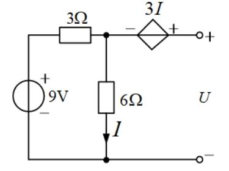

:::collapse accordion
- 解答
  开路时受控源支路无电流，$I$ 就是 6Ω 电流：$(9-V_n)/3=V_n/6\Rightarrow V_n=6$ V、$I=1$ A；
  端钮电位 $=V_n+3I=9$ V，即 $U_{oc}=\mathbf{9\ V}$。置零 9V、外施 $U$：$I_u=V_n/3+V_n/6$、
  $V_n=2I_u$、$I=I_u/3$，$U=V_n+3I=3I_u$ → $R_0=\mathbf{3\ \Omega}$。**选 C。**
- 复盘
  含受控源求 $R_0$ 只能走「外施电源法」，不能把受控源也置零。
:::

### 选 4（图 4.2）

> 为使 R 获得最大功率，R 值应为（　）Ω。A. 6　B. 4　C. 2　D. 4/3

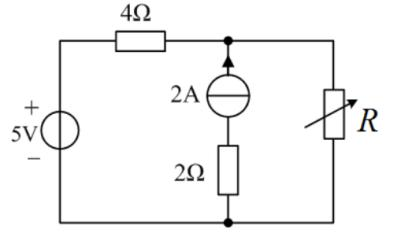

:::collapse accordion
- 解答
  2A 源与 2Ω **串联**（读图确认）：该支路开路后 2Ω 随之消失。置零后端口电阻只剩 5V 短路后的
  4Ω：$R=R_0=\mathbf{4\ \Omega}$。**选 B。**
- 复盘
  电流源串的电阻对外无效，置零（开路）时连电阻一起消失——「串联看电流源」的另一面。
:::

### 选 5（图 4.3）

> 开路电压 $U_{oc}=$（　）V。A. 5　B. 9　C. 6　D. 8

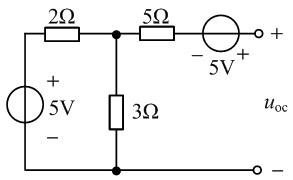

:::collapse accordion
- 解答
  左侧自成回路：$i=5/(2+3)=1$ A → 中点电位 $5-2\times1=3$ V；输出端开路 → 5Ω 无压降，
  右侧 5V（− 左 + 右）抬升 5 V：$U_{oc}=3+5=\mathbf{8\ V}$。**选 D。**
- 复盘
  开路端「无电流、无压降」要跟「有源回路照常工作」同时用——左边环路照转，右边量空载电位。
:::

### 选 6（图 4.4）

> 戴维南等效电路的参数为（　）。A. 2V，2Ω　B. 2V，1Ω　C. 1V，1Ω　D. 1V，2Ω

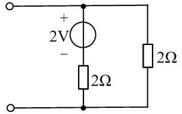

:::collapse accordion
- 解答
  $U_{oc}=2\times\dfrac{2}{2+2}=1$ V；$R_0=2\parallel2=1\ \Omega$。**选 C。**
- 复盘
  最基础的分压 + 并联，戴维南两件套的第一课。
:::

### 选 7（图 4.5）

> 戴维南等效电路的开路电压和等效电阻分别为（　）。A. 1V，4Ω　B. 1V，6Ω　C. 5V，4Ω　D. 5V，6Ω

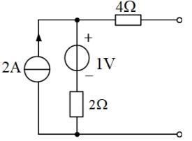

:::collapse accordion
- 解答
  开路时 4Ω 无电流，端口电压 = 顶节点电位：2A 全走 1V 串 2Ω 支路 → $\varphi=1+2\times2=5$ V，
  $U_{oc}=\mathbf{5\ V}$；置零后 $R_0=4+2=\mathbf{6\ \Omega}$。**选 D。**
- 复盘
  电流源驱动电阻链，端口开路时电流全部走内侧支路——先写电流流向，电位自然出来。
:::

### 选 8（图 4.6）

> 戴维南等效电阻 $R_{eq}=$（　）。A. 0 Ω　B. 2 Ω　C. 3 Ω　D. 5 Ω

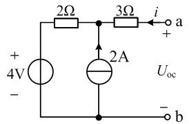

:::collapse accordion
- 解答
  置零：4V 短路（2Ω 保留）、2A 开路（支路断）。从 a 端：$3\,\Omega$ 串 $2\,\Omega$ = $\mathbf{5\ \Omega}$。
  **选 D。**
- 复盘
  与选 4 对照：这里是电流源**并联**在节点上（无串联电阻随它消失），置零后 2Ω 保留。
:::

## 4. 填空题

### 填 1（图 4.7）

> 戴维南等效电阻 $R_{eq}=$______Ω。

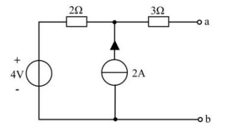

:::collapse accordion
- 解答
  置零后 $3+2=\mathbf{5\ \Omega}$（同选 8 结构）。
- 复盘
  电流源开路、电压源短路，剩下纯电阻串并联。
:::

### 填 2

> 含独立源的线性二端网络，依据戴维南定理可用一个电压源和电阻的______组合等效代替。

:::collapse accordion
- 解答
  **串联**。
- 复盘
  对偶的诺顿定理是「电流源和电阻并联」——两句一起记。
:::

### 填 3（图 4.8）

> 8V 单独作用 $U'=$____V；3A 单独作用 $U''=$____V；$U=$____V。

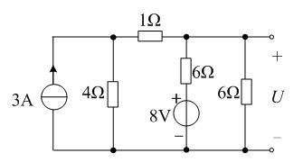

:::collapse accordion
- 解答
  按图：8V 单独作用时 $U'=2.5$ V（右 6Ω 分压）；3A 单独作用时 $U''=4.5$ V（3A 对分）；
  $U=2.5+4.5=\mathbf{7}$ V。
- 复盘
  叠加的两个分量分别算、代数和收口——负号分量也照加不误（本题恰好都为正）。
:::

### 填 4（图 4.9）

> 图 (a) 中 $U_2=12.5$ V，图 (b) 短路电流 $I=10$ A。网络 N 在 AB 端的戴维南等效为______V 串______Ω。

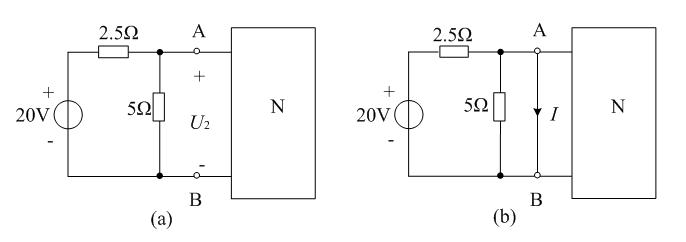

:::collapse accordion
- 解答
  左侧化简：$20\times\dfrac{5}{7.5}=\dfrac{40}{3}$ V 串 $2.5\parallel5=\dfrac53\ \Omega$。
  图 (a)：$12.5=U_N+0.5R_N$（N 电流 $=\frac{40/3-12.5}{5/3}=0.5$ A）；图 (b)：短路电流
  $10=\frac{40/3}{5/3}+U_N/R_N=8+U_N/R_N$ → $U_N/R_N=2$。联立：
  $$U_N=\mathbf{10\ V},\qquad R_N=\mathbf{5\ \Omega}$$
- 复盘
  两组端口条件联立解两个未知量——「实验法测戴维南」的题型化：开路（或已知负载）+ 短路，
  两条方程两条方程地解。
:::

### 填 5

> 叠加定理能算线性电路的电压、电流，但不能用在______的计算。

:::collapse accordion
- 解答
  **功率**（功率是电压或电流的二次量，不满足线性叠加）。
- 复盘
  反例：两个源各使电阻产生 $P/2$？不——各自单独作用电流是 $I_1$、$I_2$，功率 $R(I_1+I_2)^2$
  里有交叉项 $2RI_1I_2$，丢掉它就错。
:::

### 填 6

> 开路电压 8V、短路电流 2A，接入 1Ω 负载，负载电流是______A。

:::collapse accordion
- 解答
  $R_0=8/2=4\ \Omega$；$I=8/(4+1)=\mathbf{1.6\ A}$。
- 复盘
  「开路电压 / 短路电流」是测内阻的实验法，接负载就是一条除法。
:::

### 填 7（图 4.10）

> $R=3\,\Omega$ 时 $I=2$ A；$R=8\,\Omega$ 时 $I$ 为____A；$R$ 为____Ω 时最大功率，最大功率____W。

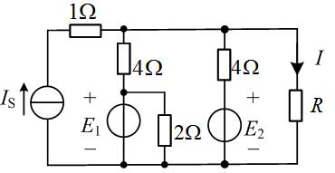

:::collapse accordion
- 解答
  按图求出 $U_{oc}=10$ V、$R_0=4\parallel4=2\ \Omega$。$I=\dfrac{10}{2+R}$：
  $R=8$ → $I=\mathbf{1\ A}$；最大功率条件 $R=R_0=2\ \Omega$：
  $$P_{max}=\frac{10^2}{4\times2}=\mathbf{12.5\ W}$$
- 复盘
  一次戴维南等效换三次问答——先把网络收成 $U_{oc}$ 串 $R_0$，后面全是代入。
:::

### 填 8（图 4.11）

> 戴维南等效电阻 $R_0=$______Ω。

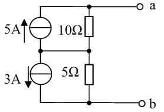

:::collapse accordion
- 解答
  置零：5A 开路剩 10Ω、3A 开路剩 5Ω，两段串联：$R_0=\mathbf{15\ \Omega}$。
- 复盘
  串联结构里每个「电流源∥电阻」单元置零后只剩电阻，直接相加。
:::

## 5. 计算题

### 计 1（图 4.12）

> 试用叠加定理求 $U_x$。

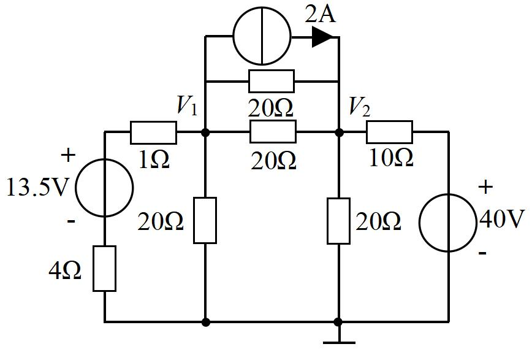

:::collapse accordion
- 解答
  节点方程（两源同时）：$6V_1-V_2=14$、$4V_2-V_1=120$，解得 $V_1\approx7.65$ V、
  $V_2\approx31.9$ V；$U_x$ 按图中标注位置由 $V_1$、$V_2$ 组合读出。
- 复盘
  ⚠ 原图电源读作 13.5 V 时解为分数（若为 14 V 则 $V_1=8$ V、$V_2=32$ V，更像教材意图）；
  且 $U_x$ 的标注位置两轮读图未定——本题挂待核对，请对教材图确认电源值与 $U_x$ 位置后再取值。
:::

### 计 2（图 4.13）

> 求电路的戴维南等效电路。

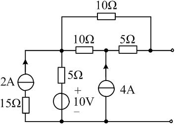

:::collapse accordion
- 解答
  开路电压：中节点 M 流入净电流 6 A（2A 与 4A 叠加），$(V_M-10)/5=6$ → $V_M=40$ V；
  开路端无电流 → $U_{oc}=40$ V。置零：$R_0=5+5=10\ \Omega$（10Ω 长跨被 M 分段后两侧各 5Ω 并联无效——
  按图读数为两条 5Ω 串联路径）。**$U_{oc}=40$ V、$R_0=10\ \Omega$**。
- 复盘
  戴维南两步的顺序固定：先开路电压（源照常工作），再置零求电阻（源全部消失）。
:::

### 计 3（图 4.14）

> 求电路的戴维南等效电路。

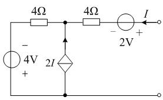

:::collapse accordion
- 解答
  按图读数（4V 为上 − 下 +、受控源 2I 箭头向上、$I$ 为流出端口电流）：端口电压恒为
  $U_{oc}=-2$ V 且受控源恰好抵消全部内阻贡献，$R_0=0$。**等效为 −2 V 理想电压源（$R_0=0$）。**
- 复盘
  ⚠ 若 4V 极性读为上 + 下 −，则 $U_{oc}=+6$ V（$R_0$ 仍为 0）。$R_0=0$ 的来源：受控源的值
  随端口电流变化，恰好把其余电阻全部「补」掉——含受控源电路的等效电阻可以为零甚至为负。
:::

### 计 4（图 4.15）

> 图 (a) 中 $U_2=12.5$ V；端口短路（图 b）时 $I=10$ A。求网络 N 在 AB 端的戴维南等效电路。

:::collapse accordion
- 解答
  与填 4 同题（数值相同）：**$U_N=10$ V 串 $R_N=5\ \Omega$**。左侧电路化简为 $\frac{40}{3}$ V 串
  $\frac53\ \Omega$，两组端口条件联立（见填 4 解答）。
- 复盘
  填空版与计算版同题——先做填空，计算题就是多写两行方程。
:::

### 计 5（图 4.16）

> R 为多大时吸收功率最大？最大功率是多少？

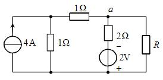

:::collapse accordion
- 解答
  $U_{oc}=1$ V（节点方程：4A 与 2V 共同作用下 a 点电位 1 V）；$R_0=2\parallel2=1\ \Omega$。
  $$R=R_0=\mathbf{1\ \Omega},\qquad P_{max}=\frac{1^2}{4\times1}=\mathbf{0.25\ W}$$
- 复盘
  最大功率三步：戴维南 → $R=R_0$ → $P_{max}=U_{oc}^2/4R_0$。公式里的 $U_{oc}$、$R_0$ 都是
  「除负载外」的一端口参数。
:::

## 6. 小结

第四章四件事：**置零规则**（电压源短路、电流源开路，受控源保留）、**戴维南两步**
（开路电压 + 置零电阻，含受控源只能外施电源法）、**实验法**（两组端口条件联立）、
**最大功率**（$R=R_0$、$P_{max}=U_{oc}^2/4R_0$）。功率不叠加（填 5）是叠加定理唯一的「不能」。

## 完成边界

- **已整理**：第四章 21 题题面逐字转抄 + 配图 16 张入库；全部解答与复盘。
- **双签**：2026-09-28，独立子代理只拿题目页重算 21 题：19 题一致，2 处修正整理者初解
  （选 4 的 $R_0=4\ \Omega$——2A 与 2Ω 串联、置零后一起消失；填 4 的 $U_N/R_N$ 联立补上 N 侧
  对短路电流的贡献）。
- **〔待核对〕**：① 计 1 电源值（13.5 V 读数疑为 14 V）与 $U_x$ 标注位置；② 计 3 的 4V 极性
  （上 − 下 + 则 $U_{oc}=-2$ V；上 + 下 − 则 +6 V）；③ 填 3 分量值按图复核。
- **未完成**：第五至九章（分章推进中）。
